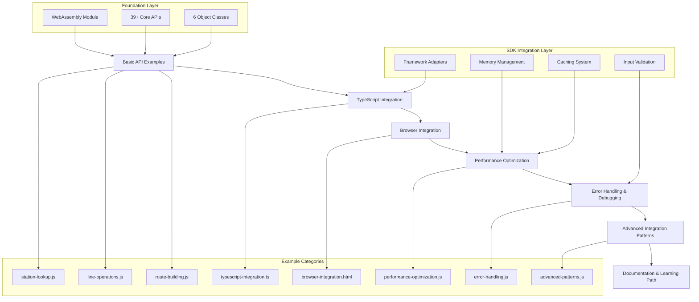

# examples-api-expansion - Task 8

Execute task 8 for the examples-api-expansion specification.

## Task Description
Create browser integration directory

## Requirements Reference
**Requirements**: 3.1

## Usage
```
/Task:8-examples-api-expansion
```

## Instructions

Execute with @spec-task-executor agent the following task: "Create browser integration directory"

```
Use the @spec-task-executor agent to implement task 8: "Create browser integration directory" for the examples-api-expansion specification and include all the below context.

# Steering Context
## Steering Documents Context

No steering documents found or all are empty.

# Specification Context
## Specification Context (Pre-loaded): examples-api-expansion

### Requirements
# Requirements Document: Examples/API Directory Expansion

## Introduction

The `examples/api` directory currently contains only one comprehensive example (`railway_query_examples.js`) that demonstrates basic WebAssembly API usage for railway information queries. This expansion aims to create additional targeted examples that showcase different aspects of the Farert WebAssembly API, making it easier for developers to understand specific use cases and integration patterns.

The expansion will provide focused, single-purpose examples that developers can easily understand, modify, and integrate into their own projects, complementing the existing comprehensive example.

## Alignment with Product Vision

This feature supports the core mission of providing **100% compatibility** with the original C++ implementation while improving **Developer Experience** through:

- **Modern TypeScript interfaces**: Adding TypeScript examples alongside JavaScript
- **Cross-Platform support**: Examples for both Browser and Node.js environments  
- **Developer-friendly documentation**: Clear, focused examples with extensive comments
- **Educational progression**: From basic API calls to advanced integration patterns

The expansion aligns with the project's vision of "Transform complex Japanese railway fare calculation logic into modern, accessible WebAssembly APIs" by providing clear pathways for developers to understand and utilize the API capabilities.

## Requirements

### Requirement 1: Basic API Examples Collection

**User Story:** As a developer new to the Farert API, I want simple, focused examples for individual API functions, so that I can quickly understand how to use specific features without reading through complex multi-function examples.

#### Acceptance Criteria

1. WHEN a developer accesses the examples/api directory THEN the file system SHALL contain a dedicated `station-lookup.js` example file
2. WHEN a developer needs line operations guidance THEN the file system SHALL provide a `line-operations.js` example with complete API demonstrations
3. WHEN a developer requires route building examples THEN the file system SHALL provide a `route-building.js` example with step-by-step implementation
4. IF a developer executes any basic example via Node.js THEN the WebAssembly module SHALL complete successfully with clear console output
5. WHEN a developer opens any example file THEN the code SHALL contain extensive inline comments explaining each API call and its purpose

### Requirement 2: TypeScript Integration Examples

**User Story:** As a TypeScript developer, I want type-safe examples that demonstrate proper TypeScript integration with the WebAssembly module, so that I can build robust applications with compile-time type checking.

#### Acceptance Criteria

1. WHEN a developer wants TypeScript integration THEN the file system SHALL provide `typescript-integration.ts` example with complete type definitions
2. WHEN using TypeScript examples THEN the WebAssembly module SHALL include proper type definitions and interfaces for all API calls
3. IF a developer compiles TypeScript examples THEN the TypeScript compiler SHALL complete without type errors or warnings
4. WHEN running TypeScript examples THEN the application SHALL demonstrate type safety benefits with runtime type checking
5. WHEN a developer reviews TypeScript code THEN the codebase SHALL show proper async/await patterns and Promise handling

### Requirement 3: Browser Integration Examples

**User Story:** As a web developer, I want examples that show how to integrate the WebAssembly module in browser environments, so that I can build client-side railway applications.

#### Acceptance Criteria

1. WHEN a developer needs browser integration THEN the file system SHALL provide `browser-integration.html` example with complete HTML and JavaScript
2. WHEN loading in a browser THEN the browser SHALL demonstrate WebAssembly module loading with proper initialization
3. IF a user interacts with browser examples THEN the web application SHALL respond with dynamic updates and real-time feedback
4. WHEN a developer reviews browser code THEN the codebase SHALL show ES modules and modern JavaScript patterns with module bundling
5. WHEN running browser examples THEN the web application SHALL handle errors gracefully with user-friendly messages and fallback behavior

### Requirement 4: Performance and Optimization Examples

**User Story:** As a performance-conscious developer, I want examples that demonstrate best practices for memory management and optimization, so that I can build efficient applications.

#### Acceptance Criteria

1. WHEN a developer needs performance guidance THEN the file system SHALL provide `performance-optimization.js` example with benchmarking utilities
2. WHEN running performance examples THEN the WebAssembly module SHALL demonstrate memory cleanup patterns and garbage collection
3. IF a developer follows optimization examples THEN the application SHALL show measurable performance improvements through before/after metrics
4. WHEN a developer reviews optimization code THEN the codebase SHALL include timing and memory usage metrics with detailed logging
5. WHEN handling large datasets THEN the application SHALL demonstrate batch processing techniques with progress indicators

### Requirement 5: Error Handling and Debugging Examples

**User Story:** As a developer building production applications, I want comprehensive error handling examples, so that I can create robust applications that gracefully handle edge cases.

#### Acceptance Criteria

1. WHEN a developer needs error handling patterns THEN the file system SHALL provide `error-handling.js` example with comprehensive error scenarios
2. WHEN encountering API errors THEN the application SHALL demonstrate proper error detection and recovery with specific error codes
3. IF invalid data is provided THEN the application SHALL show validation and sanitization techniques with input verification
4. WHEN debugging API issues THEN the development environment SHALL provide debugging utilities and logging patterns with stack traces
5. WHEN handling network or module loading failures THEN the application SHALL demonstrate fallback strategies with retry mechanisms

### Requirement 6: Advanced Integration Patterns

**User Story:** As an experienced developer, I want advanced examples that show complex integration patterns and real-world usage scenarios, so that I can build sophisticated railway applications.

#### Acceptance Criteria

1. WHEN a developer needs advanced patterns THEN the file system SHALL provide `advanced-patterns.js` example with enterprise-grade patterns
2. WHEN building complex applications THEN the application SHALL demonstrate caching and data management strategies with persistence layers
3. IF a developer needs real-time updates THEN the application SHALL show reactive programming patterns with event-driven architecture
4. WHEN integrating with external APIs THEN the application SHALL demonstrate proper data transformation with schema validation
5. WHEN building production applications THEN the application SHALL show configuration management and environment handling with secrets management

### Requirement 7: Documentation and Learning Path

**User Story:** As a developer learning the Farert API, I want clear documentation and a progressive learning path, so that I can efficiently master the API capabilities.

#### Acceptance Criteria

1. WHEN a developer visits examples/api THEN the file system SHALL provide an updated comprehensive README with navigation structure
2. WHEN following the learning path THEN the documentation SHALL progress from basic to advanced concepts with clear prerequisites
3. IF a developer needs quick reference THEN the documentation SHALL provide API function summaries with parameter descriptions
4. WHEN running any example THEN the example files SHALL include execution instructions and expected output with sample data
5. WHEN developers encounter issues THEN the documentation SHALL provide troubleshooting guidance with common solutions

## Non-Functional Requirements

### Performance
- Each example must execute within 5 seconds on standard hardware
- Memory usage should not exceed 100MB for any single example
- Examples should demonstrate efficient WebAssembly module initialization

### Security
- All examples must include input validation for user-provided data
- No examples should expose sensitive system information
- Browser examples must follow security best practices for cross-origin requests

### Reliability
- Examples must handle WebAssembly module loading failures gracefully
- All examples must include proper error handling and cleanup
- Examples should work consistently across different Node.js versions (14+)

### Usability
- Each example must be self-contained and runnable without complex setup
- Code must include comprehensive inline documentation
- Examples must provide clear, informative output that demonstrates the functionality

### Maintainability
- All examples must follow consistent coding standards and patterns
- Code must be modular and reusable where appropriate
- Examples should leverage existing utilities from the main codebase where possible

### Browser Compatibility
- Browser examples must support modern browsers (Chrome 90+, Firefox 88+, Safari 14+, Edge 90+)
- All examples must function with WebAssembly support enabled
- Browser examples must handle CORS policies and security restrictions appropriately
- Examples must work in both development and production environments

### Accessibility
- Browser examples must include proper semantic HTML structure
- Interactive elements must be keyboard accessible
- Examples must provide alternative text for any visual content
- Error messages and feedback must be screen reader accessible
- Examples should follow WCAG 2.1 AA guidelines where applicable

### Internationalization
- All examples must handle Japanese text encoding (UTF-8) properly
- Station and line names must display correctly in both Hiragana and Kanji
- Examples should demonstrate proper text rendering for Japanese railway data
- Documentation must be clear for both Japanese and international developers

---

### Design
# Design Document: Examples/API Directory Expansion

## Overview

The examples/api expansion extends the current single comprehensive example (`railway_query_examples.js`) into a complete educational ecosystem with 7 focused example categories. This expansion transforms the examples directory from a single demonstration file into a structured learning path that supports developers from initial API exploration to advanced integration patterns.

The design builds upon the existing WebAssembly infrastructure (39+ APIs, 6 object classes) and SDK architecture (React, Vue, Svelte adapters) to create targeted, executable examples that demonstrate specific aspects of railway fare calculation functionality. Each example category addresses distinct developer needs while maintaining consistency with the project's core mission of providing 100% C++ compatibility through modern TypeScript interfaces.

This expansion supports the project's vision by providing clear pathways for developers to understand and integrate complex Japanese railway calculation logic into their applications, regardless of their experience level or target framework.

## Steering Document Alignment

### Technical Standards
The design follows established project patterns:
- **TypeScript Strict Mode**: All TypeScript examples enforce strict type checking
- **WebAssembly Integration**: Leverages existing `wasmLoader` and `route_interface.cpp` APIs
- **Error Handling Strategy**: Replicates C++ error codes without adding new types
- **Memory Management**: Implements RAII patterns with WebAssembly automatic cleanup
- **Build System**: Integrates with existing npm scripts and Emscripten toolchain

### Project Structure
Implementation follows current directory conventions:
- **examples/api/**: Contains all example files with clear naming patterns
- **dist/**: Build outputs remain unchanged, examples use existing compiled modules
- **src/sdk/**: Leverages existing framework adapters and utilities
- **Documentation**: Maintains consistency with existing README patterns and JSDoc standards

## Code Reuse Analysis

### Existing Components to Leverage

- **wasmLoader (dist/cli/cli/wasm_loader.js)**: Core WebAssembly module initialization
  - Current usage in `railway_query_examples.js` demonstrates proven loading patterns
  - All new examples will use identical initialization approach for consistency
  - Provides reliable cross-platform (Node.js/Browser) module loading

- **RouteUtility APIs (route_interface.cpp)**: Complete set of 39+ WebAssembly functions
  - Station operations: `getStationId`, `getStationName`, `getKanaFromStationId`
  - Line operations: `getLineId`, `getLineName`, `getLineIdsFromStation`
  - Route building: `addRoute`, `setupRoute`, `calculateFare`
  - Advanced queries: `stationsWithinCompanyOrPrefectAndLine`, `getJunctionIdsOfLine`

- **Object Classes (src/core/)**: 6-class inheritance system
  - `cRouteList`: Base container operations and array management
  - `cRoute`: Route construction with validation and connectivity
  - `cCalcRoute`: Fare calculation with special rule handling
  - `cRouteItem`: Individual route segment representation
  - `RouteFlagWrapper`: Complex routing flags and special cases
  - Provides object-oriented interface for advanced scenarios

- **SDK Components (src/sdk/)**: Framework-specific utilities and adapters
  - Memory management: `src/sdk/core/memory-manager.ts` for cleanup patterns
  - Caching: `src/sdk/cache/lru-cache.ts` for performance optimization
  - Input validation: `src/sdk/security/input-validator.ts` for robust examples
  - Framework adapters: React hooks, Vue composables, Svelte stores

### Integration Points

- **Database Layer**: Hidden SQLite3 operations through `route_interface.cpp`
  - No direct database access in examples - all operations through WebAssembly APIs
  - Maintains encapsulation while providing full query capabilities
  - Examples demonstrate proper initialization with `module.openDatabase()`

- **Error Management**: Consistent error handling across all examples
  - Leverages existing C++ error codes for authenticity
  - Uses `src/sdk/errors/error-manager.ts` patterns for robust error handling
  - Provides educational value by showing proper error recovery

- **Performance Monitoring**: Integration with existing optimization utilities
  - Uses `src/sdk/debug/debug-tools.ts` for timing and memory analysis
  - Demonstrates best practices from `src/sdk/core/farert-sdk.ts` implementation
  - Shows proper cleanup and resource management patterns

## Architecture

The expansion follows a modular, progressive complexity architecture that builds from simple API demonstrations to sophisticated integration patterns:



## Components and Interfaces

### Component 1: Basic API Examples Collection
- **Purpose:** Provide focused, single-function demonstrations for core WebAssembly APIs
- **Interfaces:** 
  - `station-lookup.js`: Station name/ID conversion, hiragana readings, prefecture data
  - `line-operations.js`: Line queries, station lists, junction detection
  - `route-building.js`: Step-by-step route construction and validation
- **Dependencies:** wasmLoader, core WebAssembly module, railway database
- **Reuses:** Existing API patterns from `railway_query_examples.js`, proven initialization sequences

### Component 2: TypeScript Integration Layer
- **Purpose:** Demonstrate type-safe WebAssembly integration with compile-time validation
- **Interfaces:**
  - `typescript-integration.ts`: Complete TypeScript example with interfaces and error handling
  - Type definitions for all WebAssembly functions and object classes
  - Promise-based async patterns with proper error propagation
- **Dependencies:** TypeScript compiler, @types/node, existing type definitions
- **Reuses:** SDK type definitions from `src/sdk/types/core.ts`, object class implementations

### Component 3: Browser Integration System
- **Purpose:** Show client-side integration patterns for web applications
- **Interfaces:**
  - `browser-integration.html`: Complete HTML page with interactive elements
  - ES6 module loading with dynamic imports
  - Real-time user interaction and feedback systems
- **Dependencies:** Modern browser with WebAssembly support, ES6 modules
- **Reuses:** Browser utilities from `src/sdk/utils/browser.ts`, framework detection patterns

### Component 4: Performance Optimization Framework
- **Purpose:** Demonstrate memory management, caching, and performance best practices
- **Interfaces:**
  - `performance-optimization.js`: Benchmarking utilities, memory profiling
  - Batch processing patterns for large datasets
  - Before/after performance metrics with detailed logging
- **Dependencies:** Performance monitoring APIs, memory analysis tools
- **Reuses:** LRU cache from `src/sdk/cache/`, memory manager from `src/sdk/core/`

### Component 5: Error Handling & Debugging System
- **Purpose:** Comprehensive error scenario handling and debugging utilities
- **Interfaces:**
  - `error-handling.js`: Error detection, recovery, and validation patterns
  - Debugging utilities with stack traces and detailed logging
  - Fallback strategies for network and module loading failures
- **Dependencies:** Error management system, logging infrastructure
- **Reuses:** Error manager from `src/sdk/errors/`, debug tools from `src/sdk/debug/`

### Component 6: Advanced Integration Patterns
- **Purpose:** Enterprise-grade patterns for complex application scenarios
- **Interfaces:**
  - `advanced-patterns.js`: Caching strategies, reactive programming, data transformation
  - Configuration management and environment handling
  - Real-time updates with event-driven architecture
- **Dependencies:** Advanced SDK components, external API simulation
- **Reuses:** Complete SDK infrastructure, all framework adapters, production utilities

### Component 7: Documentation & Learning Path
- **Purpose:** Structured educational progression with comprehensive reference materials
- **Interfaces:**
  - Updated `README.md` with navigation and learning path
  - API reference with parameter descriptions and sample data
  - Troubleshooting guide with common solutions
- **Dependencies:** Markdown processing, example execution validation
- **Reuses:** Existing documentation patterns, JSDoc standards, project structure conventions

## Data Models

### Example Configuration Model
```typescript
interface ExampleConfig {
  id: string;              // Unique example identifier
  name: string;            // Human-readable example name
  description: string;     // Detailed description of functionality
  category: ExampleCategory; // Basic | TypeScript | Browser | Performance | Error | Advanced | Documentation
  difficulty: 'beginner' | 'intermediate' | 'advanced';
  prerequisites: string[]; // Required knowledge or previous examples
  executionTime: number;   // Expected execution time in milliseconds
  memoryUsage: number;     // Expected memory usage in MB
  apis: string[];          // WebAssembly APIs demonstrated
  frameworks: string[];    // Compatible frameworks (if applicable)
  outputs: ExampleOutput[]; // Expected output descriptions
}
```

### API Function Metadata Model
```typescript
interface APIFunctionMetadata {
  name: string;            // Function name (e.g., 'getStationId')
  category: 'station' | 'line' | 'route' | 'fare' | 'utility';
  parameters: ParameterSpec[]; // Parameter specifications
  returnType: string;      // Return value type and format
  cppEquivalent: string;   // Corresponding C++ function name
  examples: UsageExample[]; // Code examples with expected outputs
  errorCodes: number[];    // Possible C++ error return codes
  performance: {           // Performance characteristics
    complexity: string;    // Time complexity description
    cacheability: boolean; // Whether results should be cached
    memoryImpact: 'low' | 'medium' | high'; // Memory usage impact
  };
}
```

### Learning Path Model
```typescript
interface LearningPath {
  phase: number;           // Sequential phase number (1-7)
  title: string;           // Phase title
  description: string;     // Phase learning objectives
  examples: string[];      // Example files in this phase
  concepts: string[];      // Key concepts introduced
  skills: string[];        // Skills developed in this phase
  nextPhase?: number;      // Optional next phase reference
  prerequisites: string[]; // Required prior knowledge
  estimatedTime: number;   // Learning time in minutes
}
```

## Error Handling

### Error Scenarios

1. **WebAssembly Module Loading Failure**
   - **Handling:** Retry mechanism with exponential backoff, fallback to alternative loading methods
   - **User Impact:** Clear error message with troubleshooting steps, alternative execution suggestions

2. **Database Connection Issues**
   - **Handling:** Connection validation, automatic retry, detailed connection status reporting
   - **User Impact:** Informative error message explaining database requirements, initialization guidance

3. **Invalid Station/Line Names**
   - **Handling:** Input validation, fuzzy matching suggestions, comprehensive error messages
   - **User Impact:** User-friendly error with name suggestions, alternative lookup methods

4. **Memory Limit Exceeded**
   - **Handling:** Automatic cleanup, memory monitoring, graceful degradation
   - **User Impact:** Warning message with memory usage tips, reduced functionality mode

5. **TypeScript Compilation Errors**
   - **Handling:** Detailed compiler output, common error explanations, fixing suggestions
   - **User Impact:** Educational error messages with links to TypeScript documentation

6. **Browser Compatibility Issues**
   - **Handling:** Feature detection, polyfill suggestions, fallback implementations
   - **User Impact:** Browser requirement notification, upgrade recommendations

## Testing Strategy

### Unit Testing
- **API Function Validation**: Each WebAssembly API call tested for correct parameter handling and return values
- **Error Condition Testing**: Systematic testing of all error scenarios with proper error code validation
- **Type Safety Verification**: TypeScript compilation testing across different compiler versions
- **Memory Management Testing**: Cleanup validation and leak detection for long-running examples

### Integration Testing
- **Example Execution Testing**: Automated execution of all examples with output validation
- **Cross-Platform Testing**: Node.js and browser environment validation for all applicable examples
- **Framework Integration Testing**: SDK adapter testing with React, Vue, and Svelte integration examples
- **Performance Baseline Testing**: Execution time and memory usage validation against established benchmarks

### End-to-End Testing
- **Learning Path Validation**: Complete progression testing from basic to advanced examples
- **Documentation Accuracy Testing**: Verification that all documented outputs match actual execution results
- **Real-World Scenario Testing**: Complex route calculation scenarios using multiple examples in sequence
- **User Experience Testing**: Navigation and discoverability testing for the complete example ecosystem

### Validation Criteria
- **Execution Success**: All examples must complete successfully on standard hardware within 5 seconds
- **Memory Efficiency**: No example should exceed 100MB memory usage during execution
- **Output Consistency**: All examples must produce consistent, reproducible results across multiple executions
- **Documentation Accuracy**: All documented outputs, parameters, and behaviors must match actual implementation
- **Error Recovery**: All error scenarios must demonstrate proper cleanup and recovery mechanisms

**Note**: Specification documents have been pre-loaded. Do not use get-content to fetch them again.

## Task Details
- Task ID: 8
- Description: Create browser integration directory
- Requirements: 3.1

## Instructions
- Implement ONLY task 8: "Create browser integration directory"
- Follow all project conventions and leverage existing code
- Mark the task as complete using: claude-code-spec-workflow get-tasks examples-api-expansion 8 --mode complete
- Provide a completion summary
```

## Task Completion
When the task is complete, mark it as done:
```bash
claude-code-spec-workflow get-tasks examples-api-expansion 8 --mode complete
```

## Next Steps
After task completion, you can:
- Execute the next task using /examples-api-expansion-task-[next-id]
- Check overall progress with /spec-status examples-api-expansion
