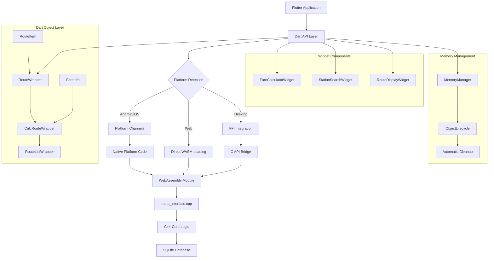

# flutter-plugin - Task 33

Execute task 33 for the flutter-plugin specification.

## Task Description
Create model unit tests in test/models/model_test.dart

## Code Reuse
**Leverage existing code**: src/sdk/flutter/test/utils/test

## Requirements Reference
**Requirements**: 8.1

## Usage
```
/Task:33-flutter-plugin
```

## Instructions

Execute with @spec-task-executor agent the following task: "Create model unit tests in test/models/model_test.dart"

```
Use the @spec-task-executor agent to implement task 33: "Create model unit tests in test/models/model_test.dart" for the flutter-plugin specification and include all the below context.

# Steering Context
## Steering Documents Context

No steering documents found or all are empty.

# Specification Context
## Specification Context (Pre-loaded): flutter-plugin

### Requirements
# Flutter WebAssembly Plugin Requirements Document

## Introduction

This document outlines the comprehensive requirements for completing the Flutter WebAssembly plugin implementation that provides Japanese railway fare calculation capabilities. The plugin will serve as a bridge between the high-performance C++ WebAssembly core and Flutter applications, enabling developers to build sophisticated transportation applications across mobile, web, and desktop platforms.

The plugin leverages the existing 39+ WebAssembly APIs and object-oriented classes from the core farert-wasm implementation, providing Flutter developers with native Dart bindings and pre-built widgets for common railway fare calculation use cases.

## Alignment with Product Vision

This feature directly supports the core mission of transforming complex Japanese railway fare calculation logic into modern, accessible WebAssembly APIs. The Flutter plugin extends this accessibility to the Flutter ecosystem, which is critical for:

- **Cross-Platform Mobile Development**: Enabling consistent railway fare calculation across iOS and Android apps
- **Developer Experience**: Providing Flutter-native interfaces with comprehensive type safety and error handling
- **Market Expansion**: Reaching Flutter developers building transportation and travel applications
- **100% Compatibility Maintenance**: Ensuring identical results to the C++ implementation through WebAssembly integration

The plugin aligns with the project's emphasis on developer experience by providing pre-built widgets, comprehensive documentation, and Flutter-specific optimizations while maintaining the performance benefits of the WebAssembly core.

## Requirements

### Requirement 1: Flutter Plugin Platform Implementation

**User Story:** As a Flutter developer, I want a fully-configured Flutter plugin with platform-specific implementations, so that I can integrate Japanese railway fare calculation into my Flutter applications across all target platforms.

#### Acceptance Criteria

1. WHEN the plugin is installed in a Flutter project THEN it SHALL support Android, iOS, Web, Windows, Linux, and macOS platforms
2. IF the platform is mobile (Android/iOS) THEN the plugin SHALL use platform channels with native implementations
3. IF the platform is web THEN the plugin SHALL directly load and interact with the WebAssembly module
4. IF the platform is desktop (Windows/Linux/macOS) THEN the plugin SHALL use FFI with C API bindings
5. WHEN the plugin is initialized THEN it SHALL automatically detect the platform and load appropriate implementation
6. WHEN plugin initialization fails THEN it SHALL provide detailed error messages specific to the platform and failure reason

### Requirement 2: Dart WebAssembly API Bindings

**User Story:** As a Flutter developer, I want complete Dart bindings for all 39+ WebAssembly APIs, so that I can access all railway fare calculation functionality with type safety and null safety.

#### Acceptance Criteria

1. WHEN calling any WebAssembly API THEN the Dart binding SHALL provide identical functionality to the C++ implementation
2. IF an API call fails THEN the binding SHALL throw appropriate Dart exceptions with detailed error information
3. WHEN working with station data THEN the binding SHALL handle Japanese text encoding correctly (UTF-8 normalization)
4. IF memory management is required THEN the binding SHALL automatically handle WebAssembly memory allocation and cleanup
5. WHEN using object classes (RouteWrapper, CalcRouteWrapper) THEN the binding SHALL maintain object lifecycle and inheritance relationships
6. IF API parameters are invalid THEN the binding SHALL validate inputs and provide meaningful error messages before calling WebAssembly

### Requirement 3: Flutter Widget Components

**User Story:** As a Flutter app developer, I want pre-built Flutter widgets for common railway fare calculation scenarios, so that I can quickly implement user interfaces without building components from scratch.

#### Acceptance Criteria

1. WHEN using FareCalculatorWidget THEN it SHALL provide a complete interface for route building and fare calculation
2. IF using StationSearchWidget THEN it SHALL provide autocomplete search with fuzzy matching for Japanese station names
3. WHEN using RouteDisplayWidget THEN it SHALL show formatted route information with line names and transfer points
4. IF widgets encounter errors THEN they SHALL display user-friendly error messages in Japanese and English
5. WHEN widgets are used in different screen sizes THEN they SHALL be responsive and adapt to mobile, tablet, and desktop layouts
6. IF accessibility features are enabled THEN widgets SHALL support screen readers and keyboard navigation
7. WHEN widgets handle Japanese text THEN they SHALL display hiragana readings and proper formatting

### Requirement 4: Cross-Platform Compatibility

**User Story:** As a Flutter developer targeting multiple platforms, I want the plugin to work consistently across mobile, web, and desktop platforms, so that I can maintain a single codebase for all deployment targets.

#### Acceptance Criteria

1. WHEN running on any supported platform THEN fare calculations SHALL produce identical results (±0 yen tolerance)
2. IF platform-specific optimizations are available THEN the plugin SHALL automatically use them without breaking compatibility
3. WHEN running in web browsers THEN the plugin SHALL handle WebAssembly loading and CORS restrictions appropriately
4. IF running on mobile devices THEN the plugin SHALL optimize memory usage and battery consumption
5. WHEN running on desktop platforms THEN the plugin SHALL handle file system access for WebAssembly modules
6. IF platform-specific errors occur THEN the plugin SHALL provide platform-appropriate error handling and recovery

### Requirement 5: Memory Management and Performance

**User Story:** As a Flutter developer building production applications, I want the plugin to efficiently manage memory and provide high performance, so that my apps remain responsive and don't experience memory leaks.

#### Acceptance Criteria

1. WHEN creating route objects THEN the plugin SHALL automatically manage WebAssembly memory allocation
2. IF route objects are no longer needed THEN the plugin SHALL automatically clean up associated memory
3. WHEN performing multiple fare calculations THEN the plugin SHALL cache frequently accessed data
4. IF memory usage exceeds safe limits THEN the plugin SHALL implement automatic cleanup strategies
5. WHEN the plugin is disposed THEN it SHALL release all WebAssembly resources and platform-specific handles
6. IF long-running operations are performed THEN the plugin SHALL provide progress callbacks and cancellation support

### Requirement 6: Error Handling and Debugging

**User Story:** As a Flutter developer debugging railway fare calculation issues, I want comprehensive error handling and debugging information, so that I can quickly identify and resolve problems in my application.

#### Acceptance Criteria

1. WHEN API calls fail THEN the plugin SHALL throw specific FarertException subclasses with detailed error information
2. IF WebAssembly module fails to load THEN the plugin SHALL provide specific guidance on resolution steps
3. WHEN invalid station names or route data are provided THEN the plugin SHALL return clear validation error messages
4. IF debugging is enabled THEN the plugin SHALL log detailed information about API calls and WebAssembly interactions
5. WHEN errors occur during fare calculation THEN the plugin SHALL preserve the original C++ error codes for compatibility
6. IF memory corruption is detected THEN the plugin SHALL fail safely and provide diagnostic information

### Requirement 7: Documentation and Developer Experience

**User Story:** As a Flutter developer new to Japanese railway systems, I want comprehensive documentation and examples, so that I can quickly understand how to implement fare calculation features in my applications.

#### Acceptance Criteria

1. WHEN accessing plugin documentation THEN it SHALL include complete API reference with parameter descriptions and examples
2. IF developers need implementation guidance THEN documentation SHALL provide step-by-step tutorials for common use cases
3. WHEN working with Japanese railway concepts THEN documentation SHALL explain station IDs, line relationships, and fare calculation rules
4. IF developers encounter issues THEN documentation SHALL include troubleshooting guides for common problems
5. WHEN examples are provided THEN they SHALL demonstrate real-world scenarios with actual station and line data
6. IF API changes occur THEN documentation SHALL maintain migration guides and version compatibility information

### Requirement 8: Testing and Quality Assurance

**User Story:** As a Flutter developer maintaining a railway application, I want comprehensive test coverage for the plugin, so that I can confidently update dependencies and ensure fare calculation accuracy.

#### Acceptance Criteria

1. WHEN running unit tests THEN they SHALL cover all public API methods with both success and error scenarios
2. IF integration tests are executed THEN they SHALL verify compatibility with the original C++ test suite results
3. WHEN widget tests run THEN they SHALL verify UI behavior and user interactions for all provided widgets
4. IF performance tests are executed THEN they SHALL validate memory usage and calculation speed benchmarks
5. WHEN platform tests run THEN they SHALL verify functionality across all supported Flutter platforms
6. IF regression tests are performed THEN they SHALL ensure fare calculation results remain identical to C++ implementation

## Non-Functional Requirements

### Performance
- **Initialization Time**: Plugin initialization SHALL complete within 2 seconds on mobile devices with 3G connection
- **API Response Time**: Individual API calls SHALL complete within 10ms for cached data, 500ms for complex route calculations
- **Memory Usage**: Plugin SHALL use less than 50MB of memory for typical usage patterns with cleanup after operations
- **Battery Impact**: On mobile platforms, plugin SHALL optimize CPU usage to minimize battery drain during fare calculations

### Security
- **Input Validation**: All API inputs SHALL be validated to prevent injection attacks or invalid data processing
- **Memory Safety**: WebAssembly integration SHALL prevent buffer overflows and memory corruption through safe bindings
- **Data Integrity**: Fare calculation results SHALL be cryptographically verifiable against the C++ reference implementation
- **Platform Security**: Plugin SHALL follow platform-specific security guidelines for Android, iOS, and web environments

### Reliability
- **Error Recovery**: Plugin SHALL gracefully handle WebAssembly module failures and provide fallback behavior where possible
- **State Management**: Plugin SHALL maintain consistent state even when individual API calls fail
- **Resource Cleanup**: Plugin SHALL automatically clean up resources in error conditions to prevent resource leaks
- **Platform Compatibility**: Plugin SHALL maintain backwards compatibility with Flutter 3.10+ and forward compatibility with future Flutter versions

### Usability
- **Japanese Language Support**: All widgets and error messages SHALL support proper Japanese text display with correct encodings
- **Accessibility**: Widgets SHALL comply with Flutter accessibility guidelines and support assistive technologies
- **Developer Experience**: API design SHALL follow Flutter conventions and provide intuitive method names and parameter structures
- **Documentation Quality**: All public APIs SHALL have comprehensive dartdoc comments with usage examples and parameter descriptions

---

### Design
# Flutter WebAssembly Plugin Design Document

## Overview

The Flutter WebAssembly Plugin provides comprehensive Japanese railway fare calculation capabilities to Flutter applications across all supported platforms (Android, iOS, Web, Windows, Linux, macOS). The plugin serves as a bridge between the high-performance C++ WebAssembly core and Flutter applications, enabling developers to build sophisticated transportation applications while maintaining 100% compatibility with the original C++ implementation.

The plugin architecture leverages the existing 39+ WebAssembly APIs from the core farert-wasm implementation, providing Flutter developers with native Dart bindings, pre-built widgets, and comprehensive type safety. The design prioritizes developer experience through intuitive APIs, automatic memory management, and extensive documentation while ensuring identical fare calculation results across all platforms.

## Steering Document Alignment

### Technical Standards (tech.md)

The design follows established technical patterns from the farert-wasm project:

- **WebAssembly Core Integration**: Utilizes the existing `route_interface.cpp` with 39+ APIs for consistent behavior
- **Object-Oriented Design**: Implements the 6-class inheritance hierarchy (`cCalcRoute < cRoute < cRouteList`) through Dart wrappers
- **Memory Management**: Adopts RAII patterns from C++ core with automatic WebAssembly cleanup through Dart finalizers
- **Error Handling**: Preserves original C++ error codes without introducing new error types
- **TypeScript Compatibility**: Follows patterns established in `src/sdk/core/` for consistent cross-language bindings

### Project Structure (structure.md)

The implementation follows project organization conventions:

- **SDK Integration**: Extends the existing `src/sdk/` structure with Flutter-specific implementations
- **Build System**: Integrates with the existing Emscripten/npm build pipeline
- **Documentation**: Follows the established documentation patterns in `docs/` and inline dartdoc
- **Testing**: Maintains compatibility with the existing test suite in `src/cli/test_exec_complete.ts`
- **Cross-Platform**: Leverages the proven platform detection patterns from `src/sdk/utils/framework-detector.ts`

## Code Reuse Analysis

### Existing Components to Leverage

- **WebAssembly Core**: The complete `src/core/route_interface.cpp` implementation with all 39+ APIs
- **Memory Management**: `src/sdk/core/memory-manager.ts` patterns for automatic resource cleanup
- **Cache System**: `src/sdk/cache/lru-cache.ts` for performance optimization of frequently accessed data
- **Input Validation**: `src/sdk/security/input-validator.ts` for sanitizing station names and route data
- **Error Management**: `src/sdk/errors/error-manager.ts` for consistent error handling patterns
- **Utility Functions**: `src/sdk/utils/station-utils.ts` and `src/sdk/utils/fare-utils.ts` for data processing

### Integration Points

- **WebAssembly Module**: Direct integration with `dist/farert.js` and `dist/farert.wasm` through platform-specific loaders
- **Database Access**: Utilizes the embedded SQLite database through the existing interface layer (no direct database access)
- **CLI Compatibility**: Maintains compatibility with `src/cli/main.ts` test cases for validation
- **SDK Patterns**: Extends the proven patterns from React (`src/sdk/react/`), Vue (`src/sdk/vue/`), and Svelte (`src/sdk/svelte/`) implementations

## Architecture

The Flutter plugin employs a layered architecture with platform-specific implementations that converge on a unified Dart API surface:



### Platform-Specific Implementation Strategy

**Android/iOS (Platform Channels)**:
- Native platform code loads WebAssembly module
- Method channel communication for API calls
- Platform-specific memory management through native finalizers

**Web (Direct WebAssembly)**:
- Browser-native WebAssembly loading through `js` interop
- Direct API calls without platform channel overhead
- Web Workers for non-blocking computation when available

**Desktop (FFI)**:
- Dynamic library loading of WebAssembly runtime
- Direct FFI calls to C API bridge functions
- Native memory management through platform-specific allocators

## Components and Interfaces

### Platform Interface Layer

**Purpose:** Provides unified API surface across all Flutter platforms
**Interfaces:** 
- `FarertWasmPlatform` - Abstract base class defining all plugin operations
- `MethodChannelFarertWasm` - Mobile platform implementation through platform channels
- `FarertWasmWeb` - Web platform implementation with direct WebAssembly integration
- `FarertWasmDesktop` - Desktop platform implementation through FFI

**Dependencies:** `plugin_platform_interface`, platform-specific dependencies (`ffi`, `js`)
**Reuses:** Error handling patterns from `src/sdk/errors/error-manager.ts`

### Dart API Bindings Layer

**Purpose:** Type-safe Dart wrappers for all 39+ WebAssembly APIs with comprehensive validation
**Interfaces:**
```dart
class FarertApi {
  // Core initialization and lifecycle
  Future<void> initialize();
  Future<void> dispose();
  
  // Station and route information APIs
  Future<int> getStationId(String stationName);
  Future<String> getStationName(int stationId);
  Future<String> getStationKana(int stationId);
  Future<List<int>> getLineIdsFromStation(int stationId);
  
  // Route building and calculation APIs
  Future<RouteWrapper> createRoute();
  Future<CalcRouteWrapper> createCalcRoute();
  Future<FareInfo> calculateFare(CalcRouteWrapper route);
}
```

**Dependencies:** Platform interface layer, validation utilities
**Reuses:** Input validation from `src/sdk/security/input-validator.ts`, caching from `src/sdk/cache/`

### Object-Oriented Wrapper Classes

**Purpose:** Dart implementations of C++ object classes with inheritance relationships
**Interfaces:**

```dart
class RouteListWrapper {
  // Base route container operations
  Future<void> assign(RouteListWrapper other);
  Future<int> count();
  Future<RouteItem> at(int index);
  Future<void> remove(int index);
}

class RouteWrapper extends RouteListWrapper {
  // Route construction and manipulation
  Future<int> addRoute(int lineId, int stationId);
  Future<void> setupRoute(String routeString);
  Future<String> routeScript();
  Future<bool> validateRoute();
}

class CalcRouteWrapper extends RouteWrapper {
  // Fare calculation with advanced options
  Future<FareInfo> calcFare();
  Future<String> showFare();
  Future<void> setLongRoute(bool enabled);
  Future<void> setSpecificTermRule115(bool enabled);
}
```

**Dependencies:** Platform interface layer, memory management
**Reuses:** Object lifecycle patterns from `src/sdk/core/memory-manager.ts`

### Flutter Widget Components

**Purpose:** Pre-built Flutter widgets for common railway fare calculation scenarios
**Interfaces:**

```dart
class FareCalculatorWidget extends StatefulWidget {
  final Function(FareInfo)? onFareCalculated;
  final VoidCallback? onError;
  final bool showAdvancedOptions;
  final Locale? locale;
}

class StationSearchWidget extends StatefulWidget {
  final Function(StationInfo)? onStationSelected;
  final String? hintText;
  final bool enableFuzzySearch;
  final int maxSuggestions;
}

class RouteDisplayWidget extends StatelessWidget {
  final RouteWrapper route;
  final bool showFareBreakdown;
  final TextStyle? routeTextStyle;
}
```

**Dependencies:** Dart API layer, Japanese text utilities
**Reuses:** UI patterns from existing SDK widget implementations in `src/sdk/svelte/components/`

### Memory Management System

**Purpose:** Automatic WebAssembly memory allocation and cleanup with lifecycle management
**Interfaces:**
```dart
class MemoryManager {
  static void registerObject(Object dartObject, int wasmPointer);
  static void disposeObject(int wasmPointer);
  static Future<void> cleanupAll();
  static void enableAutomaticCleanup();
}

class ObjectLifecycle<T> {
  Future<void> dispose();
  bool get isDisposed;
  T get value;
}
```

**Dependencies:** Platform interface layer, Dart finalizers
**Reuses:** Memory management patterns from `src/sdk/core/memory-manager.ts`

### Utilities and Helper Functions

**Purpose:** Japanese text processing, error handling, and debugging utilities
**Interfaces:**
```dart
class JapaneseTextUtils {
  static String normalizeStationName(String input);
  static String toHiragana(String katakana);
  static bool isValidJapaneseText(String text);
}

class ErrorHandler {
  static FarertException convertPlatformError(PlatformException error);
  static void logError(String context, dynamic error);
}
```

**Dependencies:** Core Dart libraries
**Reuses:** Text processing patterns from existing SDK implementations

## Data Models

### StationInfo Model
```dart
class StationInfo {
  final int id;              // Unique station identifier
  final String name;         // Station name in Japanese
  final String? nameKana;    // Hiragana reading
  final String? prefecture;  // Prefecture name
  final List<int> lineIds;   // Lines serving this station
  final bool isJunction;     // Junction station flag
  
  const StationInfo({
    required this.id,
    required this.name,
    this.nameKana,
    this.prefecture,
    required this.lineIds,
    required this.isJunction,
  });
}
```

### RouteItem Model  
```dart
class RouteItem {
  final int stationId;       // Station ID at this route point
  final int lineId;          // Line ID for route segment
  final int flag;            // Route-specific flags
  final int? fare;           // Segment fare (if calculated)
  final double? salesKm;     // Distance in kilometers
  final int? indexOfAggregate; // Aggregation index
  
  const RouteItem({
    required this.stationId,
    required this.lineId,
    required this.flag,
    this.fare,
    this.salesKm,
    this.indexOfAggregate,
  });
}
```

### FareInfo Model
```dart
class FareInfo {
  final int fare;                    // Calculated fare amount
  final bool isRule114Applied;       // Special rule application
  final int availCountForFareOfStockDiscount; // Stock discount availability
  final double totalDistance;       // Total route distance
  final List<RouteSegment> segments; // Route breakdown
  final DateTime calculatedAt;      // Calculation timestamp
  
  // Stock discount methods
  int fareForStockDiscount(int index);
  String fareForStockDiscountTitle(int index);
  
  const FareInfo({
    required this.fare,
    required this.isRule114Applied,
    required this.availCountForFareOfStockDiscount,
    required this.totalDistance,
    required this.segments,
    required this.calculatedAt,
  });
}
```

### RouteSegment Model
```dart
class RouteSegment {
  final StationInfo fromStation;     // Starting station
  final StationInfo toStation;       // Ending station
  final LineInfo line;               // Line information
  final int segmentFare;             // Fare for this segment
  final double distance;             // Segment distance
  final Duration? transferTime;      // Transfer time (if applicable)
  
  const RouteSegment({
    required this.fromStation,
    required this.toStation,
    required this.line,
    required this.segmentFare,
    required this.distance,
    this.transferTime,
  });
}
```

### LineInfo Model
```dart
class LineInfo {
  final int id;                      // Unique line identifier
  final String name;                 // Line name in Japanese
  final String? nameKana;            // Hiragana reading
  final int companyId;               // Operating company ID
  final String companyName;          // Company name
  final LineType type;               // Line type (JR, Private, etc.)
  final List<int> stationIds;        // Stations on this line
  
  const LineInfo({
    required this.id,
    required this.name,
    this.nameKana,
    required this.companyId,
    required this.companyName,
    required this.type,
    required this.stationIds,
  });
}

enum LineType { jr, private, subway, monorail, other }
```

## Error Handling

### Error Scenarios

1. **WebAssembly Module Loading Failure**
   - **Handling:** Retry loading with exponential backoff, fallback to cached module if available
   - **User Impact:** Loading indicator with retry option, detailed error message for developers

2. **Invalid Station Name or ID**
   - **Handling:** Throw `InvalidStationException` with suggested alternatives from fuzzy matching
   - **User Impact:** Autocomplete suggestions, "Did you mean?" functionality in UI

3. **Route Calculation Failure**
   - **Handling:** Preserve C++ error codes, provide detailed context about invalid route segments
   - **User Impact:** Highlight problematic route segments, suggest valid alternatives

4. **Memory Allocation Errors**
   - **Handling:** Automatic cleanup and retry, escalate to app-level error handling if persistent
   - **User Impact:** Transparent recovery for users, detailed logging for developers

5. **Platform-Specific Initialization Errors**
   - **Handling:** Platform-specific diagnostics, fallback to alternative loading methods
   - **User Impact:** Platform-appropriate error messages with resolution steps

6. **Network/Asset Loading Errors (Web Platform)**
   - **Handling:** Implement progressive loading, cache management, and offline capabilities
   - **User Impact:** Offline mode indication, automatic retry when connectivity restored

### Exception Hierarchy

```dart
abstract class FarertException implements Exception {
  final String message;
  final String? context;
  final int? errorCode;
  
  const FarertException(this.message, {this.context, this.errorCode});
}

class InvalidStationException extends FarertException {
  final String attemptedStationName;
  final List<String> suggestions;
  
  const InvalidStationException(
    String message,
    this.attemptedStationName,
    this.suggestions,
  ) : super(message);
}

class RouteCalculationException extends FarertException {
  final List<RouteItem> invalidSegments;
  
  const RouteCalculationException(
    String message,
    this.invalidSegments,
  ) : super(message);
}

class PlatformInitializationException extends FarertException {
  final String platform;
  final String resolutionSteps;
  
  const PlatformInitializationException(
    String message,
    this.platform,
    this.resolutionSteps,
  ) : super(message);
}

class MemoryManagementException extends FarertException {
  final int? objectPointer;
  final String operation;
  
  const MemoryManagementException(
    String message,
    this.objectPointer,
    this.operation,
  ) : super(message);
}
```

## Testing Strategy

### Unit Testing

**Approach:** Comprehensive test coverage for all public API methods with mock platform implementations

**Key Components to Test:**
- **API Bindings:** Verify parameter validation, error handling, and response parsing
- **Object Wrappers:** Test lifecycle management, inheritance relationships, and memory cleanup
- **Data Models:** Validate serialization, equality operations, and constraint checking
- **Utilities:** Test Japanese text processing, error conversion, and helper functions
- **Memory Management:** Verify automatic cleanup, finalizer behavior, and leak prevention

**Test Structure:**
```dart
group('FarertApi Tests', () {
  late MockFarertWasmPlatform mockPlatform;
  late FarertApi api;
  
  setUp(() {
    mockPlatform = MockFarertWasmPlatform();
    FarertWasmPlatform.instance = mockPlatform;
    api = FarertApi();
  });
  
  test('getStationId validates input and returns correct ID', () async {
    // Test implementation
  });
  
  test('throws InvalidStationException for unknown stations', () async {
    // Test implementation
  });
});
```

### Integration Testing

**Approach:** End-to-end testing with actual WebAssembly module across all supported platforms

**Key Flows to Test:**
- **Complete Fare Calculation Workflow:** From station search to final fare display
- **Cross-Platform Compatibility:** Identical results across Android, iOS, Web, and Desktop
- **Memory Management:** Long-running scenarios to verify no memory leaks
- **Error Recovery:** Platform-specific error scenarios and recovery mechanisms
- **Performance Benchmarks:** Initialization time, API response time, and memory usage

**Platform-Specific Integration Tests:**
```dart
group('Platform Integration Tests', () {
  testWidgets('Android platform channel integration', (tester) async {
    // Test Android-specific functionality
  });
  
  testWidgets('Web WebAssembly direct loading', (tester) async {
    // Test Web-specific functionality
  });
  
  testWidgets('Desktop FFI integration', (tester) async {
    // Test Desktop-specific functionality
  });
});
```

### Widget Testing

**Approach:** Flutter widget testing for all provided UI components with accessibility validation

**Key Widgets to Test:**
- **FareCalculatorWidget:** User interaction flows, error states, accessibility
- **StationSearchWidget:** Autocomplete functionality, Japanese text input, selection handling
- **RouteDisplayWidget:** Route visualization, responsive layout, text formatting

**Widget Test Structure:**
```dart
group('FareCalculatorWidget Tests', () {
  testWidgets('displays fare calculation results correctly', (tester) async {
    await tester.pumpWidget(MaterialApp(
      home: FareCalculatorWidget(
        onFareCalculated: (fare) => print('Fare: ${fare.fare}'),
      ),
    ));
    
    // Test user interactions and UI updates
    await tester.tap(find.text('Calculate Fare'));
    await tester.pumpAndSettle();
    
    expect(find.textContaining('¥'), findsOneWidget);
  });
  
  testWidgets('handles error states gracefully', (tester) async {
    // Test error handling in UI
  });
});
```

### End-to-End Testing

**Approach:** Complete application scenarios with real data and platform-specific builds

**User Scenarios to Test:**
- **New User Journey:** App installation, plugin initialization, first fare calculation
- **Complex Route Planning:** Multi-segment routes with transfers and special rules
- **Offline Capability:** Testing behavior when network is unavailable (Web platform)
- **Performance Under Load:** Multiple concurrent calculations, memory pressure scenarios
- **Accessibility Compliance:** Screen reader navigation, keyboard-only interaction

**E2E Test Implementation:**
```dart
group('End-to-End Scenarios', () {
  IntegrationTestWidgetsFlutterBinding.ensureInitialized();
  
  testWidgets('complete fare calculation journey', (tester) async {
    // Load test app
    app.main();
    await tester.pumpAndSettle();
    
    // Test complete user journey
    await tester.tap(find.text('Search Stations'));
    await tester.enterText(find.byType(TextField), '東京');
    await tester.tap(find.text('Tokyo Station'));
    
    // Continue with route building and calculation
    await tester.tap(find.text('Add Destination'));
    await tester.enterText(find.byType(TextField).last, '横浜');
    await tester.tap(find.text('Yokohama Station'));
    
    await tester.tap(find.text('Calculate Fare'));
    await tester.pumpAndSettle();
    
    // Verify results match expected C++ implementation
    expect(find.textContaining('¥'), findsWidgets);
    expect(find.textContaining('東海道線'), findsOneWidget);
  });
});
```

### Performance Testing

**Approach:** Automated performance validation with defined benchmarks

**Performance Benchmarks:**
- **Initialization Time:** < 2 seconds on mobile with 3G connection
- **API Response Time:** < 10ms for cached data, < 500ms for route calculations  
- **Memory Usage:** < 50MB for typical usage patterns
- **Battery Impact:** Optimized CPU usage to minimize battery drain

**Performance Test Implementation:**
```dart
group('Performance Benchmarks', () {
  test('plugin initialization completes within time limit', () async {
    final stopwatch = Stopwatch()..start();
    
    await FarertApi().initialize();
    
    stopwatch.stop();
    expect(stopwatch.elapsedMilliseconds, lessThan(2000));
  });
  
  test('fare calculation performance meets requirements', () async {
    final api = FarertApi();
    await api.initialize();
    
    final stopwatch = Stopwatch()..start();
    
    final route = await api.createCalcRoute();
    await route.addRoute(11301, 1130101); // Tokyo
    await route.addRoute(11302, 1130133); // Yokohama
    final fare = await route.calcFare();
    
    stopwatch.stop();
    expect(stopwatch.elapsedMilliseconds, lessThan(500));
    expect(fare.fare, greaterThan(0));
  });
});
```

### Compatibility Testing

**Approach:** Validation against C++ implementation test suite for 100% compatibility

**C++ Test Suite Integration:**
```dart
group('C++ Compatibility Tests', () {
  test('matches testmain.cpp test results exactly', () async {
    // Load test cases from src/cli/test_exec_complete.ts
    final testCases = await loadCppTestCases();
    
    for (final testCase in testCases) {
      final result = await calculateFareForRoute(testCase.route);
      expect(result.fare, equals(testCase.expectedFare));
    }
  });
});
```

This comprehensive testing strategy ensures the Flutter plugin maintains 100% compatibility with the C++ implementation while providing robust, well-tested components for Flutter developers across all supported platforms.

**Note**: Specification documents have been pre-loaded. Do not use get-content to fetch them again.

## Task Details
- Task ID: 33
- Description: Create model unit tests in test/models/model_test.dart
- Leverage: src/sdk/flutter/test/utils/test
- Requirements: 8.1

## Instructions
- Implement ONLY task 33: "Create model unit tests in test/models/model_test.dart"
- Follow all project conventions and leverage existing code
- Mark the task as complete using: claude-code-spec-workflow get-tasks flutter-plugin 33 --mode complete
- Provide a completion summary
```

## Task Completion
When the task is complete, mark it as done:
```bash
claude-code-spec-workflow get-tasks flutter-plugin 33 --mode complete
```

## Next Steps
After task completion, you can:
- Execute the next task using /flutter-plugin-task-[next-id]
- Check overall progress with /spec-status flutter-plugin
