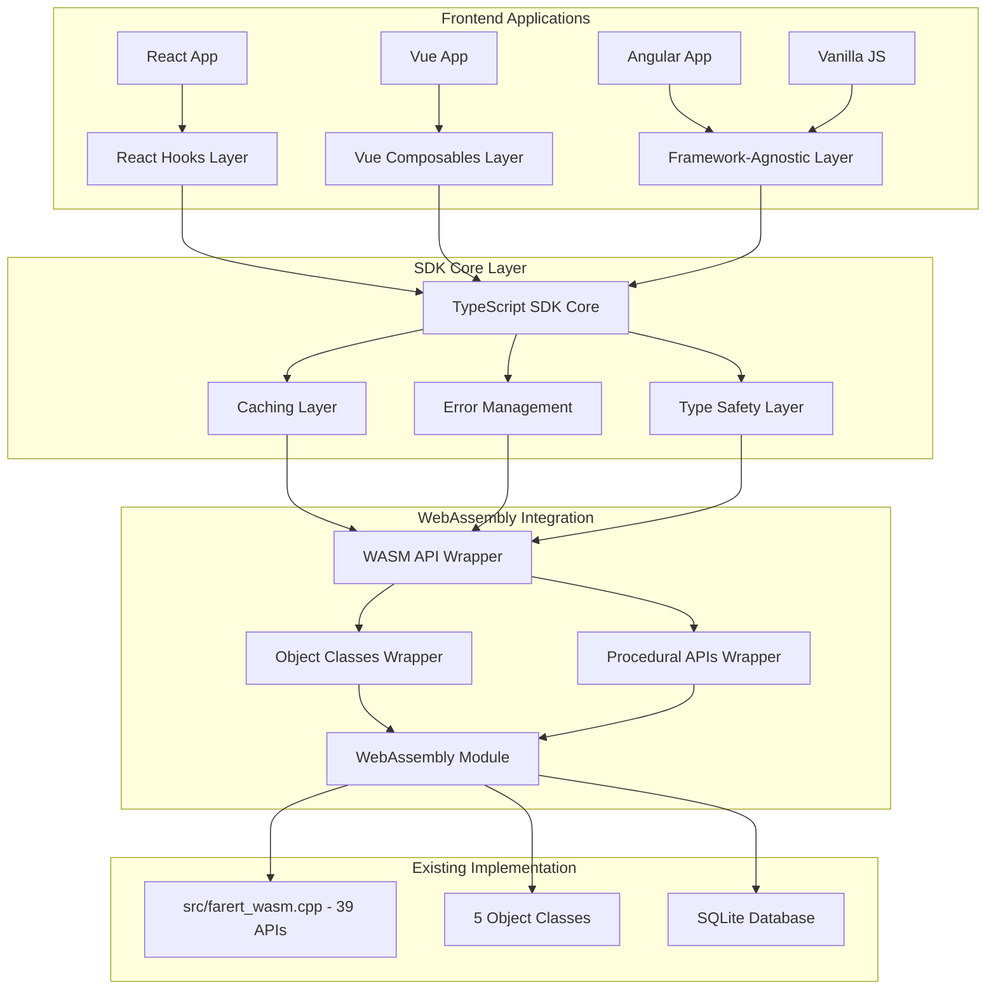
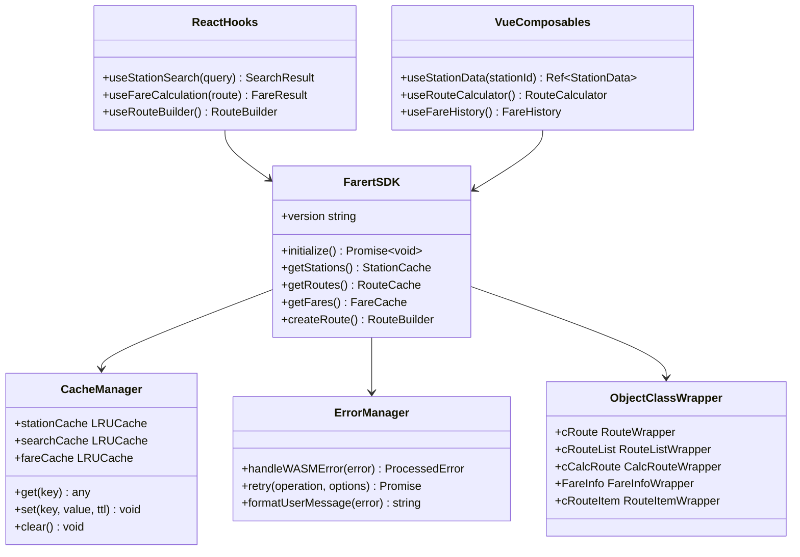

# frontend-api-layer - Task 19

Execute task 19 for the frontend-api-layer specification.

## Task Description
Create route calculator composable in src/sdk/vue/use-route-calculator.ts

## Code Reuse
**Leverage existing code**: src/sdk/utils/route-utils.ts, src/sdk/utils/fare-utils.ts

## Requirements Reference
**Requirements**: REQ-API-004

## Usage
```
/Task:19-frontend-api-layer
```

## Instructions

Execute with @spec-task-executor agent the following task: "Create route calculator composable in src/sdk/vue/use-route-calculator.ts"

```
Use the @spec-task-executor agent to implement task 19: "Create route calculator composable in src/sdk/vue/use-route-calculator.ts" for the frontend-api-layer specification and include all the below context.

# Steering Context
## Steering Documents Context

No steering documents found or all are empty.

# Specification Context
## Specification Context (Pre-loaded): frontend-api-layer

### Requirements
# Requirements Document - Frontend API Layer

## Introduction

The Frontend API Layer project creates a comprehensive, framework-agnostic JavaScript/TypeScript SDK that wraps the existing WebAssembly APIs to provide an optimized developer experience for React, Vue, and other frontend frameworks. **This layer builds upon the completed C++ migration and object class implementation** while adding caching, type safety, reactive patterns, and framework-specific integration helpers.

The project focuses on creating modern frontend development patterns around the existing 45+ WebAssembly APIs, object classes, and JSON endpoints to enable rapid development of railway fare calculation applications **while maintaining complete compatibility with the original C++ implementation results**.

## Alignment with Product Vision

This frontend API layer directly enables the project's goal of supporting modern JavaScript/TypeScript applications by:

- Providing framework-agnostic SDK that works with React, Vue, Angular, and vanilla TypeScript
- Enabling rapid development of railway fare calculation UIs and mobile applications
- Supporting the transition from C++ desktop applications to modern web-based solutions
- Creating reusable components and patterns for railway-related UI development

## Implementation Context

### Existing API Foundation

- **39 WebAssembly APIs** already implemented in `src/farert_wasm.cpp` covering all core functionality
- **JSON APIs** for frontend consumption: `getFareInfoJson()`, `getCompanyAndPrefectsAsJson()`, `getCurrentRouteAsJson()`
- **5 Object Classes** (cRouteItem, cRoute, cRouteList, cCalcRoute, FareInfo) fully functional with WebAssembly bindings
- **UI Display APIs** implemented: `getStationKana()`, `getStationPrefecture()`, `getStationNameExtended()`
- **Search and utility APIs**: Station search, company/prefecture data, route building helpers

### Current Integration Status

- TypeScript interfaces defined in `src/cli/types.ts` but focused on CLI usage
- Test coverage exists in `src/cli/test_wasm_extended.ts` for frontend APIs (B群)
- WebAssembly module loading handled by `src/cli/wasm_loader.ts`
- No framework-specific integration helpers or SDKs currently exist

## Assumptions and Constraints

### Technical Constraints

- Must build upon existing WebAssembly APIs without modifying C++ code
- Framework integrations must be optional and not require specific framework versions
- Caching layer must not interfere with real-time fare calculation requirements
- TypeScript SDK must provide complete type safety for all 39 APIs and object classes
- Error handling must gracefully handle WebAssembly module loading failures and database issues

### Business Constraints

- Cannot break existing WebAssembly API consumers (CLI, test suites, object classes)
- Database operations must be completely hidden from TypeScript interface layer as specified in CLAUDE.md
- Must support both Node.js and browser environments seamlessly
- Framework-specific features must not create vendor lock-in for developers
- API layer must be lightweight and not significantly impact bundle size for frontend applications

## Requirements

### REQ-API-001: Core TypeScript SDK Foundation

**User Story:** As a frontend developer, I want a comprehensive TypeScript SDK that wraps all WebAssembly APIs, so that I can develop applications with full type safety and modern JavaScript patterns.

#### Core SDK Acceptance Criteria

1. WHEN developer imports the SDK THEN all 39 WebAssembly APIs SHALL be available through a single, well-organized TypeScript interface
2. WHEN calling any API method THEN SDK SHALL provide complete TypeScript types for parameters and return values with JSDoc documentation
3. IF WebAssembly module loading fails THEN SDK SHALL provide clear error messages and retry mechanisms with exponential backoff
4. WHEN working with object classes (cRoute, cCalcRoute, etc.) THEN SDK SHALL provide typed wrapper classes with lifecycle management
5. IF database connection issues occur THEN SDK SHALL detect problems and provide specific guidance for resolution

### REQ-API-002: Intelligent Caching and Performance Layer

**User Story:** As a frontend developer building responsive UIs, I want intelligent caching of station data and route calculations, so that my application performs well without redundant API calls.

#### Caching Layer Acceptance Criteria

1. WHEN requesting station information (names, kana, prefectures) THEN SDK SHALL cache results for 1 hour with automatic expiration
2. WHEN searching stations by keyword THEN SDK SHALL cache search results for 15 minutes with LRU eviction strategy
3. IF route calculations are requested for identical routes THEN SDK SHALL return cached FareInfo objects for 5 minutes
4. WHEN database reference data is accessed (companies, prefectures) THEN SDK SHALL cache for entire session duration
5. IF cache memory usage exceeds 50MB THEN SDK SHALL automatically purge oldest entries using LRU algorithm

### REQ-API-003: React Integration Hooks and Components

**User Story:** As a React developer, I want custom hooks and components for railway fare calculations, so that I can quickly build responsive UIs with proper state management.

#### React Integration Acceptance Criteria

1. WHEN using `useStationSearch(query)` hook THEN it SHALL provide debounced search results with loading states and error handling
2. WHEN using `useFareCalculation(route)` hook THEN it SHALL automatically calculate fares when route changes with proper dependency tracking
3. IF using `<StationSelector>` component THEN it SHALL provide autocomplete functionality with Japanese text support and accessibility features
4. WHEN using `<RouteBuilder>` component THEN it SHALL provide drag-and-drop interface for building multi-segment routes with validation
5. IF errors occur in any hook THEN React error boundaries SHALL catch and display user-friendly error messages

### REQ-API-004: Vue Composition API Integration

**User Story:** As a Vue developer, I want composables that integrate with Vue's reactivity system, so that I can build reactive railway applications with minimal boilerplate.

#### Vue Integration Acceptance Criteria

1. WHEN using `useStationData(stationId)` composable THEN it SHALL provide reactive refs that update when stationId changes
2. WHEN using `useRouteCalculator()` composable THEN it SHALL integrate with Vue's reactivity system for automatic recalculation
3. IF using `useFareHistory()` composable THEN it SHALL maintain reactive history of fare calculations with undo/redo functionality
4. WHEN building forms with `useStationValidator()` THEN it SHALL provide reactive validation with Japanese text support
5. IF WebAssembly loading state changes THEN all composables SHALL update their loading states reactively

### REQ-API-005: Framework-Agnostic Utilities and Helpers

**User Story:** As a developer using any JavaScript framework or vanilla JS, I want utility functions and helpers for common railway data operations, so that I can integrate fare calculations regardless of my framework choice.

#### Utilities Acceptance Criteria

1. WHEN formatting station names for display THEN utility functions SHALL handle Japanese characters correctly with proper fallbacks
2. WHEN validating route connections THEN helper functions SHALL provide detailed validation results with suggestions for fixes
3. IF building route strings programmatically THEN utilities SHALL support fluent API patterns for complex route construction
4. WHEN handling fare calculation results THEN formatters SHALL provide localized currency display and breakdown information
5. IF integrating with non-React/Vue frameworks THEN utilities SHALL work in Angular, Svelte, or vanilla JavaScript environments

### REQ-API-006: Development Experience and Documentation

**User Story:** As a developer learning to use the railway APIs, I want comprehensive documentation with examples, so that I can quickly understand and implement fare calculation features.

#### Documentation Acceptance Criteria

1. WHEN developer accesses SDK documentation THEN it SHALL include complete API reference with examples for React, Vue, and vanilla JS
2. WHEN learning framework integration THEN guides SHALL provide step-by-step tutorials for common use cases with realistic Japanese station data
3. IF developer encounters integration issues THEN troubleshooting guides SHALL cover common problems with specific solutions
4. WHEN exploring advanced features THEN documentation SHALL include examples for multi-company routes, special fare rules, and complex scenarios
5. IF seeking performance guidance THEN documentation SHALL provide best practices for caching, bundle optimization, and memory management

---

## Non-Functional Requirements

### Performance

- SDK initialization SHALL complete within 2 seconds in browser environments on 3G connections
- Cached API calls SHALL respond within 10ms for station lookups and reference data
- Route calculations SHALL complete within 500ms for routes up to 10 stations including network overhead
- Bundle size for framework integrations SHALL not exceed 150KB gzipped including all dependencies

### Security

- SDK SHALL not expose WebAssembly memory directly to prevent unauthorized access to calculation internals
- API keys or authentication tokens SHALL be handled securely without logging sensitive information
- Error messages SHALL not reveal internal C++ implementation details or database schema information
- Input validation SHALL prevent injection attacks through station names or route parameters

### Reliability

- SDK SHALL handle WebAssembly module crashes gracefully without affecting the entire application
- Network failures SHALL trigger automatic retry with exponential backoff up to 3 attempts
- Memory leaks SHALL be prevented through proper cleanup of WebAssembly resources and event listeners
- Framework integrations SHALL not interfere with framework-specific development tools or hot reloading

### Usability

- TypeScript IntelliSense SHALL provide helpful autocomplete for all API methods with parameter hints
- Error messages SHALL be developer-friendly with actionable suggestions and links to documentation
- Japanese text SHALL be handled correctly across all browsers with proper encoding and display
- Framework integrations SHALL follow each framework's conventions and best practices consistently

---

### Design
# Design Document - Frontend API Layer

## Overview

The Frontend API Layer provides a comprehensive, framework-agnostic TypeScript SDK that wraps the existing 39 WebAssembly APIs and 5 Object Classes to enable rapid development of railway fare calculation applications in React, Vue, Angular, and vanilla JavaScript environments.

### Project Goals
- Create a unified TypeScript SDK wrapping all WebAssembly functionality
- Implement intelligent caching for optimal performance
- Provide React hooks and Vue composables for framework integration
- Ensure framework-agnostic utilities for broad compatibility
- Maintain type safety and excellent developer experience

## Steering Document Alignment

This design aligns with CLAUDE.md requirements by:
- Building upon the existing 39 WebAssembly APIs in `src/farert_wasm.cpp`
- Leveraging 5 Object Classes (cRouteItem, cRoute, cRouteList, cCalcRoute, FareInfo)
- Hiding database operations from TypeScript interface layer
- Supporting modern JavaScript/TypeScript application development
- Enabling transition from C++ desktop to web-based solutions

## Code Reuse Analysis

### Existing Foundation
- **WebAssembly APIs**: 39 functions already implemented in `src/farert_wasm.cpp`
- **TypeScript Interfaces**: Basic definitions in `src/cli/types.ts`
- **WASM Loader**: Module loading infrastructure in `src/cli/wasm_loader.ts`
- **Object Classes**: 5 classes with WebAssembly bindings already functional
- **JSON APIs**: Frontend-ready APIs like `getFareInfoJson()`, `getCompanyAndPrefectsAsJson()`

### Reusable Components
- WebAssembly module initialization patterns
- Error handling structures from CLI implementation
- TypeScript interface patterns from existing `types.ts`
- Test infrastructure from `src/cli/test_wasm_extended.ts`

## Architecture

### System Architecture



### SDK Core Architecture



## Components and Interfaces

### Core SDK Interface

```typescript
// Core SDK Interface
export interface FarertSDK {
  // Initialization
  initialize(): Promise<void>;
  isReady(): boolean;
  version: string;
  
  // Station Operations with Caching
  getStationById(id: number): Promise<Station>;
  getStationByName(name: string): Promise<Station>;
  searchStations(query: string, limit?: number): Promise<Station[]>;
  getStationKana(id: number): Promise<string>;
  getStationPrefecture(id: number): Promise<string>;
  
  // Route Operations
  createRoute(): RouteBuilder;
  validateRoute(route: RouteInput): ValidationResult;
  calculateFare(route: RouteInput): Promise<FareInfo>;
  
  // Reference Data (Long-term Cached)
  getCompanies(): Promise<Company[]>;
  getPrefectures(): Promise<Prefecture[]>;
  getLines(): Promise<Line[]>;
  
  // Object Classes
  objectClasses: {
    RouteList: typeof cRouteList;
    Route: typeof cRoute;
    CalcRoute: typeof cCalcRoute;
    FareInfo: typeof FareInfo;
    RouteItem: typeof cRouteItem;
  };
}
```

### Enhanced Object Class Interfaces

```typescript
// Enhanced cRoute with Fluent API
export interface cRoute extends cRouteList {
  setupRoute(route: string): cRoute;
  addStation(stationId: number): cRoute;
  addLine(lineId: number): cRoute;
  validateRoute(): ValidationResult;
  optimizeRoute(criteria: 'shortest' | 'cheapest'): cRoute;
  getAlternatives(): cRoute[];
  clone(): cRoute;
}

// Enhanced cRouteItem with Full Properties
export interface cRouteItem {
  fare: number;
  salesKm: number;
  indexOfAggregate: number;
  stationId: number;
  lineId: number;
  companyId: number;
  toJSON(): RouteItemJSON;
}

// Enhanced cRouteList with Array Operations
export interface cRouteList {
  at(index: number): cRouteItem;
  count(): number;
  remove(index: number): cRouteItem;
  removeAll(): void;
  insert(obj: cRouteList, at: number): void;
  assign(obj: cRouteList): void;
  forEach(callback: (item: cRouteItem, index: number) => void): void;
  map<T>(callback: (item: cRouteItem, index: number) => T): T[];
  toArray(): cRouteItem[];
}

// Enhanced FareInfo with Comprehensive Data
export interface FareInfo {
  fare: number;
  result: number;
  isRule114Applied: boolean;
  availCountForFareOfStockDiscount: number;
  
  // Enhanced capabilities
  getBreakdown(): FareBreakdown;
  getRouteString(): string;
  getDiscounts(): Discount[];
  compareWith(other: FareInfo): FareComparison;
  exportHistory(): CalculationHistory;
  toJSON(): FareInfoJSON;
}
```

### Caching Layer Design

```typescript
// Intelligent Caching System
export interface CacheManager {
  // Station data - 1 hour TTL
  stationCache: LRUCache<number, Station>;
  
  // Search results - 15 minutes TTL  
  searchCache: LRUCache<string, Station[]>;
  
  // Fare calculations - 5 minutes TTL
  fareCache: LRUCache<string, FareInfo>;
  
  // Reference data - Session duration
  referenceCache: Map<string, Company[] | Prefecture[] | Line[]>;
  
  // Configuration
  maxMemoryUsage: number; // 50MB limit
  
  // Methods
  get<T>(key: string, category: CacheCategory): T | undefined;
  set<T>(key: string, value: T, category: CacheCategory): void;
  invalidate(pattern?: string): void;
  getStats(): CacheStats;
}

// LRU Cache with TTL
export interface LRUCache<K, V> {
  get(key: K): V | undefined;
  set(key: K, value: V, ttlMs?: number): void;
  delete(key: K): boolean;
  clear(): void;
  size: number;
  maxSize: number;
}
```

### React Integration Layer

```typescript
// React Hooks
export function useStationSearch(query: string, options?: SearchOptions) {
  return {
    stations: Station[],
    loading: boolean,
    error: Error | null,
    hasMore: boolean,
    loadMore: () => void
  };
}

export function useFareCalculation(route: RouteInput, options?: CalcOptions) {
  return {
    fareInfo: FareInfo | null,
    loading: boolean,
    error: Error | null,
    recalculate: () => void,
    history: FareInfo[]
  };
}

export function useRouteBuilder(initialRoute?: RouteInput) {
  return {
    route: cRoute,
    isValid: boolean,
    validationErrors: ValidationError[],
    addStation: (stationId: number) => void,
    removeStation: (index: number) => void,
    clear: () => void,
    undo: () => void,
    redo: () => void
  };
}

// React Components
export const StationSelector: React.FC<StationSelectorProps>;
export const RouteBuilder: React.FC<RouteBuilderProps>;
export const FareDisplay: React.FC<FareDisplayProps>;
```

### Vue Composition API Layer

```typescript
// Vue Composables
export function useStationData(stationId: Ref<number>) {
  return {
    station: Ref<Station | null>,
    loading: Ref<boolean>,
    error: Ref<Error | null>,
    refresh: () => Promise<void>
  };
}

export function useRouteCalculator() {
  return {
    route: Ref<cRoute>,
    fareInfo: Ref<FareInfo | null>,
    loading: Ref<boolean>,
    calculate: () => Promise<void>,
    isValid: ComputedRef<boolean>
  };
}

export function useFareHistory() {
  return {
    history: Ref<FareInfo[]>,
    current: Ref<number>,
    canUndo: ComputedRef<boolean>,
    canRedo: ComputedRef<boolean>,
    undo: () => void,
    redo: () => void,
    clear: () => void
  };
}
```

## Data Models

### Station Data Model

```typescript
export interface Station {
  id: number;
  name: string;
  kana: string;
  prefecture: string;
  prefectureId: number;
  lines: Line[];
  isJunction: boolean;
  attributes: StationAttributes;
}

export interface StationAttributes {
  isTerminal: boolean;
  isSpecificJunction: boolean;
  companyBoundaries: number[];
  fareZones: FareZone[];
}
```

### Route Data Models

```typescript
export interface RouteInput {
  stations: number[];
  lines: number[];
  options?: RouteOptions;
}

export interface RouteOptions {
  preferFastRoute: boolean;
  preferCheapRoute: boolean;
  avoidLines?: number[];
  maxTransfers?: number;
}

export interface ValidationResult {
  isValid: boolean;
  errors: ValidationError[];
  warnings: ValidationWarning[];
  suggestions: RouteSuggestion[];
}
```

### Fare Data Models

```typescript
export interface FareBreakdown {
  basicFare: number;
  expressCharges: number[];
  taxes: number;
  discounts: Discount[];
  total: number;
  breakdown: FareSegment[];
}

export interface FareSegment {
  fromStation: number;
  toStation: number;
  company: number;
  distance: number;
  fare: number;
  rules: FareRule[];
}
```

## Error Handling

### Error Classification System

```typescript
// Error Types with Specific Codes
export enum ErrorCode {
  // WebAssembly Errors (WASM_001-099)
  WASM_MODULE_LOAD_FAILED = 'WASM_001',
  WASM_MEMORY_ALLOCATION = 'WASM_002',
  WASM_FUNCTION_NOT_FOUND = 'WASM_003',
  
  // Database Errors (DB_001-099)
  DATABASE_CONNECTION_FAILED = 'DB_001',
  DATABASE_QUERY_FAILED = 'DB_002',
  DATABASE_CORRUPTION = 'DB_003',
  
  // Route Errors (ROUTE_001-099)
  INVALID_STATION_NAME = 'ROUTE_001',
  INVALID_LINE_CONNECTION = 'ROUTE_002',
  ROUTE_CALCULATION_FAILED = 'ROUTE_003',
  
  // Cache Errors (CACHE_001-099)
  CACHE_MEMORY_EXCEEDED = 'CACHE_001',
  CACHE_CORRUPTION = 'CACHE_002'
}

export interface ProcessedError {
  code: ErrorCode;
  message: string;
  userMessage: string;
  suggestions: string[];
  retryable: boolean;
  context: ErrorContext;
}
```

### Retry Mechanism Design

```typescript
export interface RetryOptions {
  maxAttempts: number;
  backoffMultiplier: number;
  initialDelayMs: number;
  maxDelayMs: number;
  retryableErrors: ErrorCode[];
}

export class ErrorManager {
  async retry<T>(
    operation: () => Promise<T>,
    options: RetryOptions
  ): Promise<T> {
    // Exponential backoff retry logic
    // Error classification and user message generation
    // Context preservation for debugging
  }
}
```

## Testing Strategy

### Unit Testing Approach

```typescript
// Core SDK Unit Tests
describe('FarertSDK', () => {
  test('initializes WebAssembly module successfully');
  test('handles WebAssembly loading failures gracefully');
  test('provides correct TypeScript types for all APIs');
});

// Caching Layer Tests
describe('CacheManager', () => {
  test('LRU eviction works correctly under memory pressure');
  test('TTL expiration removes stale data');
  test('cache statistics are accurate');
});

// Object Classes Tests
describe('Object Classes', () => {
  test('cRoute fluent API chains correctly');
  test('cRouteList array operations match expected behavior');
  test('FareInfo provides accurate fare breakdowns');
});
```

### Integration Testing Strategy

```typescript
// Framework Integration Tests
describe('React Integration', () => {
  test('useStationSearch debounces correctly');
  test('useFareCalculation updates on route changes');
  test('error boundaries catch WebAssembly failures');
});

describe('Vue Integration', () => {
  test('composables integrate with Vue reactivity system');
  test('reactive refs update automatically');
  test('cleanup prevents memory leaks');
});
```

### Performance Testing

```typescript
// Performance Benchmarks
describe('Performance Requirements', () => {
  test('SDK initialization completes within 2 seconds');
  test('cached API calls respond within 10ms');
  test('route calculations complete within 500ms');
  test('bundle size does not exceed 150KB gzipped');
});
```

### Cross-Platform Testing

```typescript
// Browser Compatibility Tests
describe('Cross-Platform', () => {
  test('works in Chrome 90+');
  test('works in Firefox 88+');
  test('works in Safari 14+');
  test('Node.js 14+ compatibility');
});
```

## Implementation Plan

### Phase 1: Core SDK Foundation (Week 1-2)
1. Create TypeScript SDK wrapper around existing 39 WebAssembly APIs
2. Implement basic caching layer with LRU and TTL
3. Enhanced Object Classes with array operations and fluent API
4. Comprehensive error handling with retry mechanisms

### Phase 2: Framework Integration (Week 3-4)
5. React hooks implementation with proper state management
6. Vue composables with reactivity integration
7. Framework-agnostic utilities for Angular/Svelte
8. Bundle optimization and lazy loading

### Phase 3: Developer Experience (Week 5-6)
9. Complete TypeScript types and JSDoc documentation
10. Performance monitoring and optimization
11. Comprehensive testing suite
12. Documentation and examples

### Phase 4: Production Readiness (Week 7)
13. Security audit and input validation
14. Memory leak testing and prevention
15. Cross-browser compatibility testing
16. Performance benchmarking and optimization

This design provides a comprehensive foundation for creating a high-quality Frontend API Layer that enables rapid development of railway fare calculation applications across all major JavaScript frameworks while maintaining excellent performance and developer experience.

**Note**: Specification documents have been pre-loaded. Do not use get-content to fetch them again.

## Task Details
- Task ID: 19
- Description: Create route calculator composable in src/sdk/vue/use-route-calculator.ts
- Leverage: src/sdk/utils/route-utils.ts, src/sdk/utils/fare-utils.ts
- Requirements: REQ-API-004

## Instructions
- Implement ONLY task 19: "Create route calculator composable in src/sdk/vue/use-route-calculator.ts"
- Follow all project conventions and leverage existing code
- Mark the task as complete using: claude-code-spec-workflow get-tasks frontend-api-layer 19 --mode complete
- Provide a completion summary
```

## Task Completion
When the task is complete, mark it as done:
```bash
claude-code-spec-workflow get-tasks frontend-api-layer 19 --mode complete
```

## Next Steps
After task completion, you can:
- Execute the next task using /frontend-api-layer-task-[next-id]
- Check overall progress with /spec-status frontend-api-layer
