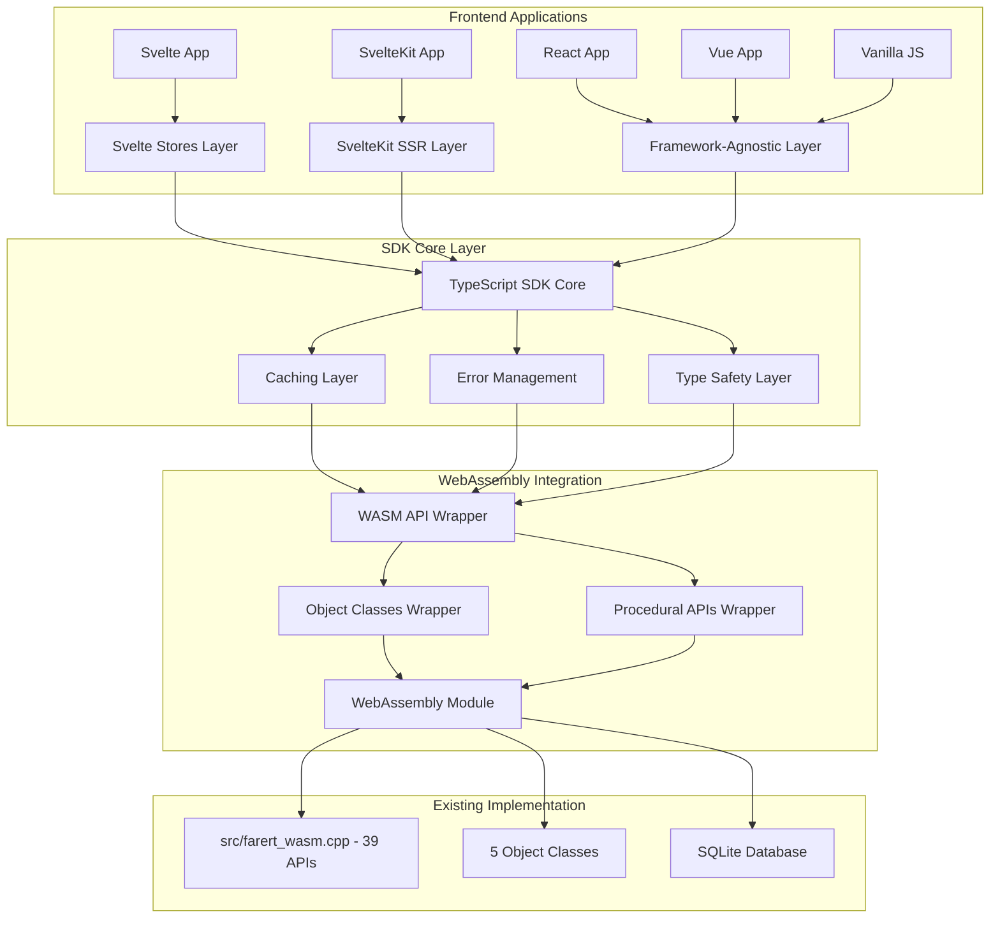
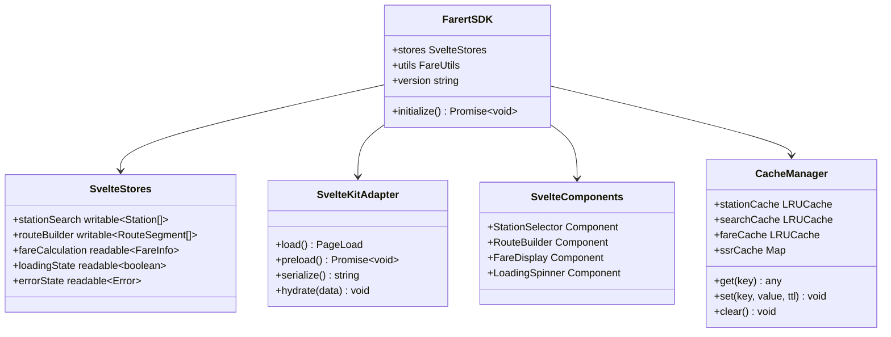

# frontend-api-layer - Task 38

Execute task 38 for the frontend-api-layer specification.

## Task Description
Create memory leak prevention in src/sdk/core/memory-manager.ts

## Code Reuse
**Leverage existing code**: WebAssembly memory management patterns

## Requirements Reference
**Requirements**: Reliability requirements

## Usage
```
/Task:38-frontend-api-layer
```

## Instructions

Execute with @spec-task-executor agent the following task: "Create memory leak prevention in src/sdk/core/memory-manager.ts"

```
Use the @spec-task-executor agent to implement task 38: "Create memory leak prevention in src/sdk/core/memory-manager.ts" for the frontend-api-layer specification and include all the below context.

# Steering Context
## Steering Documents Context

No steering documents found or all are empty.

# Specification Context
## Specification Context (Pre-loaded): frontend-api-layer

### Requirements
# Requirements Document - Frontend API Layer (Svelte Focus)

## Introduction

The Frontend API Layer project creates a comprehensive, Svelte-first JavaScript/TypeScript SDK that wraps the existing WebAssembly APIs to provide an optimized developer experience for Svelte/SvelteKit applications with secondary support for other frontend frameworks. **This layer builds upon the completed C++ migration and object class implementation** while adding caching, type safety, reactive patterns, and Svelte-specific integration helpers.

The project focuses on creating modern Svelte development patterns around the existing 45+ WebAssembly APIs, object classes, and JSON endpoints to enable rapid development of railway fare calculation applications **while maintaining complete compatibility with the original C++ implementation results**.

## Alignment with Product Vision

This frontend API layer directly enables the project's goal of supporting modern JavaScript/TypeScript applications by:

- Providing Svelte-first SDK with reactive stores and components
- Enabling rapid development of railway fare calculation UIs and SvelteKit applications  
- Supporting the transition from C++ desktop applications to modern web-based solutions
- Creating reusable Svelte components and patterns for railway-related UI development
- Offering framework-agnostic utilities for React, Vue, Angular as secondary targets

## Implementation Context

### Existing API Foundation

- **39+ WebAssembly APIs** already implemented in `src/farert_wasm.cpp` covering all core functionality
- **JSON APIs** for frontend consumption: `getFareInfoJson()`, `getCompanyAndPrefectsAsJson()`, `getCurrentRouteAsJson()`
- **6 Object Classes** (cRouteItem, cRoute, cRouteList, cCalcRoute, FareInfo, cRouteFlag) fully functional with WebAssembly bindings
- **UI Display APIs** implemented: `getStationKana()`, `getStationPrefecture()`, `getStationNameExtended()`
- **Search and utility APIs**: Station search, company/prefecture data, route building helpers

### Current Integration Status

- TypeScript interfaces defined in `src/cli/types.ts` but focused on CLI usage
- Test coverage exists in `src/cli/test_wasm_extended.ts` for frontend APIs (B群)
- WebAssembly module loading handled by `src/cli/wasm_loader.ts`
- No framework-specific integration helpers or SDKs currently exist

## Assumptions and Constraints

### Technical Constraints

- Must build upon existing WebAssembly APIs without modifying C++ code
- Framework integrations must be optional and not require specific framework versions
- Caching layer must not interfere with real-time fare calculation requirements
- TypeScript SDK must provide complete type safety for all 39 APIs and object classes
- Error handling must gracefully handle WebAssembly module loading failures and database issues

### Business Constraints

- Cannot break existing WebAssembly API consumers (CLI, test suites, object classes)
- Database operations must be completely hidden from TypeScript interface layer as specified in CLAUDE.md
- Must support both Node.js and browser environments seamlessly
- Framework-specific features must not create vendor lock-in for developers
- API layer must be lightweight and not significantly impact bundle size for frontend applications

## Requirements

### REQ-API-001: Core TypeScript SDK Foundation

**User Story:** As a frontend developer, I want a comprehensive TypeScript SDK that wraps all WebAssembly APIs, so that I can develop applications with full type safety and modern JavaScript patterns.

#### Core SDK Acceptance Criteria

1. WHEN developer imports the SDK THEN all 39+ WebAssembly APIs SHALL be available through a single, well-organized TypeScript interface
2. WHEN calling any API method THEN SDK SHALL provide complete TypeScript types for parameters and return values with JSDoc documentation
3. IF WebAssembly module loading fails THEN SDK SHALL provide clear error messages and retry mechanisms with exponential backoff
4. WHEN working with object classes (cRoute, cCalcRoute, cRouteFlag, etc.) THEN SDK SHALL provide typed wrapper classes with lifecycle management
5. IF database connection issues occur THEN SDK SHALL detect problems and provide specific guidance for resolution

### REQ-API-002: Intelligent Caching and Performance Layer

**User Story:** As a frontend developer building responsive UIs, I want intelligent caching of station data and route calculations, so that my application performs well without redundant API calls.

#### Caching Layer Acceptance Criteria

1. WHEN requesting station information (names, kana, prefectures) THEN SDK SHALL cache results for 1 hour with automatic expiration
2. WHEN searching stations by keyword THEN SDK SHALL cache search results for 15 minutes with LRU eviction strategy
3. IF route calculations are requested for identical routes THEN SDK SHALL return cached FareInfo objects for 5 minutes
4. WHEN database reference data is accessed (companies, prefectures) THEN SDK SHALL cache for entire session duration
5. IF cache memory usage exceeds 50MB THEN SDK SHALL automatically purge oldest entries using LRU algorithm

### REQ-API-003: Svelte Reactive Stores and Components

**User Story:** As a Svelte developer, I want reactive stores and components for railway fare calculations, so that I can quickly build responsive UIs with Svelte's reactivity system.

#### Svelte Integration Acceptance Criteria

1. WHEN using `stationSearchStore(query)` THEN it SHALL provide debounced search results with reactive loading states and error handling
2. WHEN using `fareCalculationStore` THEN it SHALL automatically calculate fares when route changes with proper Svelte reactivity
3. IF using `<StationSelector>` component THEN it SHALL provide autocomplete functionality with Japanese text support and accessibility features  
4. WHEN using `<RouteBuilder>` component THEN it SHALL provide drag-and-drop interface for building multi-segment routes with validation
5. IF errors occur in any store THEN Svelte error boundaries SHALL catch and display user-friendly error messages

### REQ-API-004: SvelteKit SSR and Hydration Support

**User Story:** As a SvelteKit developer, I want server-side rendering support for railway data, so that I can build SEO-friendly applications with fast initial loading.

#### SvelteKit Integration Acceptance Criteria

1. WHEN using `load` functions THEN SDK SHALL provide server-side station data loading with proper hydration
2. WHEN building SvelteKit pages THEN stores SHALL properly serialize/deserialize state during SSR
3. IF using SvelteKit routing THEN route calculations SHALL work in both server and client environments
4. WHEN deploying to static adapters THEN SDK SHALL support static site generation for reference data
5. IF WebAssembly loading occurs during SSR THEN proper fallbacks SHALL be provided for Node.js environments

### REQ-API-005: Framework-Agnostic Utilities and Helpers

**User Story:** As a developer using any JavaScript framework or vanilla JS, I want utility functions and helpers for common railway data operations, so that I can integrate fare calculations regardless of my framework choice.

#### Utilities Acceptance Criteria

1. WHEN formatting station names for display THEN utility functions SHALL handle Japanese characters correctly with proper fallbacks
2. WHEN validating route connections THEN helper functions SHALL provide detailed validation results with suggestions for fixes
3. IF building route strings programmatically THEN utilities SHALL support fluent API patterns for complex route construction
4. WHEN handling fare calculation results THEN formatters SHALL provide localized currency display and breakdown information
5. IF integrating with non-Svelte frameworks THEN utilities SHALL work in React, Vue, Angular, or vanilla JavaScript environments

### REQ-API-006: Development Experience and Documentation

**User Story:** As a developer learning to use the railway APIs, I want comprehensive documentation with examples, so that I can quickly understand and implement fare calculation features.

#### Documentation Acceptance Criteria

1. WHEN developer accesses SDK documentation THEN it SHALL include complete API reference with examples for Svelte, SvelteKit, and vanilla JS
2. WHEN learning framework integration THEN guides SHALL provide step-by-step tutorials for common use cases with realistic Japanese station data
3. IF developer encounters integration issues THEN troubleshooting guides SHALL cover common problems with specific solutions
4. WHEN exploring advanced features THEN documentation SHALL include examples for multi-company routes, special fare rules, and complex scenarios
5. IF seeking performance guidance THEN documentation SHALL provide best practices for caching, bundle optimization, and memory management

---

## Non-Functional Requirements

### Performance

- SDK initialization SHALL complete within 2 seconds in browser environments on 3G connections
- Cached API calls SHALL respond within 10ms for station lookups and reference data
- Route calculations SHALL complete within 500ms for routes up to 10 stations including network overhead
- Bundle size for framework integrations SHALL not exceed 150KB gzipped including all dependencies

### Security

- SDK SHALL not expose WebAssembly memory directly to prevent unauthorized access to calculation internals
- API keys or authentication tokens SHALL be handled securely without logging sensitive information
- Error messages SHALL not reveal internal C++ implementation details or database schema information
- Input validation SHALL prevent injection attacks through station names or route parameters

### Reliability

- SDK SHALL handle WebAssembly module crashes gracefully without affecting the entire application
- Network failures SHALL trigger automatic retry with exponential backoff up to 3 attempts
- Memory leaks SHALL be prevented through proper cleanup of WebAssembly resources and event listeners
- Framework integrations SHALL not interfere with framework-specific development tools or hot reloading

### Usability

- TypeScript IntelliSense SHALL provide helpful autocomplete for all API methods with parameter hints
- Error messages SHALL be developer-friendly with actionable suggestions and links to documentation
- Japanese text SHALL be handled correctly across all browsers with proper encoding and display
- Framework integrations SHALL follow each framework's conventions and best practices consistently

---

### Design
# Design Document - Frontend API Layer (Svelte Focus)

## Overview

The Frontend API Layer provides a comprehensive, Svelte-first TypeScript SDK that wraps the existing 39 WebAssembly APIs and 5 Object Classes to enable rapid development of railway fare calculation applications in Svelte/SvelteKit environments with secondary support for other frameworks.

### Project Goals
- Create a unified TypeScript SDK wrapping all WebAssembly functionality
- Implement intelligent caching for optimal performance
- Provide Svelte stores and components for reactive framework integration
- Implement SvelteKit SSR and static generation support
- Ensure framework-agnostic utilities for broad compatibility
- Maintain type safety and excellent developer experience

## Steering Document Alignment

This design aligns with CLAUDE.md requirements by:
- Building upon the existing 39+ WebAssembly APIs in `src/farert_wasm.cpp`
- Leveraging 6 Object Classes (cRouteItem, cRoute, cRouteList, cCalcRoute, FareInfo, cRouteFlag)
- Hiding database operations from TypeScript interface layer
- Supporting modern JavaScript/TypeScript application development
- Enabling transition from C++ desktop to web-based solutions

## Code Reuse Analysis

### Existing Foundation
- **WebAssembly APIs**: 39+ functions already implemented in `src/farert_wasm.cpp`
- **TypeScript Interfaces**: Basic definitions in `src/cli/types.ts`
- **WASM Loader**: Module loading infrastructure in `src/cli/wasm_loader.ts`
- **Object Classes**: 6 classes with WebAssembly bindings already functional
- **JSON APIs**: Frontend-ready APIs like `getFareInfoJson()`, `getCompanyAndPrefectsAsJson()`

### Reusable Components
- WebAssembly module initialization patterns
- Error handling structures from CLI implementation
- TypeScript interface patterns from existing `types.ts`
- Test infrastructure from `src/cli/test_wasm_extended.ts`

## Architecture

### System Architecture



### Svelte-First Architecture



## Components and Interfaces

### Core SDK Interface

```typescript
// Core SDK Interface for Svelte
export interface FarertSDK {
  // Initialization
  initialize(): Promise<void>;
  isReady(): boolean;
  version: string;
  
  // Svelte Stores
  stores: {
    stationSearch: Writable<StationSearchState>;
    routeBuilder: Writable<RouteBuilderState>;
    fareCalculation: Readable<FareCalculationState>;
    referenceData: Readable<ReferenceDataState>;
    loading: Readable<boolean>;
    error: Readable<Error | null>;
  };
  
  // Station Operations with Caching
  getStationById(id: number): Promise<Station>;
  getStationByName(name: string): Promise<Station>;
  searchStations(query: string, limit?: number): Promise<Station[]>;
  
  // Route Operations
  createRoute(): RouteBuilder;
  validateRoute(route: RouteInput): ValidationResult;
  calculateFare(route: RouteInput): Promise<FareInfo>;
  
  // Reference Data (Long-term Cached)
  getCompanies(): Promise<Company[]>;
  getPrefectures(): Promise<Prefecture[]>;
  getLines(): Promise<Line[]>;
  
  // SvelteKit Integration
  sveltekit: SvelteKitAdapter;
  
  // Object Classes
  objectClasses: {
    RouteList: typeof cRouteList;
    Route: typeof cRoute;
    CalcRoute: typeof cCalcRoute;
    FareInfo: typeof FareInfo;
    RouteItem: typeof cRouteItem;
    RouteFlag: typeof cRouteFlag;
  };
}
```

### Svelte Store Definitions

```typescript
// Svelte Store State Interfaces
export interface StationSearchState {
  query: string;
  results: Station[];
  loading: boolean;
  error: Error | null;
  hasMore: boolean;
}

export interface RouteBuilderState {
  segments: RouteSegment[];
  isValid: boolean;
  validationErrors: ValidationError[];
  dragState: DragState;
  history: RouteCommand[];
  historyIndex: number;
}

export interface FareCalculationState {
  route: RouteInput | null;
  result: FareInfo | null;
  loading: boolean;
  error: Error | null;
  calculationHistory: FareCalculationHistory[];
}

export interface ReferenceDataState {
  companies: Company[];
  prefectures: Prefecture[];
  lines: Line[];
  lastUpdated: Date;
  loading: boolean;
}
```

### SvelteKit Adapter Interface

```typescript
// SvelteKit SSR and Static Generation Support
export interface SvelteKitAdapter {
  // Page Load Functions
  loadStations(): PageLoad;
  loadStation(params: { id: string }): PageLoad;
  loadRoute(params: { from: string; to: string }): PageLoad;
  
  // Static Generation
  preloadAllStations(): Promise<void>;
  preloadPopularRoutes(): Promise<void>;
  
  // State Serialization
  serializeState(): string;
  hydrateState(serialized: string): void;
  
  // Server-Side Utilities
  isServer(): boolean;
  getBrowserSupport(): BrowserSupport;
}

// SvelteKit Page Load Function Types
export type PageLoad = () => Promise<{
  stations?: Station[];
  routes?: RouteInfo[];
  fare?: FareInfo;
  error?: string;
}>;
```

### Svelte Component Interfaces

```typescript
// Svelte Component Props
export interface StationSelectorProps {
  placeholder?: string;
  maxResults?: number;
  showPrefecture?: boolean;
  showKana?: boolean;
  onSelect?: (station: Station) => void;
  class?: string;
}

export interface RouteBuilderProps {
  initialRoute?: RouteSegment[];
  maxStations?: number;
  enableDragDrop?: boolean;
  enableUndo?: boolean;
  onRouteChange?: (route: RouteSegment[]) => void;
  class?: string;
}

export interface FareDisplayProps {
  fareInfo: FareInfo;
  showBreakdown?: boolean;
  showHistory?: boolean;
  currency?: 'JPY' | 'USD';
  class?: string;
}
```

## Data Models

### Station and Route Models

```typescript
export interface Station {
  id: number;
  name: string;
  kana: string;
  prefecture: string;
  prefectureId: number;
  lines: Line[];
  isJunction: boolean;
  attributes: StationAttributes;
}

export interface RouteSegment {
  stationId: number;
  stationName: string;
  lineId?: number;
  lineName?: string;
  order: number;
  isValid: boolean;
}

export interface RouteInput {
  segments: RouteSegment[];
  options?: RouteOptions;
}

export interface RouteOptions {
  preferFastRoute: boolean;
  preferCheapRoute: boolean;
  avoidLines?: number[];
  maxTransfers?: number;
}
```

### Svelte-Specific State Models

```typescript
export interface DragState {
  isDragging: boolean;
  draggedIndex: number | null;
  dropTargetIndex: number | null;
  draggedItem: RouteSegment | null;
}

export interface RouteCommand {
  id: string;
  type: 'add' | 'remove' | 'move' | 'clear';
  timestamp: number;
  description: string;
  execute: () => void;
  undo: () => void;
}

export interface FareCalculationHistory {
  id: string;
  timestamp: Date;
  route: RouteInput;
  result: FareInfo;
  executionTime: number;
}
```

## Svelte Store Implementation

### Core Store Factory

```typescript
// Core Svelte Store Factory
export function createFarertStores(sdk: FarertSDK) {
  // Station Search Store with Debouncing
  const stationSearchStore = (() => {
    const { subscribe, set, update } = writable<StationSearchState>({
      query: '',
      results: [],
      loading: false,
      error: null,
      hasMore: false
    });

    let searchTimeout: NodeJS.Timeout;
    
    return {
      subscribe,
      search: (query: string) => {
        clearTimeout(searchTimeout);
        update(state => ({ ...state, query, loading: true }));
        
        searchTimeout = setTimeout(async () => {
          try {
            const results = await sdk.searchStations(query, 20);
            update(state => ({
              ...state,
              results,
              loading: false,
              error: null,
              hasMore: results.length === 20
            }));
          } catch (error) {
            update(state => ({
              ...state,
              loading: false,
              error: error as Error
            }));
          }
        }, 300);
      },
      clear: () => set({
        query: '',
        results: [],
        loading: false,
        error: null,
        hasMore: false
      })
    };
  })();

  // Route Builder Store with Undo/Redo
  const routeBuilderStore = (() => {
    const { subscribe, set, update } = writable<RouteBuilderState>({
      segments: [],
      isValid: false,
      validationErrors: [],
      dragState: {
        isDragging: false,
        draggedIndex: null,
        dropTargetIndex: null,
        draggedItem: null
      },
      history: [],
      historyIndex: -1
    });

    const executeCommand = (command: RouteCommand) => {
      update(state => {
        const newHistory = state.history.slice(0, state.historyIndex + 1);
        newHistory.push(command);
        
        command.execute();
        
        return {
          ...state,
          history: newHistory,
          historyIndex: newHistory.length - 1
        };
      });
    };

    return {
      subscribe,
      addStation: (station: Station, lineId?: number) => {
        const command: RouteCommand = {
          id: generateId(),
          type: 'add',
          timestamp: Date.now(),
          description: `Add ${station.name}`,
          execute: () => {
            update(state => ({
              ...state,
              segments: [...state.segments, {
                stationId: station.id,
                stationName: station.name,
                lineId,
                lineName: lineId ? getLineName(lineId) : undefined,
                order: state.segments.length,
                isValid: true
              }]
            }));
          },
          undo: () => {
            update(state => ({
              ...state,
              segments: state.segments.slice(0, -1)
            }));
          }
        };
        executeCommand(command);
      },
      removeStation: (index: number) => {
        // Implementation similar to addStation
      },
      moveStation: (fromIndex: number, toIndex: number) => {
        // Implementation for drag and drop
      },
      undo: () => {
        update(state => {
          if (state.historyIndex >= 0) {
            state.history[state.historyIndex].undo();
            return {
              ...state,
              historyIndex: state.historyIndex - 1
            };
          }
          return state;
        });
      },
      redo: () => {
        update(state => {
          if (state.historyIndex < state.history.length - 1) {
            const nextIndex = state.historyIndex + 1;
            state.history[nextIndex].execute();
            return {
              ...state,
              historyIndex: nextIndex
            };
          }
          return state;
        });
      }
    };
  })();

  return {
    stationSearch: stationSearchStore,
    routeBuilder: routeBuilderStore,
    // ... other stores
  };
}
```

## SvelteKit Integration

### SSR and Static Generation

```typescript
// SvelteKit Load Functions
export const load: PageLoad = async ({ params, url, fetch }) => {
  const sdk = await initializeFarertSDK();
  
  // Server-side data loading
  if (params.stationId) {
    try {
      const station = await sdk.getStationById(parseInt(params.stationId));
      return {
        station,
        seo: {
          title: `${station.name}駅 - 運賃計算`,
          description: `${station.name}駅（${station.prefecture}）の運賃情報`
        }
      };
    } catch (error) {
      throw error(404, 'Station not found');
    }
  }
  
  // Popular stations for homepage
  const popularStations = await sdk.getPopularStations();
  return {
    popularStations,
    seo: {
      title: '鉄道運賃計算システム',
      description: '日本全国の鉄道運賃を正確に計算'
    }
  };
};

// Static Generation Support
export const prerender = true;

export async function entries() {
  const sdk = await initializeFarertSDK();
  const stations = await sdk.getAllStations();
  
  return stations.map(station => ({
    stationId: station.id.toString()
  }));
}
```

## Testing Strategy

### Svelte Component Testing

```typescript
// Svelte Component Tests with @testing-library/svelte
import { render, fireEvent, waitFor } from '@testing-library/svelte';
import StationSelector from '../StationSelector.svelte';
import { createMockSDK } from './mocks';

describe('StationSelector', () => {
  test('searches stations on input', async () => {
    const mockSDK = createMockSDK();
    const { getByPlaceholderText, getByText } = render(StationSelector, {
      props: { placeholder: 'Search stations...' },
      context: new Map([['sdk', mockSDK]])
    });

    const input = getByPlaceholderText('Search stations...');
    await fireEvent.input(input, { target: { value: '東京' } });
    
    await waitFor(() => {
      expect(getByText('東京駅')).toBeInTheDocument();
    });
  });
});

// Store Testing
import { get } from 'svelte/store';
import { createFarertStores } from '../stores';

describe('Svelte Stores', () => {
  test('station search store updates correctly', async () => {
    const mockSDK = createMockSDK();
    const stores = createFarertStores(mockSDK);
    
    stores.stationSearch.search('東京');
    
    await waitFor(() => {
      const state = get(stores.stationSearch);
      expect(state.results).toHaveLength(10);
      expect(state.loading).toBe(false);
    });
  });
});
```

## Implementation Plan

### Phase 1: Core Svelte SDK (Week 1-2)
1. Create TypeScript SDK wrapper around existing 39 WebAssembly APIs
2. Implement Svelte stores with reactive caching
3. Create core Svelte components (StationSelector, RouteBuilder, FareDisplay)
4. Basic error handling and loading states

### Phase 2: SvelteKit Integration (Week 3)
5. SvelteKit adapter with SSR support
6. Static site generation for reference data
7. Page load functions for common routes
8. SEO optimization and metadata

### Phase 3: Advanced Features (Week 4)
9. Drag-and-drop route building with undo/redo
10. Performance optimization with intelligent caching
11. Accessibility features and keyboard navigation
12. Mobile-responsive components

### Phase 4: Framework Compatibility (Week 5)
13. Framework-agnostic utility layer for React/Vue
14. Bundle optimization and tree-shaking
15. Cross-browser compatibility testing
16. Documentation and examples

This design provides a comprehensive foundation for creating a high-quality, Svelte-first Frontend API Layer that enables rapid development of railway fare calculation applications while maintaining excellent performance and developer experience in SvelteKit environments.

**Note**: Specification documents have been pre-loaded. Do not use get-content to fetch them again.

## Task Details
- Task ID: 38
- Description: Create memory leak prevention in src/sdk/core/memory-manager.ts
- Leverage: WebAssembly memory management patterns
- Requirements: Reliability requirements

## Instructions
- Implement ONLY task 38: "Create memory leak prevention in src/sdk/core/memory-manager.ts"
- Follow all project conventions and leverage existing code
- Mark the task as complete using: claude-code-spec-workflow get-tasks frontend-api-layer 38 --mode complete
- Provide a completion summary
```

## Task Completion
When the task is complete, mark it as done:
```bash
claude-code-spec-workflow get-tasks frontend-api-layer 38 --mode complete
```

## Next Steps
After task completion, you can:
- Execute the next task using /frontend-api-layer-task-[next-id]
- Check overall progress with /spec-status frontend-api-layer
