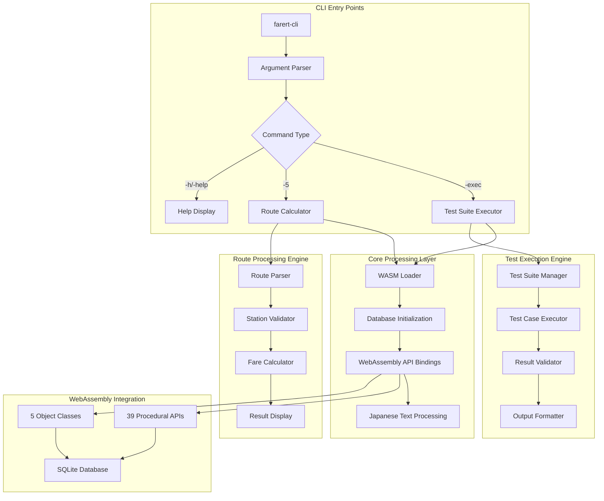
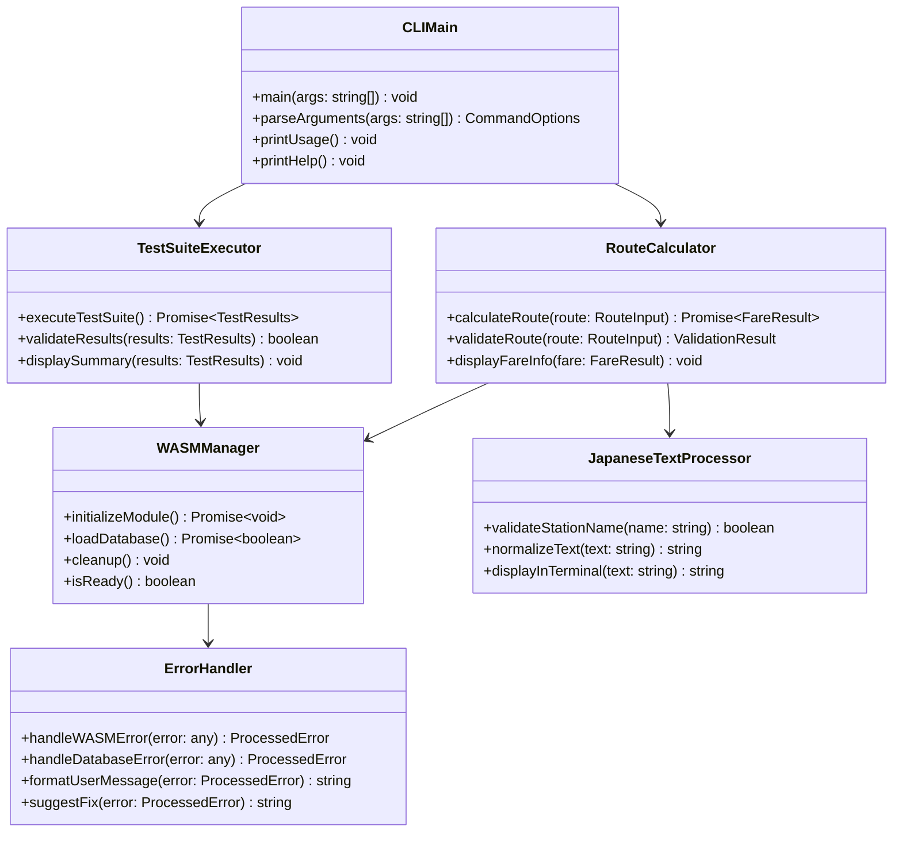

# typescript-cli-interface - Task 9

Execute task 9 for the typescript-cli-interface specification.

## Task Description
Implement robust error handling with specific error codes

## Code Reuse
**Leverage existing code**: existing CLIError class, error handling patterns in main.ts

## Requirements Reference
**Requirements**: REQ-CLI-003.1, REQ-CLI-003.2, REQ-CLI-003.4

## Usage
```
/Task:9-typescript-cli-interface
```

## Instructions

Execute with @spec-task-executor agent the following task: "Implement robust error handling with specific error codes"

```
Use the @spec-task-executor agent to implement task 9: "Implement robust error handling with specific error codes" for the typescript-cli-interface specification and include all the below context.

# Steering Context
## Steering Documents Context

No steering documents found or all are empty.

# Specification Context
## Specification Context (Pre-loaded): typescript-cli-interface

### Requirements
# 要件定義書 - TypeScript CLI インターフェース拡張

## はじめに

TypeScript CLI インターフェース拡張プロジェクトは、鉄道運賃計算システムCLIの既存TypeScript実装を完成・精錬することを目的とします。現在の実装は既に`testmain.cpp`と`test_exec.cpp`から移植し、同一のものを作成します。
CLIは、コア機能である、alpdb.cpp の動作が正しい結果を返すかを検証する役目とともに、CLI として機能を実現するユーティリティとして役割ももちます。

## 製品ビジョンとの整合性

この機能は、完全なWebAssemblyベース鉄道運賃計算システムの提供というプロジェクトの中核使命を直接支援します。CLIインターフェースは以下として機能します：

- 包括的テストによるWebAssembly APIの検証ツール
- デバッグと検証のための開発ユーティリティ
- WASMモジュールの適切な使用方法を示すリファレンス実装
- C++からTypeScript/JavaScriptワークフローへの移行橋渡し

## 前提条件と制約

### 技術制約

- CLIは元のtestmain.cppとtest_exec.cppの動作との完全互換性を維持する必要
- WebAssemblyモジュール読み込みとデータベース初期化は5秒以内に完了する必要
- 日本語文字エンコーディングはUTF-8のみを使用する必要
- 互換性のためNode.js version 14.0.0以上が必要
- TypeScriptコンパイルはES2020以上をターゲットにする必要

### ビジネス制約

- 元のtest_exec.cppのテスト実行順序は変更不可
- 運賃計算結果は元のC++実装と±0円の許容誤差内で一致する必要
- 既存のnpmスクリプトとビルドプロセスは継続して動作する必要
- CLIインターフェースはWebAssemblyの専門知識がない開発者でも使用可能でなければならない

## 要件

### REQ-CLI-001: CLIコマンド完成と拡張

**ユーザーストーリー：** 開発者として、元のtestmain.cppの全機能を持つ完全なCLIインターフェースが欲しい。これによりWebAssembly実装の完全なテストと検証が可能になる。

#### 受入基準

1. ユーザーが引数なしで`farert-cli`を実行した場合、システムは全利用可能コマンド（`-exec`, `-5`, `-h`, `-help`）を含む使用方法情報を表示すること
2. ユーザーが`farert-cli -exec`を実行した場合、システムはtest_exec.cppからの完全テストスイートを同一のテスト順序と結果で実行すること  
3. ユーザーが`farert-cli -5 <駅1> <路線1> <駅2> <路線2> <駅3>`を実行した場合、システムは元のC++実装と±0円以内で一致する運賃計算と結果表示を行うこと
4. ユーザーが`farert-cli -h`または`farert-cli -help`を実行した場合、システムは日本語駅名の例を含む詳細ヘルプを表示すること
5. ユーザーが無効な引数を提供した場合、システムは無効なパラメータを示す具体的エラーメッセージと正しい使用構文を表示すること

### REQ-CLI-002: テストスイート検証と完全性  

**ユーザーストーリー：** 開発者として、元のtest_exec.cppの動作と完全に一致するテストスイートが欲しい。これによりWebAssembly実装の正確性を検証できる。

#### テストスイート受入基準

1. テストスイート実行時、システムは元のtest_exec.cppと同じ順序で変更なく全テストを実行すること
2. テスト完了時、システムは全テストケースで元のC++実装と±0円許容誤差内で一致する運賃計算結果を出力すること
3. 任意のテストが失敗した場合、システムはテスト名、期待値、実際値、許容誤差チェックを含む詳細失敗情報を提供すること
4. `-v`フラグでverboseモードが有効な場合、システムはWASMモジュール読み込み、データベースクエリ、中間計算を示す詳細実行ログを表示すること
5. テスト完了時、システムは元の出力形式と一致する「Test Results: X/Y passed (Z.Z%)」形式でサマリー統計を表示すること

### REQ-CLI-003: エラーハンドリングと堅牢性

**ユーザーストーリー：** 開発者として、堅牢なエラーハンドリングと明確なエラーメッセージが欲しい。これにより問題の迅速な特定と解決が可能になる。

#### エラーハンドリング受入基準

1. WebAssemblyモジュールの読み込み失敗時、システムは「WebAssemblyモジュールの読み込みに失敗しました: [具体的理由]」エラーメッセージを表示し、ファイルパスと権限の確認を提案すること
2. データベースが開けない場合、システムは「データベース初期化に失敗しました: [具体的SQLiteエラー]」を表示し、jrdbnewest.dbファイルの存在を確認すること
3. 無効な駅名が提供された場合、システムはファジーマッチングを使用して最大3つの類似する有効駅名を提案すること
4. システムがJavaScript例外に遭遇した場合、システムはエラー詳細をコンソールにログし、スタックトレースを保持してコード1で終了すること
5. 必要な依存関係が欠如している場合、システムはNode.jsバージョン、TypeScriptインストールをチェックし、具体的なインストールコマンドを表示すること

### REQ-CLI-004: 設定と環境管理

**ユーザーストーリー：** 開発者として、柔軟な設定オプションと環境管理が欲しい。これにより異なるシナリオでCLIを実行できる。

#### 設定受入基準

1. CLI開始時、システムは必要ファイルの存在を検証すること: dist/farert.js, dist/farert.wasm, data/jrdbnewest.db
2. 開発環境での実行時、システムは全リソースでプロジェクトルートからの相対パスを使用すること
3. CLI_DEBUG環境変数が設定されている場合、システムは詳細ログを有効化し、WebAssemblyメモリ使用統計を表示すること
4. CLI_WASM_PATH環境変数が提供されている場合、システムはWebAssemblyモジュール読み込みで指定されたパスを使用すること
5. 設定エラーが発生した場合、システムは検出されたプラットフォーム（macOS/Linux/Windows）向けの環境固有セットアップ指示を表示すること

### REQ-CLI-005: ビルドシステムとの統合

**ユーザーストーリー：** 開発者として、プロジェクトのビルドシステムとのシームレスな統合が欲しい。これにより開発ワークフローにCLIテストを容易に組み込める。

#### ビルド統合受入基準

1. `npm run cli:build`実行時、TypeScriptは適切なモジュール解決でdist/cli/ディレクトリに正常にコンパイルすること
2. CI/CDパイプラインが`npm run cli:exec`を実行する場合、CLIテストは実行され適切な終了コード（成功時0、失敗時1）を返すこと
3. WebAssemblyアーティファクトが更新された場合、CLIは最新のdist/farert.jsとdist/farert.wasmファイルを自動検出・使用すること
4. npmスクリプト実行時、CLIは既存スクリプト（`cli:build`, `cli:exec`, `cli:test-all`）と競合なく統合すること
5. TypeScriptコンパイルが失敗した場合、システムはコンパイルエラーの具体的なファイルと行番号を提案と共に表示すること

### REQ-CLI-006: ドキュメント化とユーザビリティ

**ユーザーストーリー：** 新しい開発者として、明確なドキュメントと直感的なCLI使用法が欲しい。これによりツールの迅速な理解と使用が可能になる。

#### ドキュメント受入基準

1. ユーザーが`farert-cli -h`を実行した場合、システムはコマンド構文、パラメータ説明、「東京」「新宿」「大阪」駅での使用例を含む包括的ヘルプを表示すること
2. ドキュメントアクセス時、README_CLI.mdはステップバイステップのインストール、ビルド指示、一般的なトラブルシューティングシナリオを含むこと
3. ユーザーが一般的ミス（パラメータ数間違い、無効駅名）を犯した場合、システムは具体的な修正提案を提供すること
4. 例が提供される場合、実際のデータベースからのリアルな日本語駅名・路線名（東海道線、山手線等）を使用すること
5. ユーザーがエラーに遭遇した場合、システムはドキュメントの特定セクションを参照するか、関連トラブルシューティングガイドへのリンクを提供すること

---

## 非機能要件

### パフォーマンス

- CLI起動時間は標準開発マシン（2.0GHz CPU, 8GB RAM）で2秒以下であること
- テストスイート実行は完全スイート（全6テストスイート）で30秒以内に完了すること
- メモリ使用量はWebAssemblyヒープを含む通常動作で512MBを超えないこと
- 経路計算は一般的な経路（最大5駅）で1秒以内に完了すること

### セキュリティ

- CLIはログやエラーメッセージで機密データベース情報を公開しないこと（生SQLや内部IDなし）
- ファイルシステムアクセスはプロジェクトディレクトリとOS一時ファイルのみに制限すること
- ネットワークアクセスは無しに制限すること（CLIは完全オフライン）
- 入力検証はユーザー提供の駅名・路線名をサニタイズしてコマンドインジェクションを防ぐこと

### 信頼性

- CLIはSIGINT/SIGTERMシグナルでの適切なシャットダウンを処理し、WebAssemblyメモリをクリーンアップすること
- テスト失敗はCLIクラッシュやメモリ破損を引き起こさないこと
- WebAssemblyモジュールエラーは明確なエラーレポートで分離・復旧可能であること
- データベース接続問題は3秒以内に具体的エラーコードで検出されること

### ユーザビリティ

- エラーメッセージは解決のための具体的提案とともに明確で実行可能であること
- 進行インジケータは現在のテスト名と完了率でテスト実行状態を表示すること
- 日本語テキストは全サポートターミナル環境（macOS Terminal, Linux bash, Windows cmd）で正しく表示されること
- CLIコマンドは標準Unix慣例に従うこと：`--`で長オプション、`-`で短オプション、適切な終了コード

---

### Design
# 設計書 - TypeScript CLI インターフェース拡張

## 概要

TypeScript CLI インターフェース拡張プロジェクトは、`testmain.cpp`と`test_exec.cpp`からの機能を移植する既存TypeScript実装を完成・精錬します。CLIはWebAssembly APIの検証ツール、開発ユーティリティ、そしてWASMベース鉄道運賃計算システムのリファレンス実装として機能します。

### プロジェクト目標
- C++ CLI機能のTypeScriptへの忠実な完全移植
- 元の実装との正確なテスト結果互換性維持
- 堅牢なエラーハンドリングと日本語テキスト対応提供
- 既存ビルドシステムとnpmワークフローとのシームレス統合
- 包括的WebAssembly API検証の実現

## ステアリング文書との整合性

この設計はCLAUDE.md要件と以下の点で整合します：
- `src/farert_wasm.cpp`の既存39 WebAssembly APIを基盤とする
- C++からWebAssemblyベースシステムへの完全移植を活用
- 元のテスト動作との後方互換性維持
- UTF-8日本語テキスト処理の排他的対応
- 既存Emscriptenとnpmビルドワークフローとの統合

## コード再利用分析

### 既存基盤
- **CLI構造**: `src/cli/main.ts`の引数解析付き基本CLIフレームワーク
- **テストフレームワーク**: `src/cli/test_exec.ts`と`test_exec_original.ts`の部分実装
- **WebAssembly統合**: `src/cli/wasm_loader.ts`のモジュール読み込み
- **経路計算**: `src/cli/route_calculator.ts`のコアロジック
- **型定義**: `src/cli/types.ts`の完全インターフェース
- **拡張テスト**: `src/cli/test_wasm_extended.ts`の高度APIテスト

### 再利用可能コンポーネント
- 既存WebAssemblyモジュール初期化パターン
- 現在のCLI実装からの日本語テキスト処理
- 経路計算機からのエラーハンドリング構造
- npmスクリプト統合パターン
- TypeScriptコンパイルとビルドワークフロー

## Architecture

### CLI System Architecture



### Component Architecture



## Components and Interfaces

### CLI Command Interface

```typescript
// Command-line Interface Types
export interface CommandOptions {
  command: 'exec' | 'route' | 'help';
  routeParams?: RouteParams;
  verbose?: boolean;
  configPath?: string;
}

export interface RouteParams {
  station1: string;
  line1: string;
  station2: string;
  line2: string;
  station3: string;
}

// Main CLI Interface
export class CLIMain {
  async main(args: string[]): Promise<number> {
    try {
      const options = this.parseArguments(args);
      await this.initializeWASM();
      
      switch (options.command) {
        case 'exec':
          return await this.executeTests(options);
        case 'route':
          return await this.calculateRoute(options.routeParams!);
        case 'help':
          this.printHelp();
          return 0;
        default:
          this.printUsage();
          return 1;
      }
    } catch (error) {
      this.handleError(error);
      return 1;
    }
  }
}
```

### Test Suite Interface

```typescript
// Test Execution Framework
export interface TestSuite {
  name: string;
  tests: TestCase[];
  setup(): Promise<void>;
  teardown(): Promise<void>;
}

export interface TestCase {
  name: string;
  description: string;
  execute(): Promise<TestResult>;
  expectedResult?: any;
}

export interface TestResult {
  success: boolean;
  actualValue: any;
  expectedValue: any;
  tolerance?: number;
  executionTime: number;
  error?: Error;
}

// Test Suite Implementation
export class TestSuiteExecutor {
  private testSuites: TestSuite[] = [];
  
  async executeTestSuite(verbose: boolean = false): Promise<TestResults> {
    const results: TestResults = {
      totalTests: 0,
      passedTests: 0,
      failedTests: 0,
      executionTime: 0,
      details: []
    };
    
    for (const suite of this.testSuites) {
      await suite.setup();
      
      for (const test of suite.tests) {
        const result = await this.executeTest(test, verbose);
        results.details.push(result);
        results.totalTests++;
        
        if (result.success) {
          results.passedTests++;
        } else {
          results.failedTests++;
        }
      }
      
      await suite.teardown();
    }
    
    return results;
  }
}
```

### Route Calculation Interface

```typescript
// Route Calculation System
export interface RouteCalculationRequest {
  stations: string[];
  lines: string[];
  options?: CalculationOptions;
}

export interface CalculationOptions {
  longRoute?: boolean;
  startAsCity?: boolean;
  arriveAsCity?: boolean;
}

export interface FareCalculationResult {
  fare: number;
  fareString: string;
  route: RouteInfo;
  calculation: FareDetails;
  warnings: string[];
  errors: string[];
}

export class RouteCalculator {
  private wasmModule: FarertModule;
  
  async calculateFare(request: RouteCalculationRequest): Promise<FareCalculationResult> {
    // Validate input
    const validation = await this.validateRoute(request);
    if (!validation.isValid) {
      throw new ValidationError(validation.errors);
    }
    
    // Initialize route
    this.wasmModule.createRoute();
    
    // Add stations and lines
    for (let i = 0; i < request.stations.length; i++) {
      const stationId = this.wasmModule.getStationId(request.stations[i]);
      if (stationId <= 0) {
        throw new StationNotFoundError(request.stations[i]);
      }
      
      if (i === 0) {
        this.wasmModule.addRouteBegin(stationId);
      } else {
        const lineId = this.wasmModule.getLineId(request.lines[i - 1]);
        if (lineId <= 0) {
          throw new LineNotFoundError(request.lines[i - 1]);
        }
        this.wasmModule.addRoute(lineId, stationId);
      }
    }
    
    // Calculate fare
    const fare = this.wasmModule.calculateFare();
    const fareString = this.wasmModule.getFareString();
    
    return {
      fare,
      fareString,
      route: this.buildRouteInfo(request),
      calculation: this.buildFareDetails(),
      warnings: [],
      errors: []
    };
  }
}
```

### WebAssembly Management Interface

```typescript
// WebAssembly Module Management
export interface WASMConfiguration {
  wasmPath: string;
  databasePath: string;
  timeout: number;
  memoryInitial: number;
  memoryMaximum: number;
}

export class WASMManager {
  private module: FarertModule | null = null;
  private initialized: boolean = false;
  
  async initialize(config: WASMConfiguration): Promise<void> {
    try {
      // Load WebAssembly module
      const wasmBuffer = await this.loadWASMFile(config.wasmPath);
      this.module = await this.instantiateWASM(wasmBuffer);
      
      // Initialize database
      const dbSuccess = this.module.openDatabase();
      if (!dbSuccess) {
        throw new DatabaseInitializationError('Failed to open SQLite database');
      }
      
      this.initialized = true;
    } catch (error) {
      throw new WASMInitializationError(`Failed to initialize WebAssembly: ${error.message}`);
    }
  }
  
  getModule(): FarertModule {
    if (!this.initialized || !this.module) {
      throw new Error('WebAssembly module not initialized');
    }
    return this.module;
  }
  
  async cleanup(): Promise<void> {
    if (this.module) {
      this.module.closeDatabase();
      this.module = null;
      this.initialized = false;
    }
  }
}
```

## Data Models

### Configuration Data Models

```typescript
// CLI Configuration
export interface CLIConfiguration {
  wasm: WASMConfiguration;
  logging: LoggingConfiguration;
  testing: TestConfiguration;
  display: DisplayConfiguration;
}

export interface LoggingConfiguration {
  level: 'debug' | 'info' | 'warn' | 'error';
  file?: string;
  console: boolean;
}

export interface TestConfiguration {
  timeout: number;
  tolerance: number;
  parallel: boolean;
  verbose: boolean;
}

export interface DisplayConfiguration {
  encoding: string;
  colors: boolean;
  progressBar: boolean;
  locale: string;
}
```

### Test Data Models

```typescript
// Test Framework Data Models
export interface TestResults {
  totalTests: number;
  passedTests: number;
  failedTests: number;
  executionTime: number;
  details: TestResult[];
  summary: TestSummary;
}

export interface TestSummary {
  successRate: number;
  averageExecutionTime: number;
  slowestTest: string;
  fastestTest: string;
  memoryUsage: MemoryUsage;
}

export interface MemoryUsage {
  initial: number;
  peak: number;
  final: number;
  wasmHeap: number;
}
```

### Route Data Models

```typescript
// Route and Station Data Models
export interface RouteInfo {
  stations: StationInfo[];
  lines: LineInfo[];
  distance: number;
  companies: CompanyInfo[];
  transferCount: number;
}

export interface StationInfo {
  id: number;
  name: string;
  kana: string;
  prefecture: string;
  isJunction: boolean;
  attributes: number;
}

export interface LineInfo {
  id: number;
  name: string;
  company: CompanyInfo;
  type: 'local' | 'express' | 'limited';
}

export interface FareDetails {
  basicFare: number;
  expressCharges: number[];
  taxes: number;
  discounts: DiscountInfo[];
  rules: FareRule[];
}
```

## Error Handling

### Error Classification System

```typescript
// Comprehensive Error Classification
export enum CLIErrorCode {
  // Initialization Errors (1-10)
  WASM_LOAD_FAILED = 1,
  DATABASE_INIT_FAILED = 2,
  CONFIG_LOAD_FAILED = 3,
  DEPENDENCY_MISSING = 4,
  
  // Input Validation Errors (11-20)
  INVALID_ARGUMENTS = 11,
  STATION_NOT_FOUND = 12,
  LINE_NOT_FOUND = 13,
  INVALID_ROUTE = 14,
  
  // Calculation Errors (21-30)
  FARE_CALC_FAILED = 21,
  ROUTE_BUILD_FAILED = 22,
  DATABASE_QUERY_FAILED = 23,
  
  // Test Execution Errors (31-40)
  TEST_SUITE_FAILED = 31,
  TEST_TIMEOUT = 32,
  RESULT_VALIDATION_FAILED = 33,
  
  // System Errors (41-50)
  OUT_OF_MEMORY = 41,
  FILESYSTEM_ERROR = 42,
  PERMISSION_DENIED = 43,
  UNEXPECTED_ERROR = 50
}

export class CLIError extends Error {
  constructor(
    public code: CLIErrorCode,
    message: string,
    public userMessage?: string,
    public suggestions?: string[],
    public context?: any
  ) {
    super(message);
    this.name = 'CLIError';
  }
}

// Error Handler with Japanese Support
export class ErrorHandler {
  formatError(error: CLIError): string {
    const baseMessage = error.userMessage || error.message;
    
    switch (error.code) {
      case CLIErrorCode.STATION_NOT_FOUND:
        return this.formatStationNotFoundError(error);
      case CLIErrorCode.WASM_LOAD_FAILED:
        return this.formatWASMLoadError(error);
      case CLIErrorCode.DATABASE_INIT_FAILED:
        return this.formatDatabaseError(error);
      default:
        return baseMessage;
    }
  }
  
  private formatStationNotFoundError(error: CLIError): string {
    const stationName = error.context?.stationName;
    const suggestions = error.suggestions || [];
    
    let message = `駅名「${stationName}」が見つかりません。\n`;
    
    if (suggestions.length > 0) {
      message += '候補駅名:\n';
      suggestions.forEach((suggestion, index) => {
        message += `  ${index + 1}. ${suggestion}\n`;
      });
    }
    
    return message;
  }
}
```

### Retry and Recovery Strategy

```typescript
// Retry Mechanism for CLI Operations
export interface RetryConfiguration {
  maxAttempts: number;
  initialDelay: number;
  backoffMultiplier: number;
  maxDelay: number;
  retryableErrors: CLIErrorCode[];
}

export class RetryHandler {
  async executeWithRetry<T>(
    operation: () => Promise<T>,
    config: RetryConfiguration
  ): Promise<T> {
    let lastError: Error;
    
    for (let attempt = 1; attempt <= config.maxAttempts; attempt++) {
      try {
        return await operation();
      } catch (error) {
        lastError = error;
        
        if (error instanceof CLIError && 
            config.retryableErrors.includes(error.code)) {
          
          if (attempt < config.maxAttempts) {
            const delay = Math.min(
              config.initialDelay * Math.pow(config.backoffMultiplier, attempt - 1),
              config.maxDelay
            );
            
            console.warn(`Attempt ${attempt} failed, retrying in ${delay}ms...`);
            await this.sleep(delay);
            continue;
          }
        }
        
        throw error;
      }
    }
    
    throw lastError!;
  }
  
  private sleep(ms: number): Promise<void> {
    return new Promise(resolve => setTimeout(resolve, ms));
  }
}
```

## Testing Strategy

### Unit Testing Framework

```typescript
// CLI-Specific Unit Tests
describe('CLI Main', () => {
  test('parses arguments correctly', () => {
    const args = ['-5', '渋谷', '山手線', '品川', '東海道線', '静岡'];
    const options = CLIMain.parseArguments(args);
    expect(options.command).toBe('route');
    expect(options.routeParams?.station1).toBe('渋谷');
  });
  
  test('handles invalid arguments gracefully', () => {
    expect(() => CLIMain.parseArguments(['--invalid'])).toThrow();
  });
  
  test('displays help correctly', () => {
    const output = captureConsoleOutput(() => CLIMain.printHelp());
    expect(output).toContain('-exec');
    expect(output).toContain('Examples:');
  });
});

describe('WebAssembly Manager', () => {
  test('initializes module successfully', async () => {
    const manager = new WASMManager();
    await expect(manager.initialize(testConfig)).resolves.not.toThrow();
    expect(manager.isReady()).toBe(true);
  });
  
  test('handles initialization failure gracefully', async () => {
    const manager = new WASMManager();
    const invalidConfig = { ...testConfig, wasmPath: 'invalid.wasm' };
    await expect(manager.initialize(invalidConfig)).rejects.toThrow();
  });
});
```

### Integration Testing Strategy

```typescript
// End-to-End CLI Testing
describe('CLI Integration', () => {
  test('executes test suite successfully', async () => {
    const result = await executeCLI(['-exec']);
    expect(result.exitCode).toBe(0);
    expect(result.stdout).toContain('Test Results:');
  });
  
  test('calculates fare correctly', async () => {
    const result = await executeCLI(['-5', '東京', '東海道線', '品川', '山手線', '渋谷']);
    expect(result.exitCode).toBe(0);
    expect(result.stdout).toContain('運賃:');
  });
  
  test('handles Japanese text correctly', async () => {
    const result = await executeCLI(['-5', 'あいうえお', '路線', '駅', '路線', '駅']);
    expect(result.exitCode).toBe(1);
    expect(result.stderr).toContain('駅名');
  });
});
```

### Performance Testing

```typescript
// CLI Performance Tests
describe('CLI Performance', () => {
  test('startup time within requirements', async () => {
    const start = Date.now();
    await initializeCLI();
    const duration = Date.now() - start;
    
    expect(duration).toBeLessThan(2000); // 2 second requirement
  });
  
  test('memory usage within limits', async () => {
    const initialMemory = process.memoryUsage();
    await executeLargeTestSuite();
    const finalMemory = process.memoryUsage();
    
    const memoryIncrease = finalMemory.heapUsed - initialMemory.heapUsed;
    expect(memoryIncrease).toBeLessThan(512 * 1024 * 1024); // 512MB limit
  });
});
```

## Implementation Plan

### Phase 1: Core CLI Foundation (Week 1)
1. Complete argument parsing system with full validation
2. Enhanced error handling with Japanese text support
3. Improved WebAssembly module loading with proper error recovery
4. Configuration management system

### Phase 2: Test Suite Migration (Week 2)
5. Complete migration of test_exec.cpp with identical test ordering
6. Result validation system with tolerance checking
7. Comprehensive test reporting and summary display
8. Memory usage monitoring and leak detection

### Phase 3: Route Calculation Enhancement (Week 3)
9. Enhanced route calculation with detailed validation
10. Japanese station name fuzzy matching
11. Comprehensive fare information display
12. Error suggestion system

### Phase 4: Build Integration and Documentation (Week 4)
13. npm script integration and CI/CD support
14. Comprehensive help system and documentation
15. Cross-platform compatibility testing
16. Performance optimization and monitoring

This design provides a complete foundation for creating a production-ready TypeScript CLI that faithfully recreates the original C++ functionality while providing enhanced error handling, Japanese text support, and seamless integration with the existing WebAssembly-based railway fare calculation system.

**Note**: Specification documents have been pre-loaded. Do not use get-content to fetch them again.

## Task Details
- Task ID: 9
- Description: Implement robust error handling with specific error codes
- Leverage: existing CLIError class, error handling patterns in main.ts
- Requirements: REQ-CLI-003.1, REQ-CLI-003.2, REQ-CLI-003.4

## Instructions
- Implement ONLY task 9: "Implement robust error handling with specific error codes"
- Follow all project conventions and leverage existing code
- Mark the task as complete using: claude-code-spec-workflow get-tasks typescript-cli-interface 9 --mode complete
- Provide a completion summary
```

## Task Completion
When the task is complete, mark it as done:
```bash
claude-code-spec-workflow get-tasks typescript-cli-interface 9 --mode complete
```

## Next Steps
After task completion, you can:
- Execute the next task using /typescript-cli-interface-task-[next-id]
- Check overall progress with /spec-status typescript-cli-interface
