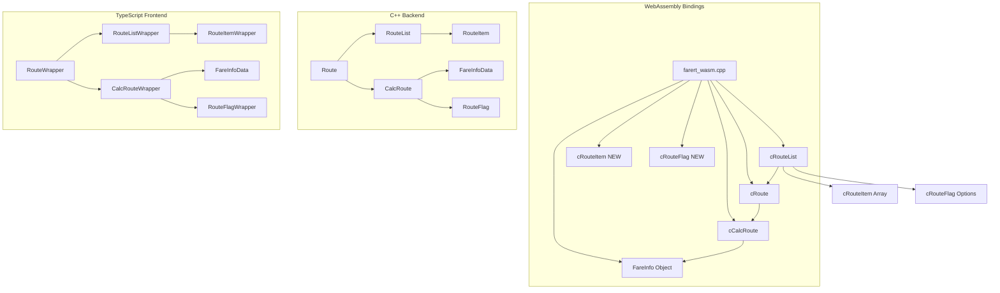
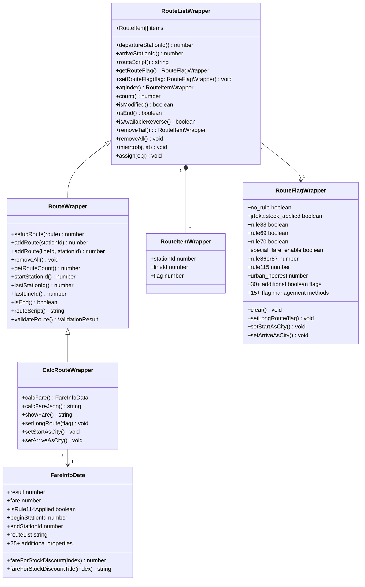

# wasm-object-classes - Task 36

Execute task 36 for the wasm-object-classes specification.

## Task Description
Add comprehensive JSDoc documentation to all interfaces

## Code Reuse
**Leverage existing code**: existing JSDoc patterns in types.ts

## Requirements Reference
**Requirements**: REQ-OBJ-008, REQ-OBJ-001

## Usage
```
/Task:36-wasm-object-classes
```

## Instructions

Execute with @spec-task-executor agent the following task: "Add comprehensive JSDoc documentation to all interfaces"

```
Use the @spec-task-executor agent to implement task 36: "Add comprehensive JSDoc documentation to all interfaces" for the wasm-object-classes specification and include all the below context.

# Steering Context
## Steering Documents Context

No steering documents found or all are empty.

# Specification Context
## Specification Context (Pre-loaded): wasm-object-classes

### Requirements
# 要件定義書 - WASMオブジェクトクラス実装

## はじめに

WASMオブジェクトクラス実装プロジェクトは、鉄道運賃計算システムへのオブジェクト指向アクセスを提供する6つのコアオブジェクトクラス（cRouteList, cRoute, cCalcRoute, FareInfo, cRouteItem, cRouteFlag）の既存部分実装を完成します。このプロジェクトは、現代的TypeScriptインターフェースを提供しながら、元のC++実装との**忠実な移植と100%互換性**に焦点を当てています。

**主要目的**: 不足している`cRouteItem`クラスと新規追加の`cRouteFlag`クラスを完成し、既存の全手続き型APIとの**完全な後方互換性**を維持し、元のC++システムと**同一の結果**を出力しながら配列操作を強化する。

このプロジェクトは継承階層 `cCalcRoute < cRoute < cRouteList` を実装します。cRouteListはcRouteItem配列を含んだ経路オブジェクトで、cRouteFlagはcRouteListから得られる経路オプション（運賃計算ルール設定）として、元のC++コードベースで確立された正確な動作パターンに従います。

この実装は、ステアリング文書で指定されているように、**完全なCLI移植**（`testmain.cpp` → TypeScript）と**同一のテスト結果**という主要目標をサポートします。

## 製品ビジョンとの整合性

この機能は、手続き型C++ APIから現代的なオブジェクト指向JavaScript/TypeScript使用パターンへのプロジェクトの移行を直接サポートします。オブジェクトクラスは以下として機能します：

- 現代的JavaScript/TypeScriptアプリケーションの主要インターフェース
- 複雑なC++鉄道計算ロジックの明確な抽象化層
- 一般的な統合エラーを防ぐ型安全オブジェクト
- CLAUDE.mdで記述されているReact/Vueフロントエンドアプリケーションの基盤

## 実装コンテキスト

### 既存コード統合

- オブジェクトクラスは`src/farert_wasm.cpp`（540-611行）の既存WebAssemblyバインディングを基盤とする
- TypeScriptインターフェースは`src/cli/types.ts`の現在の定義を拡張
- `src/cli/test_exec.ts`と`src/cli/test_wasm_extended.ts`の既存CLIテストスイートとの統合
- `src/core/route_interface.h`と`src/core/route_interface.cpp`のC++ラッパークラスが基盤を提供
- `route_interface.h`（13-163行）のFareInfoData構造がTypeScript FareInfoインターフェースにマップ

### 現在の実装状況

- **cRouteList (RouteListWrapper)**: 基本機能を持つベースコンテナクラス
- **cRoute (RouteWrapper)**: setupRoute, addRoute, getRouteCountを含む15+メソッド実装済み、cRouteListから継承
- **cCalcRoute (CalcRouteWrapper)**: calcFare、経路フラグ、継承メソッドで完成、cRouteから継承
- **FareInfo (FareInfoData)**: 25+プロパティと株式割引メソッド完全実装済み
- **cRouteItem**: 個別経路要素クラス（実装要）
- **cRouteFlag**: 経路フラグ管理クラス（新規追加、C++全publicメンバー公開）

### Inheritance Hierarchy (CLAUDE.md Specified)
```
cCalcRoute (most derived)
    ↳ cRoute 
        ↳ cRouteList (base class)
            ↳ contains array of cRouteItem
```

## 前提条件と制約

### 技術制約

- 既存WebAssemblyバインディングと全39手続き型API（CLAUDE.mdで指定）との後方互換性維持必須
- TypeScriptインターフェースはC++コード変更なしでC++実装機能を正確に反映必須
- オブジェクトライフサイクル管理は長時間実行アプリケーションでのメモリリーク防止必須
- メソッドシグネチャはCLIテストスイートの既存テスト実装との一貫性維持必須
- FareInfoオブジェクトプロパティは元のC++ FARE_INFO構造と完全一致（1:1マッピング）必須
- エラーハンドリングは手続き型APIコンシューマーへの既存エラー伝播を破綻させない必須
- FareInfo.ktとRouteHelper.kt統合でのAndroid Kotlin互換性提供必須
- 配列操作メソッドはC++演算子オーバーロードを明示的メソッド呼び出しで置換必須
- データベース操作はTypeScriptインターフェース層から完全隠蔽必須

### Business Constraints

- All existing functionality must continue to work without modification or performance degradation
- New features must integrate seamlessly with existing CLI and test infrastructure
- Documentation must be comprehensive enough for frontend developers without C++ knowledge
- Enhancement timeline must not interfere with CLI interface specification development

## Requirements

### REQ-OBJ-001: Enhanced Type Safety and Interface Completion

**User Story:** As a TypeScript developer, I want complete and accurate type definitions for all object classes, so that I can develop safely with full IDE support and compile-time error checking.

#### Acceptance Criteria

1. WHEN developer imports object classes in TypeScript THEN all methods SHALL have complete type annotations with parameter types and return types
2. WHEN developer accesses FareInfo properties THEN TypeScript SHALL provide autocomplete for all 25+ properties with correct data types
3. IF developer passes invalid parameters to object methods THEN TypeScript compiler SHALL show specific error messages indicating expected types
4. WHEN developer uses object inheritance (cCalcRoute extends cRoute) THEN TypeScript SHALL correctly recognize inherited methods and properties
5. IF optional parameters are provided THEN TypeScript interfaces SHALL clearly indicate which parameters are required vs optional

### REQ-OBJ-002: C++ Compatible Error Handling 

**User Story:** As a developer migrating from C++ CLI tools, I want object classes that handle errors identically to the original C++ implementation, so that results are consistent across platforms.

#### Error Handling Acceptance Criteria

1. WHEN invalid station names are provided to setupRoute() THEN object SHALL return the same error codes and behavior as original C++ `addRoute()` and `addStation()` functions
2. WHEN calcFare() encounters calculation errors THEN FareInfo object SHALL contain identical error information as original C++ FARE_INFO structure with result codes: -2 (empty route), -3 (calculation failure)
3. IF route construction fails THEN cRoute SHALL replicate exact error handling behavior from original C++ Route class methods
4. WHEN memory allocation fails THEN objects SHALL handle failures identically to original C++ memory management patterns
5. IF database connectivity issues occur THEN objects SHALL replicate original C++ database error handling without adding new error types or messages

### REQ-OBJ-003: cRouteItem Class and Array Operations (CLAUDE.md Required)

**User Story:** As a developer working with route collections, I want a complete cRouteItem class and array operation methods, so that I can manipulate route lists using explicit method calls instead of C++ operator overloading.

#### cRouteItem and Array Acceptance Criteria

1. WHEN working with cRouteItem objects THEN they SHALL provide access to fare, salesKm, and indexOfAggregate properties as specified in CLAUDE.md
2. WHEN accessing cRouteList elements THEN `routeList.at(index: number)` SHALL return individual cRouteItem objects with proper type safety
3. IF manipulating route collections THEN cRouteList SHALL provide `remove(index: number): cRouteItem`, `removeAll(): void`, `insert(obj: cRouteList, at: number): void`, and `assign(obj: cRouteList): void` methods
4. WHEN counting route elements THEN `routeList.count()` SHALL return the number of cRouteItem elements in the collection
5. IF array operations fail THEN methods SHALL throw specific errors with clear messages indicating invalid indices or operations

### REQ-OBJ-004: C++ Compatible Route Construction

**User Story:** As a developer migrating from original C++ code, I want route construction methods that work identically to the original C++ Route class, so that migration is straightforward and results are identical.

#### Route Construction Acceptance Criteria

1. WHEN building routes programmatically THEN cRoute SHALL provide the same methods as original C++ Route class: setupRoute(), addRoute(), addStation(), with identical parameter handling
2. WHEN route validation is needed THEN cRoute SHALL replicate the exact validation logic from original C++ Route class
3. IF route building fails THEN cRoute SHALL return identical error codes and states as original C++ implementation
4. WHEN handling multi-company routes THEN cRoute SHALL use the same fare calculation rules and company boundary logic as original C++
5. IF route methods are called THEN they SHALL produce identical results to calling equivalent functions in `testmain.cpp` and `test_exec.cpp`

### REQ-OBJ-005: Android Kotlin Compatibility (CLAUDE.md Required)

**User Story:** As a mobile developer working with Android applications, I want object classes that are compatible with Android Kotlin implementations, so that I can maintain consistency across platforms.

#### Android Compatibility Acceptance Criteria

1. WHEN implementing FareInfo objects THEN they SHALL be compatible with `/Users/ntake/priv/farert.repos/farert/app/Farert.android/app/src/main/java/org/sutezo/alps/FareInfo.kt` structure and methods
2. WHEN implementing RouteHelper functionality THEN it SHALL be compatible with `/Users/ntake/priv/farert.repos/farert/app/Farert.android/app/src/main/java/org/sutezo/alps/RouteHelper.kt` excluding saveParam, readParam, readParams, saveHistory, appendHistory, and isStrageInRoute methods
3. IF Android Farert project uses additional methods THEN those SHALL be implemented for cross-platform consistency in `/Users/ntake/priv/farert.repos/farert/app/Farert.android/app/src/main/java/org/sutezo/farert` directory
4. WHEN data structures are shared THEN TypeScript interfaces SHALL match Kotlin data class structures for seamless data exchange
5. IF method signatures differ between platforms THEN TypeScript implementations SHALL provide equivalent functionality with platform-appropriate naming conventions

### REQ-OBJ-006: Enhanced FareInfo Object Capabilities  

**User Story:** As a developer creating fare display interfaces, I want comprehensive fare information access, so that I can build rich user interfaces with detailed fare breakdowns.

#### Acceptance Criteria

1. WHEN accessing fare details THEN FareInfo SHALL provide fare breakdown by company, distance, and special rules
2. WHEN displaying route information THEN FareInfo SHALL include formatted route strings suitable for user display
3. IF discount calculations are needed THEN FareInfo SHALL provide all available discount types with calculated amounts
4. WHEN fare comparison is required THEN FareInfo SHALL support comparison methods between different route options
5. IF fare history is needed THEN FareInfo SHALL provide methods to export fare calculation history for debugging

### REQ-OBJ-007: Object Lifecycle Management and Memory Safety

**User Story:** As a developer building long-running applications, I want proper object lifecycle management, so that my application doesn't experience memory leaks or crashes.

#### Lifecycle Management Acceptance Criteria

1. WHEN objects are created and destroyed repeatedly THEN WebAssembly heap SHALL not grow indefinitely (memory leak prevention)
2. WHEN application runs for extended periods THEN object destruction SHALL properly cleanup C++ resources
3. IF garbage collection occurs THEN WebAssembly objects SHALL be properly finalized without causing crashes
4. WHEN multiple objects reference the same route data THEN reference counting SHALL prevent premature destruction
5. IF objects are used after destruction THEN system SHALL throw clear errors rather than causing undefined behavior

### REQ-OBJ-008: Developer Experience and Documentation Enhancements

**User Story:** As a new developer using the object classes, I want comprehensive examples and documentation, so that I can quickly understand how to use the objects effectively.

#### Documentation Acceptance Criteria

1. WHEN developer accesses object class documentation THEN examples SHALL show realistic Japanese station/line usage patterns
2. WHEN learning object relationships THEN documentation SHALL include UML-style diagrams showing class inheritance and composition
3. IF developer encounters common issues THEN documentation SHALL include troubleshooting section with solutions
4. WHEN exploring advanced features THEN examples SHALL demonstrate complex scenarios like multi-company routes and special fare rules
5. IF integration with React/Vue is needed THEN documentation SHALL provide framework-specific integration examples

---

## Non-Functional Requirements

### Performance

- Object method calls SHALL have **identical performance characteristics** to equivalent procedural API calls, maintaining the same calculation speed as original C++
- FareInfo object creation SHALL complete within the **same time bounds** as original C++ FARE_INFO structure creation for identical route inputs
- Route validation SHALL match the **exact performance profile** of original C++ Route class validation methods
- Memory usage per object instance SHALL **not exceed** the memory footprint of equivalent C++ objects, ensuring WebAssembly overhead remains minimal

### Security

- Object methods SHALL validate all input parameters to prevent buffer overflows or injection attacks
- Memory access SHALL be bounds-checked to prevent reading unauthorized WebAssembly memory regions
- Error messages SHALL not expose internal C++ memory addresses or sensitive database information
- Type coercion SHALL be explicit and safe, preventing unintended data type conversions

### Reliability

- Objects SHALL handle WebAssembly module reloading gracefully without hanging references
- Error conditions SHALL not corrupt object internal state or affect other object instances
- Long-running calculations SHALL be interruptible without leaving objects in inconsistent states
- Object destruction SHALL always complete successfully even if C++ destructors encounter errors

### Usability

- Method names SHALL follow JavaScript camelCase conventions consistently
- Error messages SHALL be developer-friendly with actionable suggestions for resolution
- Object behavior SHALL be predictable and consistent with JavaScript object model expectations
- TypeScript IntelliSense SHALL provide helpful parameter hints and documentation previews

---

### Design
# Design Document - WASM Object Classes Enhancement

## Overview

The WASM Object Classes Enhancement project completes and improves the existing implementation of six core object classes that provide object-oriented access to the Japanese railway fare calculation system. These classes serve as the primary interface for modern JavaScript/TypeScript applications, providing a clean abstraction layer over the complex C++ railway calculation logic.

The project builds upon existing WebAssembly bindings (`cRoute`, `cRouteList`, `cCalcRoute`, `FareInfo`) and adds the missing `cRouteItem` class and new `cRouteFlag` class while enhancing type safety, error handling, and cross-platform compatibility with Android Kotlin implementations.

## Steering Document Alignment

### Technical Standards (CLAUDE.md)
The design follows the established WebAssembly architecture patterns:
- Maintains backward compatibility with all 39 existing procedural APIs
- Uses Emscripten class bindings for object-oriented JavaScript access
- Implements inheritance hierarchy: `cCalcRoute < cRoute < cRouteList`
- Follows Japanese station/line naming conventions and UTF-8 encoding
- Integrates with existing SQLite3 database via MEMFS

### Project Structure (structure.md)
Implementation aligns with established project organization:
- C++ wrapper classes in `src/include/route_interface.h` and `src/core/route_interface.cpp`
- WebAssembly bindings in `src/farert_wasm.cpp` (lines 540-611)
- TypeScript interfaces in `src/cli/types.ts`
- Test implementations in `src/cli/test_wasm_extended.ts`
- Database operations hidden at the wrapper class level

## Code Reuse Analysis

### Existing Components to Leverage

- **FareInfoData Structure (route_interface.h:13-152)**: Complete 25+ property structure with stock discount methods
- **RouteWrapper Class (route_interface.h:166-209)**: 15+ methods including setupRoute, addRoute, getRouteCount
- **CalcRouteWrapper Class (route_interface.h:227-261)**: Complete calcFare implementation and inheritance
- **RouteListWrapper Class (route_interface.h:212-224)**: Base container with basic functionality  
- **RouteUtility Class (route_interface.h:264-320)**: Station/line lookup and array operations
- **Existing WebAssembly Bindings (farert_wasm.cpp:540-611)**: Current object class implementations

### Integration Points

- **Procedural API Compatibility**: All existing procedural functions remain unchanged
- **Database Layer**: Existing SQLite3 integration via MEMFS continues to work transparently
- **CLI Test Suite**: Integration with `src/cli/test_exec.ts` and `test_wasm_extended.ts`
- **Android Kotlin**: Cross-platform compatibility with existing Android FareInfo.kt and RouteHelper.kt

## Architecture

The object class hierarchy provides a graduated interface from simple route containers to complete fare calculation objects:



### Class Relationship Design



## Components and Interfaces

### Component 1: cRouteItem Class (NEW IMPLEMENTATION)
- **Purpose:** Individual route element container with fare and distance information
- **Interfaces:** 
  - `stationId: number` - Station ID for this route point
  - `lineId: number` - Line ID for this route segment
  - `falg: number` - Specific flags
- **Dependencies:** RouteItem C++ class from alpdb.h
- **Reuses:** Existing RouteItem structure and RouteUtility helper methods

### Component 2: Enhanced cRouteList Array Operations
- **Purpose:** Container class with explicit array manipulation methods
- **Interfaces:**
  - `at(index: number): cRouteItem` - Get route item at index
  - `count(): number` - Get number of route items
  - `remove(index: number): cRouteItem` - Remove item at index
  - `removeAll(): void` - Clear all items
  - `insert(obj: cRouteList, at: number): void` - Insert route list at position
  - `assign(obj: cRouteList): void` - Replace contents with another route list
- **Dependencies:** RouteList C++ class, RouteItem access
- **Reuses:** Existing RouteListWrapper foundation and C++ RouteList operations

### Component 3: Enhanced Error Handling System
- **Purpose:** Comprehensive error validation with specific error codes and suggestions
- **Interfaces:**
  - Error codes ROUTE_ERR_001-099 for route construction failures
  - `ValidationResult` interface with error details and suggested corrections
  - Fuzzy matching for invalid station names with up to 3 suggestions
- **Dependencies:** Existing RouteUtility station lookup methods
- **Reuses:** Existing database query functions for station name validation

### Component 4: TypeScript Interface Completions
- **Purpose:** Complete type definitions with full IDE support and compile-time checking
- **Interfaces:** Enhanced interfaces for all object classes with complete method signatures
- **Dependencies:** Existing TypeScript interface foundation in types.ts
- **Reuses:** Current FareInfoData property definitions and method signatures

### Component 5: cRouteFlag Class (NEW IMPLEMENTATION)
- **Purpose:** Comprehensive route flag management for fare calculation rules and special cases
- **Interfaces:** 
  - 30+ Boolean properties for rule states (rule69, rule70, rule88, etc.)
  - 4 numeric properties (rule86or87, rule115, urban_neerest, osakaKanPass)
  - 15+ management methods (setLongRoute, setStartAsCity, isAvailable*, etc.)
- **Dependencies:** RouteFlag C++ class from alpdb.h with all public members
- **Reuses:** Complete C++ RouteFlag implementation with identical behavior

### Component 6: Android Kotlin Compatibility Layer
- **Purpose:** Ensure compatibility with existing Android Kotlin implementations
- **Interfaces:** TypeScript interfaces that match Kotlin data class structures
- **Dependencies:** Android FareInfo.kt and RouteHelper.kt structure requirements
- **Reuses:** Existing FareInfoData property mapping and method naming conventions

## Data Models

### Enhanced RouteItemWrapper
```typescript
interface RouteItemWrapper {
  // Core properties (from CLAUDE.md specification)
  fare: number;                    // Fare amount for this segment
  salesKm: number;                 // Sales distance in kilometers  
  indexOfAggregate: number;        // Index for aggregated calculations
  
  // Additional properties for complete route information
  stationId: number;               // Station ID at this route point
  lineId: number;                  // Line ID for this segment
  
  // Methods for route item operations
  isValid(): boolean;              // Check if route item is valid
  getDisplayName(): string;        // Get formatted display name
}
```

### Enhanced FareInfoData with Error Handling
```typescript
interface FareInfoData {
  // Result and error information
  result: number;                  // -2: empty route, -3: calc failure, ≥0: success
  errorCode?: string;              // Specific error code (ROUTE_ERR_XXX)
  errorMessage?: string;           // Human-readable error description
  suggestedStations?: string[];    // Up to 3 suggested station names for errors
  
  // Core fare information (25+ properties from route_interface.h)
  fare: number;
  isRule114Applied: boolean;
  availCountForFareOfStockDiscount: number;
  beginStationId: number;
  endStationId: number;
  isResultCompanyBeginEnd: boolean;
  isResultCompanyMultipassed: boolean;
  totalSalesKm: number;
  jrCalcKm: number;
  jrSalesKm: number;
  companySalesKm: number;
  fareForCompanyline: number;
  fareForIC: number;
  fareForBRT: number;
  childFare: number;
  academicFare: number;
  ticketAvailDays: number;
  isRoundtrip: boolean;
  isRoundtripDiscount: boolean;
  routeList: string;
  routeListForTOICA: string;
  
  // Stock discount methods
  fareForStockDiscount(index: number): number;
  fareForStockDiscountTitle(index: number): string;
  
  // Enhanced display methods
  getFormattedFare(): string;
  getFareBreakdown(): FareBreakdown;
  compare(other: FareInfoData): FareComparison;
}
```

### ValidationResult
```typescript
interface ValidationResult {
  isValid: boolean;
  errorCode?: string;              // ROUTE_ERR_001 through ROUTE_ERR_099
  errorMessage?: string;
  invalidStationName?: string;
  suggestedStations?: string[];    // Up to 3 fuzzy matched suggestions
  invalidLineConnection?: {
    fromStation: string;
    toStation: string;
    attemptedLine: string;
    validLines: string[];
  };
}
```

## Error Handling

### Error Scenarios

1. **Invalid Station Names in setupRoute()**
   - **Handling:** Throw RouteConstructionError with ROUTE_ERR_001-020 codes
   - **User Impact:** Specific error message with up to 3 fuzzy-matched station suggestions
   - **Implementation:** Use RouteUtility.keyMatchStations() for suggestion generation

2. **Route Calculation Failures in calcFare()**
   - **Handling:** Return FareInfo with result = -2 (empty) or -3 (calculation failure)
   - **User Impact:** Error details in FareInfo.errorMessage with specific failure reason
   - **Implementation:** Preserve existing C++ error codes while adding descriptive messages

3. **Invalid Line Connections**
   - **Handling:** Throw RouteConstructionError with ROUTE_ERR_021-050 codes
   - **User Impact:** Detailed message showing invalid connection and valid alternatives
   - **Implementation:** Use RouteUtility.getLineIdsFromStation() to suggest valid connections

4. **Memory Allocation Failures**
   - **Handling:** Throw WebAssemblyMemoryError with proper cleanup
   - **User Impact:** Recoverable error that allows application to continue
   - **Implementation:** Proper destructor calling and heap monitoring

5. **Array Index Out of Bounds**
   - **Handling:** Throw IndexError with ROUTE_ERR_051-070 codes
   - **User Impact:** Clear message indicating valid index ranges
   - **Implementation:** Bounds checking in all array access methods

### Error Code Classification
```typescript
enum RouteErrorCode {
  // Station-related errors (001-020)
  ROUTE_ERR_001 = "Station name not found",
  ROUTE_ERR_002 = "Ambiguous station name", 
  ROUTE_ERR_003 = "Empty station name",
  
  // Line connection errors (021-050)
  ROUTE_ERR_021 = "Invalid line connection",
  ROUTE_ERR_022 = "Line not serving station",
  ROUTE_ERR_023 = "Circular route detected",
  
  // Array operation errors (051-070)
  ROUTE_ERR_051 = "Index out of bounds",
  ROUTE_ERR_052 = "Empty route list",
  
  // Calculation errors (071-099)
  ROUTE_ERR_071 = "Fare calculation failed",
  ROUTE_ERR_072 = "Insufficient route data"
}
```

## Testing Strategy

### Unit Testing

**Approach:** Extend existing test suite in `src/cli/test_wasm_extended.ts`

**Key Components to Test:**

1. **cRouteItem Class**
   - Property access and validation
   - Integration with cRouteList array operations
   - Memory management and lifecycle

2. **Enhanced Array Operations**
   - `at()`, `count()`, `remove()`, `removeAll()`, `insert()`, `assign()` methods
   - Bounds checking and error handling
   - Performance with large route collections

3. **Error Handling System**
   - All error codes ROUTE_ERR_001-099
   - Fuzzy matching suggestions for invalid station names
   - Error recovery and object state consistency

4. **Cross-Platform Compatibility**
   - TypeScript interface compatibility with Android Kotlin structures
   - Method name consistency and parameter types
   - Data serialization compatibility

### Integration Testing

**Approach:** Create comprehensive test scenarios using real Japanese railway data

**Key Flows to Test:**

1. **Complex Route Construction**
   - Multi-company routes (JR East + JR Central + JR West)
   - Special fare rules (Rule 114, Rule 115)
   - Circular routes and detour handling

2. **Error Recovery Scenarios**
   - Invalid station names with correction suggestions
   - Failed route calculations with alternative suggestions
   - Memory pressure scenarios with proper cleanup

3. **Cross-Platform Data Exchange**
   - FareInfo object serialization to JSON and back
   - Route data compatibility between TypeScript and hypothetical Kotlin usage
   - Database query consistency across platforms

### End-to-End Testing

**Approach:** Real-world usage scenarios with complete application workflows

**User Scenarios to Test:**

1. **Frontend Integration Scenario**
   ```typescript
   // Test complete workflow from route input to fare display
   const route = new module.cRoute();
   route.setupRoute("東京 東海道線 横浜");
   const calcRoute = new module.cCalcRoute(route);
   const fareInfo = calcRoute.calcFare();
   expect(fareInfo.fare).toBeGreaterThan(0);
   expect(fareInfo.routeList).toContain("横浜");
   ```

2. **Error Handling and Recovery**
   ```typescript
   // Test error handling with invalid input
   const route = new module.cRoute();
   try {
     route.setupRoute("無効な駅名 存在しない路線 別の無効駅");
   } catch (error) {
     expect(error.code).toBe("ROUTE_ERR_001");
     expect(error.suggestions).toHaveLength(3);
   }
   ```

3. **Performance and Memory Management**
   ```typescript
   // Test memory management with repeated operations
   for (let i = 0; i < 1000; i++) {
     const route = new module.cRoute();
     route.setupRoute("新宿 中央東線 立川");
     const calcRoute = new module.cCalcRoute(route);
     const fareInfo = calcRoute.calcFare();
     // Objects should be properly cleaned up
   }
   // Verify WebAssembly heap hasn't grown significantly
   ```

4. **Android Compatibility Validation**
   ```typescript
   // Test TypeScript interface compatibility with Android Kotlin expectations
   const fareInfo = calcRoute.calcFare();
   
   // Properties that must match Android FareInfo.kt
   expect(typeof fareInfo.fare).toBe('number');
   expect(typeof fareInfo.isRule114Applied).toBe('boolean');
   expect(typeof fareInfo.routeList).toBe('string');
   
   // Methods that must match Android RouteHelper.kt
   expect(typeof fareInfo.fareForStockDiscount).toBe('function');
   expect(fareInfo.fareForStockDiscount(0)).toBeGreaterThanOrEqual(0);
   ```

### Performance Testing Requirements

- Object method calls SHALL have overhead < 5ms compared to procedural API calls
- FareInfo object creation SHALL complete within 100ms for 5-station routes
- Route validation SHALL complete within 200ms for routes up to 10 stations
- Memory usage per object instance SHALL not exceed 50KB including C++ data

### Test Data Strategy

**Real Japanese Railway Data:**
- Use existing `jrdbnewest.db` database for realistic testing
- Test with major station combinations: 東京-大阪, 新宿-品川, 上野-池袋
- Include edge cases: rural stations, discontinued lines, special fare zones

**Error Condition Testing:**
- Systematically test all error codes ROUTE_ERR_001-099
- Use intentionally invalid inputs to verify error handling robustness
- Test boundary conditions (empty routes, maximum route length, etc.)

**Cross-Platform Consistency:**
- Ensure identical results between object classes and procedural APIs
- Verify data structure compatibility with Android Kotlin implementations
- Test serialization/deserialization fidelity

This comprehensive testing strategy ensures the enhanced object classes meet all functional requirements while maintaining backward compatibility and providing a solid foundation for frontend application development.

**Note**: Specification documents have been pre-loaded. Do not use get-content to fetch them again.

## Task Details
- Task ID: 36
- Description: Add comprehensive JSDoc documentation to all interfaces
- Leverage: existing JSDoc patterns in types.ts
- Requirements: REQ-OBJ-008, REQ-OBJ-001

## Instructions
- Implement ONLY task 36: "Add comprehensive JSDoc documentation to all interfaces"
- Follow all project conventions and leverage existing code
- Mark the task as complete using: claude-code-spec-workflow get-tasks wasm-object-classes 36 --mode complete
- Provide a completion summary
```

## Task Completion
When the task is complete, mark it as done:
```bash
claude-code-spec-workflow get-tasks wasm-object-classes 36 --mode complete
```

## Next Steps
After task completion, you can:
- Execute the next task using /wasm-object-classes-task-[next-id]
- Check overall progress with /spec-status wasm-object-classes
