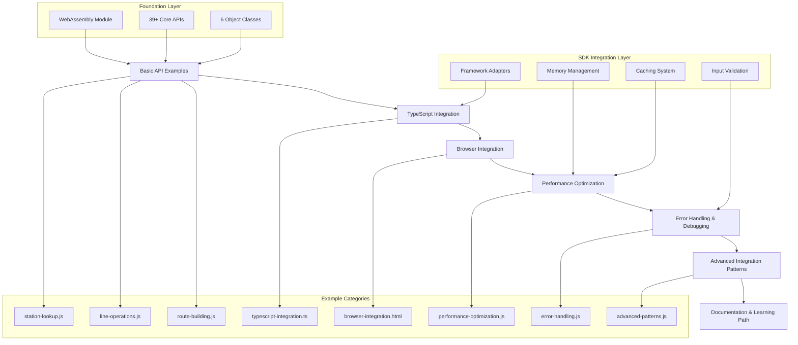

# Design Document: Examples/API Directory Expansion

## Overview

The examples/api expansion extends the current single comprehensive example (`railway_query_examples.js`) into a complete educational ecosystem with 7 focused example categories. This expansion transforms the examples directory from a single demonstration file into a structured learning path that supports developers from initial API exploration to advanced integration patterns.

The design builds upon the existing WebAssembly infrastructure (39+ APIs, 6 object classes) and SDK architecture (React, Vue, Svelte adapters) to create targeted, executable examples that demonstrate specific aspects of railway fare calculation functionality. Each example category addresses distinct developer needs while maintaining consistency with the project's core mission of providing 100% C++ compatibility through modern TypeScript interfaces.

This expansion supports the project's vision by providing clear pathways for developers to understand and integrate complex Japanese railway calculation logic into their applications, regardless of their experience level or target framework.

## Steering Document Alignment

### Technical Standards
The design follows established project patterns:
- **TypeScript Strict Mode**: All TypeScript examples enforce strict type checking
- **WebAssembly Integration**: Leverages existing `wasmLoader` and `route_interface.cpp` APIs
- **Error Handling Strategy**: Replicates C++ error codes without adding new types
- **Memory Management**: Implements RAII patterns with WebAssembly automatic cleanup
- **Build System**: Integrates with existing npm scripts and Emscripten toolchain

### Project Structure
Implementation follows current directory conventions:
- **examples/api/**: Contains all example files with clear naming patterns
- **dist/**: Build outputs remain unchanged, examples use existing compiled modules
- **src/sdk/**: Leverages existing framework adapters and utilities
- **Documentation**: Maintains consistency with existing README patterns and JSDoc standards

## Code Reuse Analysis

### Existing Components to Leverage

- **wasmLoader (dist/cli/cli/wasm_loader.js)**: Core WebAssembly module initialization
  - Current usage in `railway_query_examples.js` demonstrates proven loading patterns
  - All new examples will use identical initialization approach for consistency
  - Provides reliable cross-platform (Node.js/Browser) module loading

- **RouteUtility APIs (route_interface.cpp)**: Complete set of 39+ WebAssembly functions
  - Station operations: `getStationId`, `getStationName`, `getKanaFromStationId`
  - Line operations: `getLineId`, `getLineName`, `getLineIdsFromStation`
  - Route building: `addRoute`, `setupRoute`, `calculateFare`
  - Advanced queries: `stationsWithinCompanyOrPrefectAndLine`, `getJunctionIdsOfLine`

- **Object Classes (src/core/)**: 6-class inheritance system
  - `cRouteList`: Base container operations and array management
  - `cRoute`: Route construction with validation and connectivity
  - `cCalcRoute`: Fare calculation with special rule handling
  - `cRouteItem`: Individual route segment representation
  - `RouteFlagWrapper`: Complex routing flags and special cases
  - Provides object-oriented interface for advanced scenarios

- **SDK Components (src/sdk/)**: Framework-specific utilities and adapters
  - Memory management: `src/sdk/core/memory-manager.ts` for cleanup patterns
  - Caching: `src/sdk/cache/lru-cache.ts` for performance optimization
  - Input validation: `src/sdk/security/input-validator.ts` for robust examples
  - Framework adapters: React hooks, Vue composables, Svelte stores

### Integration Points

- **Database Layer**: Hidden SQLite3 operations through `route_interface.cpp`
  - No direct database access in examples - all operations through WebAssembly APIs
  - Maintains encapsulation while providing full query capabilities
  - Examples demonstrate proper initialization with `module.openDatabase()`

- **Error Management**: Consistent error handling across all examples
  - Leverages existing C++ error codes for authenticity
  - Uses `src/sdk/errors/error-manager.ts` patterns for robust error handling
  - Provides educational value by showing proper error recovery

- **Performance Monitoring**: Integration with existing optimization utilities
  - Uses `src/sdk/debug/debug-tools.ts` for timing and memory analysis
  - Demonstrates best practices from `src/sdk/core/farert-sdk.ts` implementation
  - Shows proper cleanup and resource management patterns

## Architecture

The expansion follows a modular, progressive complexity architecture that builds from simple API demonstrations to sophisticated integration patterns:



## Components and Interfaces

### Component 1: Basic API Examples Collection
- **Purpose:** Provide focused, single-function demonstrations for core WebAssembly APIs
- **Interfaces:** 
  - `station-lookup.js`: Station name/ID conversion, hiragana readings, prefecture data
  - `line-operations.js`: Line queries, station lists, junction detection
  - `route-building.js`: Step-by-step route construction and validation
- **Dependencies:** wasmLoader, core WebAssembly module, railway database
- **Reuses:** Existing API patterns from `railway_query_examples.js`, proven initialization sequences

### Component 2: TypeScript Integration Layer
- **Purpose:** Demonstrate type-safe WebAssembly integration with compile-time validation
- **Interfaces:**
  - `typescript-integration.ts`: Complete TypeScript example with interfaces and error handling
  - Type definitions for all WebAssembly functions and object classes
  - Promise-based async patterns with proper error propagation
- **Dependencies:** TypeScript compiler, @types/node, existing type definitions
- **Reuses:** SDK type definitions from `src/sdk/types/core.ts`, object class implementations

### Component 3: Browser Integration System
- **Purpose:** Show client-side integration patterns for web applications
- **Interfaces:**
  - `browser-integration.html`: Complete HTML page with interactive elements
  - ES6 module loading with dynamic imports
  - Real-time user interaction and feedback systems
- **Dependencies:** Modern browser with WebAssembly support, ES6 modules
- **Reuses:** Browser utilities from `src/sdk/utils/browser.ts`, framework detection patterns

### Component 4: Performance Optimization Framework
- **Purpose:** Demonstrate memory management, caching, and performance best practices
- **Interfaces:**
  - `performance-optimization.js`: Benchmarking utilities, memory profiling
  - Batch processing patterns for large datasets
  - Before/after performance metrics with detailed logging
- **Dependencies:** Performance monitoring APIs, memory analysis tools
- **Reuses:** LRU cache from `src/sdk/cache/`, memory manager from `src/sdk/core/`

### Component 5: Error Handling & Debugging System
- **Purpose:** Comprehensive error scenario handling and debugging utilities
- **Interfaces:**
  - `error-handling.js`: Error detection, recovery, and validation patterns
  - Debugging utilities with stack traces and detailed logging
  - Fallback strategies for network and module loading failures
- **Dependencies:** Error management system, logging infrastructure
- **Reuses:** Error manager from `src/sdk/errors/`, debug tools from `src/sdk/debug/`

### Component 6: Advanced Integration Patterns
- **Purpose:** Enterprise-grade patterns for complex application scenarios
- **Interfaces:**
  - `advanced-patterns.js`: Caching strategies, reactive programming, data transformation
  - Configuration management and environment handling
  - Real-time updates with event-driven architecture
- **Dependencies:** Advanced SDK components, external API simulation
- **Reuses:** Complete SDK infrastructure, all framework adapters, production utilities

### Component 7: Documentation & Learning Path
- **Purpose:** Structured educational progression with comprehensive reference materials
- **Interfaces:**
  - Updated `README.md` with navigation and learning path
  - API reference with parameter descriptions and sample data
  - Troubleshooting guide with common solutions
- **Dependencies:** Markdown processing, example execution validation
- **Reuses:** Existing documentation patterns, JSDoc standards, project structure conventions

## Data Models

### Example Configuration Model
```typescript
interface ExampleConfig {
  id: string;              // Unique example identifier
  name: string;            // Human-readable example name
  description: string;     // Detailed description of functionality
  category: ExampleCategory; // Basic | TypeScript | Browser | Performance | Error | Advanced | Documentation
  difficulty: 'beginner' | 'intermediate' | 'advanced';
  prerequisites: string[]; // Required knowledge or previous examples
  executionTime: number;   // Expected execution time in milliseconds
  memoryUsage: number;     // Expected memory usage in MB
  apis: string[];          // WebAssembly APIs demonstrated
  frameworks: string[];    // Compatible frameworks (if applicable)
  outputs: ExampleOutput[]; // Expected output descriptions
}
```

### API Function Metadata Model
```typescript
interface APIFunctionMetadata {
  name: string;            // Function name (e.g., 'getStationId')
  category: 'station' | 'line' | 'route' | 'fare' | 'utility';
  parameters: ParameterSpec[]; // Parameter specifications
  returnType: string;      // Return value type and format
  cppEquivalent: string;   // Corresponding C++ function name
  examples: UsageExample[]; // Code examples with expected outputs
  errorCodes: number[];    // Possible C++ error return codes
  performance: {           // Performance characteristics
    complexity: string;    // Time complexity description
    cacheability: boolean; // Whether results should be cached
    memoryImpact: 'low' | 'medium' | high'; // Memory usage impact
  };
}
```

### Learning Path Model
```typescript
interface LearningPath {
  phase: number;           // Sequential phase number (1-7)
  title: string;           // Phase title
  description: string;     // Phase learning objectives
  examples: string[];      // Example files in this phase
  concepts: string[];      // Key concepts introduced
  skills: string[];        // Skills developed in this phase
  nextPhase?: number;      // Optional next phase reference
  prerequisites: string[]; // Required prior knowledge
  estimatedTime: number;   // Learning time in minutes
}
```

## Error Handling

### Error Scenarios

1. **WebAssembly Module Loading Failure**
   - **Handling:** Retry mechanism with exponential backoff, fallback to alternative loading methods
   - **User Impact:** Clear error message with troubleshooting steps, alternative execution suggestions

2. **Database Connection Issues**
   - **Handling:** Connection validation, automatic retry, detailed connection status reporting
   - **User Impact:** Informative error message explaining database requirements, initialization guidance

3. **Invalid Station/Line Names**
   - **Handling:** Input validation, fuzzy matching suggestions, comprehensive error messages
   - **User Impact:** User-friendly error with name suggestions, alternative lookup methods

4. **Memory Limit Exceeded**
   - **Handling:** Automatic cleanup, memory monitoring, graceful degradation
   - **User Impact:** Warning message with memory usage tips, reduced functionality mode

5. **TypeScript Compilation Errors**
   - **Handling:** Detailed compiler output, common error explanations, fixing suggestions
   - **User Impact:** Educational error messages with links to TypeScript documentation

6. **Browser Compatibility Issues**
   - **Handling:** Feature detection, polyfill suggestions, fallback implementations
   - **User Impact:** Browser requirement notification, upgrade recommendations

## Testing Strategy

### Unit Testing
- **API Function Validation**: Each WebAssembly API call tested for correct parameter handling and return values
- **Error Condition Testing**: Systematic testing of all error scenarios with proper error code validation
- **Type Safety Verification**: TypeScript compilation testing across different compiler versions
- **Memory Management Testing**: Cleanup validation and leak detection for long-running examples

### Integration Testing
- **Example Execution Testing**: Automated execution of all examples with output validation
- **Cross-Platform Testing**: Node.js and browser environment validation for all applicable examples
- **Framework Integration Testing**: SDK adapter testing with React, Vue, and Svelte integration examples
- **Performance Baseline Testing**: Execution time and memory usage validation against established benchmarks

### End-to-End Testing
- **Learning Path Validation**: Complete progression testing from basic to advanced examples
- **Documentation Accuracy Testing**: Verification that all documented outputs match actual execution results
- **Real-World Scenario Testing**: Complex route calculation scenarios using multiple examples in sequence
- **User Experience Testing**: Navigation and discoverability testing for the complete example ecosystem

### Validation Criteria
- **Execution Success**: All examples must complete successfully on standard hardware within 5 seconds
- **Memory Efficiency**: No example should exceed 100MB memory usage during execution
- **Output Consistency**: All examples must produce consistent, reproducible results across multiple executions
- **Documentation Accuracy**: All documented outputs, parameters, and behaviors must match actual implementation
- **Error Recovery**: All error scenarios must demonstrate proper cleanup and recovery mechanisms