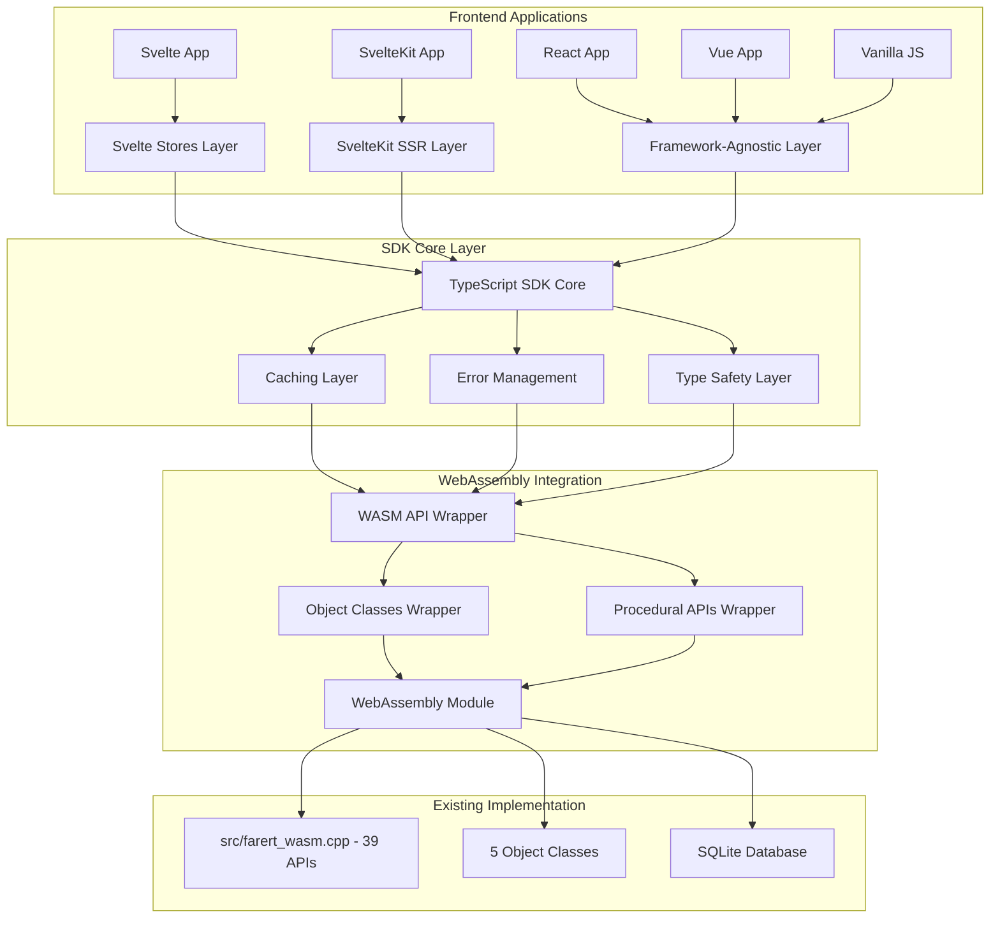
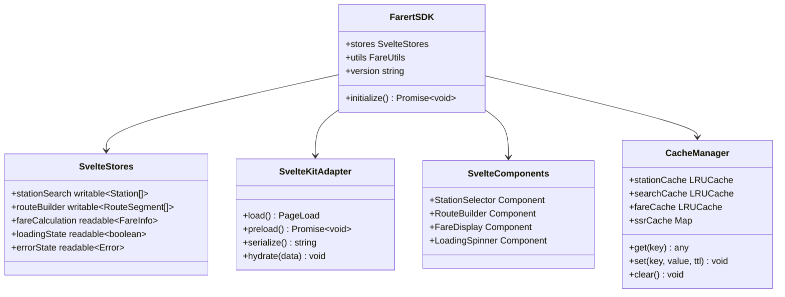

# Design Document - Frontend API Layer (Svelte Focus)

## Overview

The Frontend API Layer provides a comprehensive, Svelte-first TypeScript SDK that wraps the existing 39 WebAssembly APIs and 5 Object Classes to enable rapid development of railway fare calculation applications in Svelte/SvelteKit environments with secondary support for other frameworks.

### Project Goals
- Create a unified TypeScript SDK wrapping all WebAssembly functionality
- Implement intelligent caching for optimal performance
- Provide Svelte stores and components for reactive framework integration
- Implement SvelteKit SSR and static generation support
- Ensure framework-agnostic utilities for broad compatibility
- Maintain type safety and excellent developer experience

## Steering Document Alignment

This design aligns with CLAUDE.md requirements by:
- Building upon the existing 39+ WebAssembly APIs in `src/farert_wasm.cpp`
- Leveraging 6 Object Classes (cRouteItem, cRoute, cRouteList, cCalcRoute, FareInfo, cRouteFlag)
- Hiding database operations from TypeScript interface layer
- Supporting modern JavaScript/TypeScript application development
- Enabling transition from C++ desktop to web-based solutions

## Code Reuse Analysis

### Existing Foundation
- **WebAssembly APIs**: 39+ functions already implemented in `src/farert_wasm.cpp`
- **TypeScript Interfaces**: Basic definitions in `src/cli/types.ts`
- **WASM Loader**: Module loading infrastructure in `src/cli/wasm_loader.ts`
- **Object Classes**: 6 classes with WebAssembly bindings already functional
- **JSON APIs**: Frontend-ready APIs like `getFareInfoJson()`, `getCompanyAndPrefectsAsJson()`

### Reusable Components
- WebAssembly module initialization patterns
- Error handling structures from CLI implementation
- TypeScript interface patterns from existing `types.ts`
- Test infrastructure from `src/cli/test_wasm_extended.ts`

## Architecture

### System Architecture



### Svelte-First Architecture



## Components and Interfaces

### Core SDK Interface

```typescript
// Core SDK Interface for Svelte
export interface FarertSDK {
  // Initialization
  initialize(): Promise<void>;
  isReady(): boolean;
  version: string;
  
  // Svelte Stores
  stores: {
    stationSearch: Writable<StationSearchState>;
    routeBuilder: Writable<RouteBuilderState>;
    fareCalculation: Readable<FareCalculationState>;
    referenceData: Readable<ReferenceDataState>;
    loading: Readable<boolean>;
    error: Readable<Error | null>;
  };
  
  // Station Operations with Caching
  getStationById(id: number): Promise<Station>;
  getStationByName(name: string): Promise<Station>;
  searchStations(query: string, limit?: number): Promise<Station[]>;
  
  // Route Operations
  createRoute(): RouteBuilder;
  validateRoute(route: RouteInput): ValidationResult;
  calculateFare(route: RouteInput): Promise<FareInfo>;
  
  // Reference Data (Long-term Cached)
  getCompanies(): Promise<Company[]>;
  getPrefectures(): Promise<Prefecture[]>;
  getLines(): Promise<Line[]>;
  
  // SvelteKit Integration
  sveltekit: SvelteKitAdapter;
  
  // Object Classes
  objectClasses: {
    RouteList: typeof cRouteList;
    Route: typeof cRoute;
    CalcRoute: typeof cCalcRoute;
    FareInfo: typeof FareInfo;
    RouteItem: typeof cRouteItem;
    RouteFlag: typeof cRouteFlag;
  };
}
```

### Svelte Store Definitions

```typescript
// Svelte Store State Interfaces
export interface StationSearchState {
  query: string;
  results: Station[];
  loading: boolean;
  error: Error | null;
  hasMore: boolean;
}

export interface RouteBuilderState {
  segments: RouteSegment[];
  isValid: boolean;
  validationErrors: ValidationError[];
  dragState: DragState;
  history: RouteCommand[];
  historyIndex: number;
}

export interface FareCalculationState {
  route: RouteInput | null;
  result: FareInfo | null;
  loading: boolean;
  error: Error | null;
  calculationHistory: FareCalculationHistory[];
}

export interface ReferenceDataState {
  companies: Company[];
  prefectures: Prefecture[];
  lines: Line[];
  lastUpdated: Date;
  loading: boolean;
}
```

### SvelteKit Adapter Interface

```typescript
// SvelteKit SSR and Static Generation Support
export interface SvelteKitAdapter {
  // Page Load Functions
  loadStations(): PageLoad;
  loadStation(params: { id: string }): PageLoad;
  loadRoute(params: { from: string; to: string }): PageLoad;
  
  // Static Generation
  preloadAllStations(): Promise<void>;
  preloadPopularRoutes(): Promise<void>;
  
  // State Serialization
  serializeState(): string;
  hydrateState(serialized: string): void;
  
  // Server-Side Utilities
  isServer(): boolean;
  getBrowserSupport(): BrowserSupport;
}

// SvelteKit Page Load Function Types
export type PageLoad = () => Promise<{
  stations?: Station[];
  routes?: RouteInfo[];
  fare?: FareInfo;
  error?: string;
}>;
```

### Svelte Component Interfaces

```typescript
// Svelte Component Props
export interface StationSelectorProps {
  placeholder?: string;
  maxResults?: number;
  showPrefecture?: boolean;
  showKana?: boolean;
  onSelect?: (station: Station) => void;
  class?: string;
}

export interface RouteBuilderProps {
  initialRoute?: RouteSegment[];
  maxStations?: number;
  enableDragDrop?: boolean;
  enableUndo?: boolean;
  onRouteChange?: (route: RouteSegment[]) => void;
  class?: string;
}

export interface FareDisplayProps {
  fareInfo: FareInfo;
  showBreakdown?: boolean;
  showHistory?: boolean;
  currency?: 'JPY' | 'USD';
  class?: string;
}
```

## Data Models

### Station and Route Models

```typescript
export interface Station {
  id: number;
  name: string;
  kana: string;
  prefecture: string;
  prefectureId: number;
  lines: Line[];
  isJunction: boolean;
  attributes: StationAttributes;
}

export interface RouteSegment {
  stationId: number;
  stationName: string;
  lineId?: number;
  lineName?: string;
  order: number;
  isValid: boolean;
}

export interface RouteInput {
  segments: RouteSegment[];
  options?: RouteOptions;
}

export interface RouteOptions {
  preferFastRoute: boolean;
  preferCheapRoute: boolean;
  avoidLines?: number[];
  maxTransfers?: number;
}
```

### Svelte-Specific State Models

```typescript
export interface DragState {
  isDragging: boolean;
  draggedIndex: number | null;
  dropTargetIndex: number | null;
  draggedItem: RouteSegment | null;
}

export interface RouteCommand {
  id: string;
  type: 'add' | 'remove' | 'move' | 'clear';
  timestamp: number;
  description: string;
  execute: () => void;
  undo: () => void;
}

export interface FareCalculationHistory {
  id: string;
  timestamp: Date;
  route: RouteInput;
  result: FareInfo;
  executionTime: number;
}
```

## Svelte Store Implementation

### Core Store Factory

```typescript
// Core Svelte Store Factory
export function createFarertStores(sdk: FarertSDK) {
  // Station Search Store with Debouncing
  const stationSearchStore = (() => {
    const { subscribe, set, update } = writable<StationSearchState>({
      query: '',
      results: [],
      loading: false,
      error: null,
      hasMore: false
    });

    let searchTimeout: NodeJS.Timeout;
    
    return {
      subscribe,
      search: (query: string) => {
        clearTimeout(searchTimeout);
        update(state => ({ ...state, query, loading: true }));
        
        searchTimeout = setTimeout(async () => {
          try {
            const results = await sdk.searchStations(query, 20);
            update(state => ({
              ...state,
              results,
              loading: false,
              error: null,
              hasMore: results.length === 20
            }));
          } catch (error) {
            update(state => ({
              ...state,
              loading: false,
              error: error as Error
            }));
          }
        }, 300);
      },
      clear: () => set({
        query: '',
        results: [],
        loading: false,
        error: null,
        hasMore: false
      })
    };
  })();

  // Route Builder Store with Undo/Redo
  const routeBuilderStore = (() => {
    const { subscribe, set, update } = writable<RouteBuilderState>({
      segments: [],
      isValid: false,
      validationErrors: [],
      dragState: {
        isDragging: false,
        draggedIndex: null,
        dropTargetIndex: null,
        draggedItem: null
      },
      history: [],
      historyIndex: -1
    });

    const executeCommand = (command: RouteCommand) => {
      update(state => {
        const newHistory = state.history.slice(0, state.historyIndex + 1);
        newHistory.push(command);
        
        command.execute();
        
        return {
          ...state,
          history: newHistory,
          historyIndex: newHistory.length - 1
        };
      });
    };

    return {
      subscribe,
      addStation: (station: Station, lineId?: number) => {
        const command: RouteCommand = {
          id: generateId(),
          type: 'add',
          timestamp: Date.now(),
          description: `Add ${station.name}`,
          execute: () => {
            update(state => ({
              ...state,
              segments: [...state.segments, {
                stationId: station.id,
                stationName: station.name,
                lineId,
                lineName: lineId ? getLineName(lineId) : undefined,
                order: state.segments.length,
                isValid: true
              }]
            }));
          },
          undo: () => {
            update(state => ({
              ...state,
              segments: state.segments.slice(0, -1)
            }));
          }
        };
        executeCommand(command);
      },
      removeStation: (index: number) => {
        // Implementation similar to addStation
      },
      moveStation: (fromIndex: number, toIndex: number) => {
        // Implementation for drag and drop
      },
      undo: () => {
        update(state => {
          if (state.historyIndex >= 0) {
            state.history[state.historyIndex].undo();
            return {
              ...state,
              historyIndex: state.historyIndex - 1
            };
          }
          return state;
        });
      },
      redo: () => {
        update(state => {
          if (state.historyIndex < state.history.length - 1) {
            const nextIndex = state.historyIndex + 1;
            state.history[nextIndex].execute();
            return {
              ...state,
              historyIndex: nextIndex
            };
          }
          return state;
        });
      }
    };
  })();

  return {
    stationSearch: stationSearchStore,
    routeBuilder: routeBuilderStore,
    // ... other stores
  };
}
```

## SvelteKit Integration

### SSR and Static Generation

```typescript
// SvelteKit Load Functions
export const load: PageLoad = async ({ params, url, fetch }) => {
  const sdk = await initializeFarertSDK();
  
  // Server-side data loading
  if (params.stationId) {
    try {
      const station = await sdk.getStationById(parseInt(params.stationId));
      return {
        station,
        seo: {
          title: `${station.name}駅 - 運賃計算`,
          description: `${station.name}駅（${station.prefecture}）の運賃情報`
        }
      };
    } catch (error) {
      throw error(404, 'Station not found');
    }
  }
  
  // Popular stations for homepage
  const popularStations = await sdk.getPopularStations();
  return {
    popularStations,
    seo: {
      title: '鉄道運賃計算システム',
      description: '日本全国の鉄道運賃を正確に計算'
    }
  };
};

// Static Generation Support
export const prerender = true;

export async function entries() {
  const sdk = await initializeFarertSDK();
  const stations = await sdk.getAllStations();
  
  return stations.map(station => ({
    stationId: station.id.toString()
  }));
}
```

## Testing Strategy

### Svelte Component Testing

```typescript
// Svelte Component Tests with @testing-library/svelte
import { render, fireEvent, waitFor } from '@testing-library/svelte';
import StationSelector from '../StationSelector.svelte';
import { createMockSDK } from './mocks';

describe('StationSelector', () => {
  test('searches stations on input', async () => {
    const mockSDK = createMockSDK();
    const { getByPlaceholderText, getByText } = render(StationSelector, {
      props: { placeholder: 'Search stations...' },
      context: new Map([['sdk', mockSDK]])
    });

    const input = getByPlaceholderText('Search stations...');
    await fireEvent.input(input, { target: { value: '東京' } });
    
    await waitFor(() => {
      expect(getByText('東京駅')).toBeInTheDocument();
    });
  });
});

// Store Testing
import { get } from 'svelte/store';
import { createFarertStores } from '../stores';

describe('Svelte Stores', () => {
  test('station search store updates correctly', async () => {
    const mockSDK = createMockSDK();
    const stores = createFarertStores(mockSDK);
    
    stores.stationSearch.search('東京');
    
    await waitFor(() => {
      const state = get(stores.stationSearch);
      expect(state.results).toHaveLength(10);
      expect(state.loading).toBe(false);
    });
  });
});
```

## Implementation Plan

### Phase 1: Core Svelte SDK (Week 1-2)
1. Create TypeScript SDK wrapper around existing 39 WebAssembly APIs
2. Implement Svelte stores with reactive caching
3. Create core Svelte components (StationSelector, RouteBuilder, FareDisplay)
4. Basic error handling and loading states

### Phase 2: SvelteKit Integration (Week 3)
5. SvelteKit adapter with SSR support
6. Static site generation for reference data
7. Page load functions for common routes
8. SEO optimization and metadata

### Phase 3: Advanced Features (Week 4)
9. Drag-and-drop route building with undo/redo
10. Performance optimization with intelligent caching
11. Accessibility features and keyboard navigation
12. Mobile-responsive components

### Phase 4: Framework Compatibility (Week 5)
13. Framework-agnostic utility layer for React/Vue
14. Bundle optimization and tree-shaking
15. Cross-browser compatibility testing
16. Documentation and examples

This design provides a comprehensive foundation for creating a high-quality, Svelte-first Frontend API Layer that enables rapid development of railway fare calculation applications while maintaining excellent performance and developer experience in SvelteKit environments.