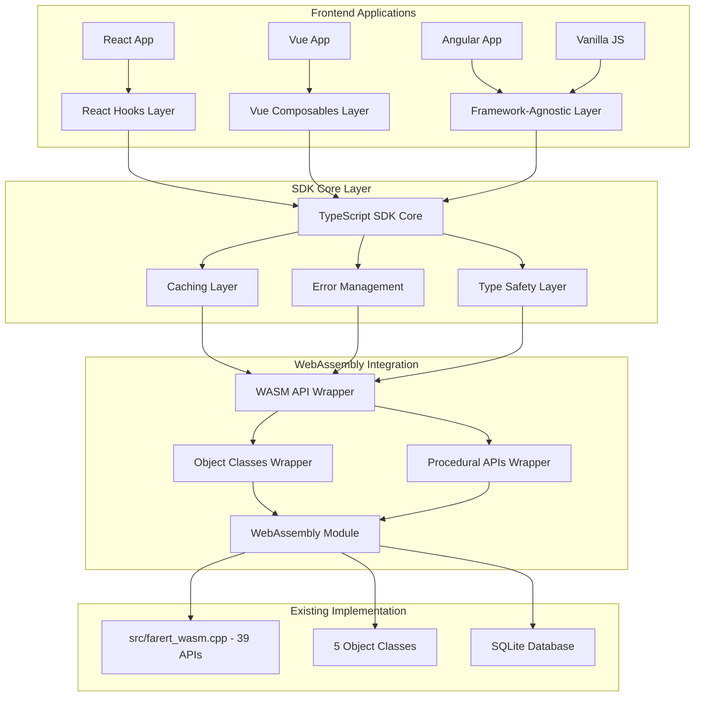
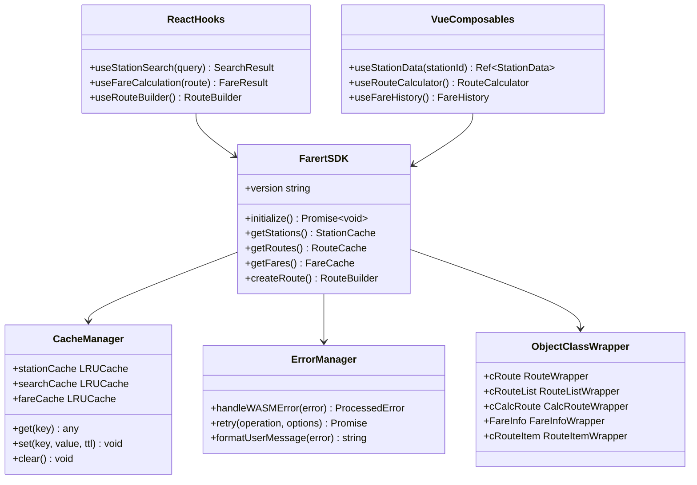

# Design Document - Frontend API Layer

## Overview

The Frontend API Layer provides a comprehensive, framework-agnostic TypeScript SDK that wraps the existing 39 WebAssembly APIs and 5 Object Classes to enable rapid development of railway fare calculation applications in React, Vue, Angular, and vanilla JavaScript environments.

### Project Goals
- Create a unified TypeScript SDK wrapping all WebAssembly functionality
- Implement intelligent caching for optimal performance
- Provide React hooks and Vue composables for framework integration
- Ensure framework-agnostic utilities for broad compatibility
- Maintain type safety and excellent developer experience

## Steering Document Alignment

This design aligns with CLAUDE.md requirements by:
- Building upon the existing 39 WebAssembly APIs in `src/farert_wasm.cpp`
- Leveraging 5 Object Classes (cRouteItem, cRoute, cRouteList, cCalcRoute, FareInfo)
- Hiding database operations from TypeScript interface layer
- Supporting modern JavaScript/TypeScript application development
- Enabling transition from C++ desktop to web-based solutions

## Code Reuse Analysis

### Existing Foundation
- **WebAssembly APIs**: 39 functions already implemented in `src/farert_wasm.cpp`
- **TypeScript Interfaces**: Basic definitions in `src/cli/types.ts`
- **WASM Loader**: Module loading infrastructure in `src/cli/wasm_loader.ts`
- **Object Classes**: 5 classes with WebAssembly bindings already functional
- **JSON APIs**: Frontend-ready APIs like `getFareInfoJson()`, `getCompanyAndPrefectsAsJson()`

### Reusable Components
- WebAssembly module initialization patterns
- Error handling structures from CLI implementation
- TypeScript interface patterns from existing `types.ts`
- Test infrastructure from `src/cli/test_wasm_extended.ts`

## Architecture

### System Architecture



### SDK Core Architecture



## Components and Interfaces

### Core SDK Interface

```typescript
// Core SDK Interface
export interface FarertSDK {
  // Initialization
  initialize(): Promise<void>;
  isReady(): boolean;
  version: string;
  
  // Station Operations with Caching
  getStationById(id: number): Promise<Station>;
  getStationByName(name: string): Promise<Station>;
  searchStations(query: string, limit?: number): Promise<Station[]>;
  getStationKana(id: number): Promise<string>;
  getStationPrefecture(id: number): Promise<string>;
  
  // Route Operations
  createRoute(): RouteBuilder;
  validateRoute(route: RouteInput): ValidationResult;
  calculateFare(route: RouteInput): Promise<FareInfo>;
  
  // Reference Data (Long-term Cached)
  getCompanies(): Promise<Company[]>;
  getPrefectures(): Promise<Prefecture[]>;
  getLines(): Promise<Line[]>;
  
  // Object Classes
  objectClasses: {
    RouteList: typeof cRouteList;
    Route: typeof cRoute;
    CalcRoute: typeof cCalcRoute;
    FareInfo: typeof FareInfo;
    RouteItem: typeof cRouteItem;
  };
}
```

### Enhanced Object Class Interfaces

```typescript
// Enhanced cRoute with Fluent API
export interface cRoute extends cRouteList {
  setupRoute(route: string): cRoute;
  addStation(stationId: number): cRoute;
  addLine(lineId: number): cRoute;
  validateRoute(): ValidationResult;
  optimizeRoute(criteria: 'shortest' | 'cheapest'): cRoute;
  getAlternatives(): cRoute[];
  clone(): cRoute;
}

// Enhanced cRouteItem with Full Properties
export interface cRouteItem {
  fare: number;
  salesKm: number;
  indexOfAggregate: number;
  stationId: number;
  lineId: number;
  companyId: number;
  toJSON(): RouteItemJSON;
}

// Enhanced cRouteList with Array Operations
export interface cRouteList {
  at(index: number): cRouteItem;
  count(): number;
  remove(index: number): cRouteItem;
  removeAll(): void;
  insert(obj: cRouteList, at: number): void;
  assign(obj: cRouteList): void;
  forEach(callback: (item: cRouteItem, index: number) => void): void;
  map<T>(callback: (item: cRouteItem, index: number) => T): T[];
  toArray(): cRouteItem[];
}

// Enhanced FareInfo with Comprehensive Data
export interface FareInfo {
  fare: number;
  result: number;
  isRule114Applied: boolean;
  availCountForFareOfStockDiscount: number;
  
  // Enhanced capabilities
  getBreakdown(): FareBreakdown;
  getRouteString(): string;
  getDiscounts(): Discount[];
  compareWith(other: FareInfo): FareComparison;
  exportHistory(): CalculationHistory;
  toJSON(): FareInfoJSON;
}
```

### Caching Layer Design

```typescript
// Intelligent Caching System
export interface CacheManager {
  // Station data - 1 hour TTL
  stationCache: LRUCache<number, Station>;
  
  // Search results - 15 minutes TTL  
  searchCache: LRUCache<string, Station[]>;
  
  // Fare calculations - 5 minutes TTL
  fareCache: LRUCache<string, FareInfo>;
  
  // Reference data - Session duration
  referenceCache: Map<string, Company[] | Prefecture[] | Line[]>;
  
  // Configuration
  maxMemoryUsage: number; // 50MB limit
  
  // Methods
  get<T>(key: string, category: CacheCategory): T | undefined;
  set<T>(key: string, value: T, category: CacheCategory): void;
  invalidate(pattern?: string): void;
  getStats(): CacheStats;
}

// LRU Cache with TTL
export interface LRUCache<K, V> {
  get(key: K): V | undefined;
  set(key: K, value: V, ttlMs?: number): void;
  delete(key: K): boolean;
  clear(): void;
  size: number;
  maxSize: number;
}
```

### React Integration Layer

```typescript
// React Hooks
export function useStationSearch(query: string, options?: SearchOptions) {
  return {
    stations: Station[],
    loading: boolean,
    error: Error | null,
    hasMore: boolean,
    loadMore: () => void
  };
}

export function useFareCalculation(route: RouteInput, options?: CalcOptions) {
  return {
    fareInfo: FareInfo | null,
    loading: boolean,
    error: Error | null,
    recalculate: () => void,
    history: FareInfo[]
  };
}

export function useRouteBuilder(initialRoute?: RouteInput) {
  return {
    route: cRoute,
    isValid: boolean,
    validationErrors: ValidationError[],
    addStation: (stationId: number) => void,
    removeStation: (index: number) => void,
    clear: () => void,
    undo: () => void,
    redo: () => void
  };
}

// React Components
export const StationSelector: React.FC<StationSelectorProps>;
export const RouteBuilder: React.FC<RouteBuilderProps>;
export const FareDisplay: React.FC<FareDisplayProps>;
```

### Vue Composition API Layer

```typescript
// Vue Composables
export function useStationData(stationId: Ref<number>) {
  return {
    station: Ref<Station | null>,
    loading: Ref<boolean>,
    error: Ref<Error | null>,
    refresh: () => Promise<void>
  };
}

export function useRouteCalculator() {
  return {
    route: Ref<cRoute>,
    fareInfo: Ref<FareInfo | null>,
    loading: Ref<boolean>,
    calculate: () => Promise<void>,
    isValid: ComputedRef<boolean>
  };
}

export function useFareHistory() {
  return {
    history: Ref<FareInfo[]>,
    current: Ref<number>,
    canUndo: ComputedRef<boolean>,
    canRedo: ComputedRef<boolean>,
    undo: () => void,
    redo: () => void,
    clear: () => void
  };
}
```

## Data Models

### Station Data Model

```typescript
export interface Station {
  id: number;
  name: string;
  kana: string;
  prefecture: string;
  prefectureId: number;
  lines: Line[];
  isJunction: boolean;
  attributes: StationAttributes;
}

export interface StationAttributes {
  isTerminal: boolean;
  isSpecificJunction: boolean;
  companyBoundaries: number[];
  fareZones: FareZone[];
}
```

### Route Data Models

```typescript
export interface RouteInput {
  stations: number[];
  lines: number[];
  options?: RouteOptions;
}

export interface RouteOptions {
  preferFastRoute: boolean;
  preferCheapRoute: boolean;
  avoidLines?: number[];
  maxTransfers?: number;
}

export interface ValidationResult {
  isValid: boolean;
  errors: ValidationError[];
  warnings: ValidationWarning[];
  suggestions: RouteSuggestion[];
}
```

### Fare Data Models

```typescript
export interface FareBreakdown {
  basicFare: number;
  expressCharges: number[];
  taxes: number;
  discounts: Discount[];
  total: number;
  breakdown: FareSegment[];
}

export interface FareSegment {
  fromStation: number;
  toStation: number;
  company: number;
  distance: number;
  fare: number;
  rules: FareRule[];
}
```

## Error Handling

### Error Classification System

```typescript
// Error Types with Specific Codes
export enum ErrorCode {
  // WebAssembly Errors (WASM_001-099)
  WASM_MODULE_LOAD_FAILED = 'WASM_001',
  WASM_MEMORY_ALLOCATION = 'WASM_002',
  WASM_FUNCTION_NOT_FOUND = 'WASM_003',
  
  // Database Errors (DB_001-099)
  DATABASE_CONNECTION_FAILED = 'DB_001',
  DATABASE_QUERY_FAILED = 'DB_002',
  DATABASE_CORRUPTION = 'DB_003',
  
  // Route Errors (ROUTE_001-099)
  INVALID_STATION_NAME = 'ROUTE_001',
  INVALID_LINE_CONNECTION = 'ROUTE_002',
  ROUTE_CALCULATION_FAILED = 'ROUTE_003',
  
  // Cache Errors (CACHE_001-099)
  CACHE_MEMORY_EXCEEDED = 'CACHE_001',
  CACHE_CORRUPTION = 'CACHE_002'
}

export interface ProcessedError {
  code: ErrorCode;
  message: string;
  userMessage: string;
  suggestions: string[];
  retryable: boolean;
  context: ErrorContext;
}
```

### Retry Mechanism Design

```typescript
export interface RetryOptions {
  maxAttempts: number;
  backoffMultiplier: number;
  initialDelayMs: number;
  maxDelayMs: number;
  retryableErrors: ErrorCode[];
}

export class ErrorManager {
  async retry<T>(
    operation: () => Promise<T>,
    options: RetryOptions
  ): Promise<T> {
    // Exponential backoff retry logic
    // Error classification and user message generation
    // Context preservation for debugging
  }
}
```

## Testing Strategy

### Unit Testing Approach

```typescript
// Core SDK Unit Tests
describe('FarertSDK', () => {
  test('initializes WebAssembly module successfully');
  test('handles WebAssembly loading failures gracefully');
  test('provides correct TypeScript types for all APIs');
});

// Caching Layer Tests
describe('CacheManager', () => {
  test('LRU eviction works correctly under memory pressure');
  test('TTL expiration removes stale data');
  test('cache statistics are accurate');
});

// Object Classes Tests
describe('Object Classes', () => {
  test('cRoute fluent API chains correctly');
  test('cRouteList array operations match expected behavior');
  test('FareInfo provides accurate fare breakdowns');
});
```

### Integration Testing Strategy

```typescript
// Framework Integration Tests
describe('React Integration', () => {
  test('useStationSearch debounces correctly');
  test('useFareCalculation updates on route changes');
  test('error boundaries catch WebAssembly failures');
});

describe('Vue Integration', () => {
  test('composables integrate with Vue reactivity system');
  test('reactive refs update automatically');
  test('cleanup prevents memory leaks');
});
```

### Performance Testing

```typescript
// Performance Benchmarks
describe('Performance Requirements', () => {
  test('SDK initialization completes within 2 seconds');
  test('cached API calls respond within 10ms');
  test('route calculations complete within 500ms');
  test('bundle size does not exceed 150KB gzipped');
});
```

### Cross-Platform Testing

```typescript
// Browser Compatibility Tests
describe('Cross-Platform', () => {
  test('works in Chrome 90+');
  test('works in Firefox 88+');
  test('works in Safari 14+');
  test('Node.js 14+ compatibility');
});
```

## Implementation Plan

### Phase 1: Core SDK Foundation (Week 1-2)
1. Create TypeScript SDK wrapper around existing 39 WebAssembly APIs
2. Implement basic caching layer with LRU and TTL
3. Enhanced Object Classes with array operations and fluent API
4. Comprehensive error handling with retry mechanisms

### Phase 2: Framework Integration (Week 3-4)
5. React hooks implementation with proper state management
6. Vue composables with reactivity integration
7. Framework-agnostic utilities for Angular/Svelte
8. Bundle optimization and lazy loading

### Phase 3: Developer Experience (Week 5-6)
9. Complete TypeScript types and JSDoc documentation
10. Performance monitoring and optimization
11. Comprehensive testing suite
12. Documentation and examples

### Phase 4: Production Readiness (Week 7)
13. Security audit and input validation
14. Memory leak testing and prevention
15. Cross-browser compatibility testing
16. Performance benchmarking and optimization

This design provides a comprehensive foundation for creating a high-quality Frontend API Layer that enables rapid development of railway fare calculation applications across all major JavaScript frameworks while maintaining excellent performance and developer experience.