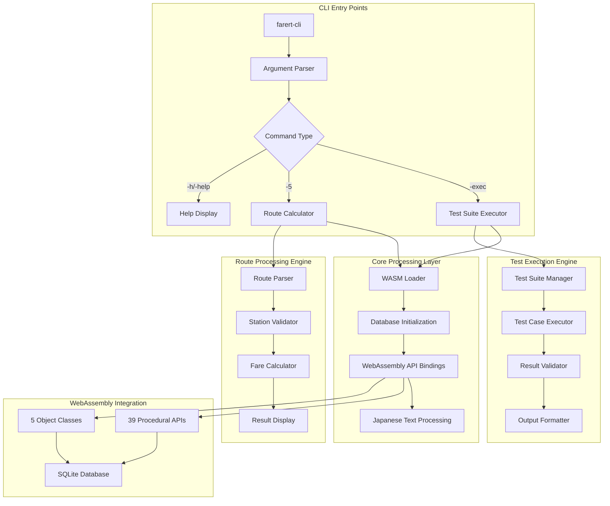
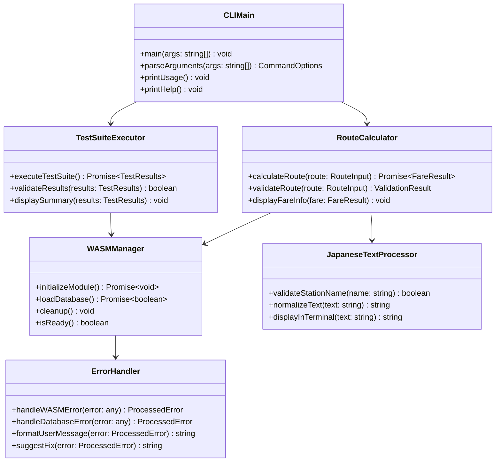

# 設計書 - TypeScript CLI インターフェース拡張

## 概要

TypeScript CLI インターフェース拡張プロジェクトは、`testmain.cpp`と`test_exec.cpp`からの機能を移植する既存TypeScript実装を完成・精錬します。CLIはWebAssembly APIの検証ツール、開発ユーティリティ、そしてWASMベース鉄道運賃計算システムのリファレンス実装として機能します。

### プロジェクト目標
- C++ CLI機能のTypeScriptへの忠実な完全移植
- 元の実装との正確なテスト結果互換性維持
- 堅牢なエラーハンドリングと日本語テキスト対応提供
- 既存ビルドシステムとnpmワークフローとのシームレス統合
- 包括的WebAssembly API検証の実現

## ステアリング文書との整合性

この設計はCLAUDE.md要件と以下の点で整合します：
- `src/farert_wasm.cpp`の既存39 WebAssembly APIを基盤とする
- C++からWebAssemblyベースシステムへの完全移植を活用
- 元のテスト動作との後方互換性維持
- UTF-8日本語テキスト処理の排他的対応
- 既存Emscriptenとnpmビルドワークフローとの統合

## コード再利用分析

### 既存基盤
- **CLI構造**: `src/cli/main.ts`の引数解析付き基本CLIフレームワーク
- **テストフレームワーク**: `src/cli/test_exec.ts`と`test_exec_original.ts`の部分実装
- **WebAssembly統合**: `src/cli/wasm_loader.ts`のモジュール読み込み
- **経路計算**: `src/cli/route_calculator.ts`のコアロジック
- **型定義**: `src/cli/types.ts`の完全インターフェース
- **拡張テスト**: `src/cli/test_wasm_extended.ts`の高度APIテスト

### 再利用可能コンポーネント
- 既存WebAssemblyモジュール初期化パターン
- 現在のCLI実装からの日本語テキスト処理
- 経路計算機からのエラーハンドリング構造
- npmスクリプト統合パターン
- TypeScriptコンパイルとビルドワークフロー

## Architecture

### CLI System Architecture



### Component Architecture



## Components and Interfaces

### CLI Command Interface

```typescript
// Command-line Interface Types
export interface CommandOptions {
  command: 'exec' | 'route' | 'help';
  routeParams?: RouteParams;
  verbose?: boolean;
  configPath?: string;
}

export interface RouteParams {
  station1: string;
  line1: string;
  station2: string;
  line2: string;
  station3: string;
}

// Main CLI Interface
export class CLIMain {
  async main(args: string[]): Promise<number> {
    try {
      const options = this.parseArguments(args);
      await this.initializeWASM();
      
      switch (options.command) {
        case 'exec':
          return await this.executeTests(options);
        case 'route':
          return await this.calculateRoute(options.routeParams!);
        case 'help':
          this.printHelp();
          return 0;
        default:
          this.printUsage();
          return 1;
      }
    } catch (error) {
      this.handleError(error);
      return 1;
    }
  }
}
```

### Test Suite Interface

```typescript
// Test Execution Framework
export interface TestSuite {
  name: string;
  tests: TestCase[];
  setup(): Promise<void>;
  teardown(): Promise<void>;
}

export interface TestCase {
  name: string;
  description: string;
  execute(): Promise<TestResult>;
  expectedResult?: any;
}

export interface TestResult {
  success: boolean;
  actualValue: any;
  expectedValue: any;
  tolerance?: number;
  executionTime: number;
  error?: Error;
}

// Test Suite Implementation
export class TestSuiteExecutor {
  private testSuites: TestSuite[] = [];
  
  async executeTestSuite(verbose: boolean = false): Promise<TestResults> {
    const results: TestResults = {
      totalTests: 0,
      passedTests: 0,
      failedTests: 0,
      executionTime: 0,
      details: []
    };
    
    for (const suite of this.testSuites) {
      await suite.setup();
      
      for (const test of suite.tests) {
        const result = await this.executeTest(test, verbose);
        results.details.push(result);
        results.totalTests++;
        
        if (result.success) {
          results.passedTests++;
        } else {
          results.failedTests++;
        }
      }
      
      await suite.teardown();
    }
    
    return results;
  }
}
```

### Route Calculation Interface

```typescript
// Route Calculation System
export interface RouteCalculationRequest {
  stations: string[];
  lines: string[];
  options?: CalculationOptions;
}

export interface CalculationOptions {
  longRoute?: boolean;
  startAsCity?: boolean;
  arriveAsCity?: boolean;
}

export interface FareCalculationResult {
  fare: number;
  fareString: string;
  route: RouteInfo;
  calculation: FareDetails;
  warnings: string[];
  errors: string[];
}

export class RouteCalculator {
  private wasmModule: FarertModule;
  
  async calculateFare(request: RouteCalculationRequest): Promise<FareCalculationResult> {
    // Validate input
    const validation = await this.validateRoute(request);
    if (!validation.isValid) {
      throw new ValidationError(validation.errors);
    }
    
    // Initialize route
    this.wasmModule.createRoute();
    
    // Add stations and lines
    for (let i = 0; i < request.stations.length; i++) {
      const stationId = this.wasmModule.getStationId(request.stations[i]);
      if (stationId <= 0) {
        throw new StationNotFoundError(request.stations[i]);
      }
      
      if (i === 0) {
        this.wasmModule.addRouteBegin(stationId);
      } else {
        const lineId = this.wasmModule.getLineId(request.lines[i - 1]);
        if (lineId <= 0) {
          throw new LineNotFoundError(request.lines[i - 1]);
        }
        this.wasmModule.addRoute(lineId, stationId);
      }
    }
    
    // Calculate fare
    const fare = this.wasmModule.calculateFare();
    const fareString = this.wasmModule.getFareString();
    
    return {
      fare,
      fareString,
      route: this.buildRouteInfo(request),
      calculation: this.buildFareDetails(),
      warnings: [],
      errors: []
    };
  }
}
```

### WebAssembly Management Interface

```typescript
// WebAssembly Module Management
export interface WASMConfiguration {
  wasmPath: string;
  databasePath: string;
  timeout: number;
  memoryInitial: number;
  memoryMaximum: number;
}

export class WASMManager {
  private module: FarertModule | null = null;
  private initialized: boolean = false;
  
  async initialize(config: WASMConfiguration): Promise<void> {
    try {
      // Load WebAssembly module
      const wasmBuffer = await this.loadWASMFile(config.wasmPath);
      this.module = await this.instantiateWASM(wasmBuffer);
      
      // Initialize database
      const dbSuccess = this.module.openDatabase();
      if (!dbSuccess) {
        throw new DatabaseInitializationError('Failed to open SQLite database');
      }
      
      this.initialized = true;
    } catch (error) {
      throw new WASMInitializationError(`Failed to initialize WebAssembly: ${error.message}`);
    }
  }
  
  getModule(): FarertModule {
    if (!this.initialized || !this.module) {
      throw new Error('WebAssembly module not initialized');
    }
    return this.module;
  }
  
  async cleanup(): Promise<void> {
    if (this.module) {
      this.module.closeDatabase();
      this.module = null;
      this.initialized = false;
    }
  }
}
```

## Data Models

### Configuration Data Models

```typescript
// CLI Configuration
export interface CLIConfiguration {
  wasm: WASMConfiguration;
  logging: LoggingConfiguration;
  testing: TestConfiguration;
  display: DisplayConfiguration;
}

export interface LoggingConfiguration {
  level: 'debug' | 'info' | 'warn' | 'error';
  file?: string;
  console: boolean;
}

export interface TestConfiguration {
  timeout: number;
  tolerance: number;
  parallel: boolean;
  verbose: boolean;
}

export interface DisplayConfiguration {
  encoding: string;
  colors: boolean;
  progressBar: boolean;
  locale: string;
}
```

### Test Data Models

```typescript
// Test Framework Data Models
export interface TestResults {
  totalTests: number;
  passedTests: number;
  failedTests: number;
  executionTime: number;
  details: TestResult[];
  summary: TestSummary;
}

export interface TestSummary {
  successRate: number;
  averageExecutionTime: number;
  slowestTest: string;
  fastestTest: string;
  memoryUsage: MemoryUsage;
}

export interface MemoryUsage {
  initial: number;
  peak: number;
  final: number;
  wasmHeap: number;
}
```

### Route Data Models

```typescript
// Route and Station Data Models
export interface RouteInfo {
  stations: StationInfo[];
  lines: LineInfo[];
  distance: number;
  companies: CompanyInfo[];
  transferCount: number;
}

export interface StationInfo {
  id: number;
  name: string;
  kana: string;
  prefecture: string;
  isJunction: boolean;
  attributes: number;
}

export interface LineInfo {
  id: number;
  name: string;
  company: CompanyInfo;
  type: 'local' | 'express' | 'limited';
}

export interface FareDetails {
  basicFare: number;
  expressCharges: number[];
  taxes: number;
  discounts: DiscountInfo[];
  rules: FareRule[];
}
```

## Error Handling

### Error Classification System

```typescript
// Comprehensive Error Classification
export enum CLIErrorCode {
  // Initialization Errors (1-10)
  WASM_LOAD_FAILED = 1,
  DATABASE_INIT_FAILED = 2,
  CONFIG_LOAD_FAILED = 3,
  DEPENDENCY_MISSING = 4,
  
  // Input Validation Errors (11-20)
  INVALID_ARGUMENTS = 11,
  STATION_NOT_FOUND = 12,
  LINE_NOT_FOUND = 13,
  INVALID_ROUTE = 14,
  
  // Calculation Errors (21-30)
  FARE_CALC_FAILED = 21,
  ROUTE_BUILD_FAILED = 22,
  DATABASE_QUERY_FAILED = 23,
  
  // Test Execution Errors (31-40)
  TEST_SUITE_FAILED = 31,
  TEST_TIMEOUT = 32,
  RESULT_VALIDATION_FAILED = 33,
  
  // System Errors (41-50)
  OUT_OF_MEMORY = 41,
  FILESYSTEM_ERROR = 42,
  PERMISSION_DENIED = 43,
  UNEXPECTED_ERROR = 50
}

export class CLIError extends Error {
  constructor(
    public code: CLIErrorCode,
    message: string,
    public userMessage?: string,
    public suggestions?: string[],
    public context?: any
  ) {
    super(message);
    this.name = 'CLIError';
  }
}

// Error Handler with Japanese Support
export class ErrorHandler {
  formatError(error: CLIError): string {
    const baseMessage = error.userMessage || error.message;
    
    switch (error.code) {
      case CLIErrorCode.STATION_NOT_FOUND:
        return this.formatStationNotFoundError(error);
      case CLIErrorCode.WASM_LOAD_FAILED:
        return this.formatWASMLoadError(error);
      case CLIErrorCode.DATABASE_INIT_FAILED:
        return this.formatDatabaseError(error);
      default:
        return baseMessage;
    }
  }
  
  private formatStationNotFoundError(error: CLIError): string {
    const stationName = error.context?.stationName;
    const suggestions = error.suggestions || [];
    
    let message = `駅名「${stationName}」が見つかりません。\n`;
    
    if (suggestions.length > 0) {
      message += '候補駅名:\n';
      suggestions.forEach((suggestion, index) => {
        message += `  ${index + 1}. ${suggestion}\n`;
      });
    }
    
    return message;
  }
}
```

### Retry and Recovery Strategy

```typescript
// Retry Mechanism for CLI Operations
export interface RetryConfiguration {
  maxAttempts: number;
  initialDelay: number;
  backoffMultiplier: number;
  maxDelay: number;
  retryableErrors: CLIErrorCode[];
}

export class RetryHandler {
  async executeWithRetry<T>(
    operation: () => Promise<T>,
    config: RetryConfiguration
  ): Promise<T> {
    let lastError: Error;
    
    for (let attempt = 1; attempt <= config.maxAttempts; attempt++) {
      try {
        return await operation();
      } catch (error) {
        lastError = error;
        
        if (error instanceof CLIError && 
            config.retryableErrors.includes(error.code)) {
          
          if (attempt < config.maxAttempts) {
            const delay = Math.min(
              config.initialDelay * Math.pow(config.backoffMultiplier, attempt - 1),
              config.maxDelay
            );
            
            console.warn(`Attempt ${attempt} failed, retrying in ${delay}ms...`);
            await this.sleep(delay);
            continue;
          }
        }
        
        throw error;
      }
    }
    
    throw lastError!;
  }
  
  private sleep(ms: number): Promise<void> {
    return new Promise(resolve => setTimeout(resolve, ms));
  }
}
```

## Testing Strategy

### Unit Testing Framework

```typescript
// CLI-Specific Unit Tests
describe('CLI Main', () => {
  test('parses arguments correctly', () => {
    const args = ['-5', '渋谷', '山手線', '品川', '東海道線', '静岡'];
    const options = CLIMain.parseArguments(args);
    expect(options.command).toBe('route');
    expect(options.routeParams?.station1).toBe('渋谷');
  });
  
  test('handles invalid arguments gracefully', () => {
    expect(() => CLIMain.parseArguments(['--invalid'])).toThrow();
  });
  
  test('displays help correctly', () => {
    const output = captureConsoleOutput(() => CLIMain.printHelp());
    expect(output).toContain('-exec');
    expect(output).toContain('Examples:');
  });
});

describe('WebAssembly Manager', () => {
  test('initializes module successfully', async () => {
    const manager = new WASMManager();
    await expect(manager.initialize(testConfig)).resolves.not.toThrow();
    expect(manager.isReady()).toBe(true);
  });
  
  test('handles initialization failure gracefully', async () => {
    const manager = new WASMManager();
    const invalidConfig = { ...testConfig, wasmPath: 'invalid.wasm' };
    await expect(manager.initialize(invalidConfig)).rejects.toThrow();
  });
});
```

### Integration Testing Strategy

```typescript
// End-to-End CLI Testing
describe('CLI Integration', () => {
  test('executes test suite successfully', async () => {
    const result = await executeCLI(['-exec']);
    expect(result.exitCode).toBe(0);
    expect(result.stdout).toContain('Test Results:');
  });
  
  test('calculates fare correctly', async () => {
    const result = await executeCLI(['-5', '東京', '東海道線', '品川', '山手線', '渋谷']);
    expect(result.exitCode).toBe(0);
    expect(result.stdout).toContain('運賃:');
  });
  
  test('handles Japanese text correctly', async () => {
    const result = await executeCLI(['-5', 'あいうえお', '路線', '駅', '路線', '駅']);
    expect(result.exitCode).toBe(1);
    expect(result.stderr).toContain('駅名');
  });
});
```

### Performance Testing

```typescript
// CLI Performance Tests
describe('CLI Performance', () => {
  test('startup time within requirements', async () => {
    const start = Date.now();
    await initializeCLI();
    const duration = Date.now() - start;
    
    expect(duration).toBeLessThan(2000); // 2 second requirement
  });
  
  test('memory usage within limits', async () => {
    const initialMemory = process.memoryUsage();
    await executeLargeTestSuite();
    const finalMemory = process.memoryUsage();
    
    const memoryIncrease = finalMemory.heapUsed - initialMemory.heapUsed;
    expect(memoryIncrease).toBeLessThan(512 * 1024 * 1024); // 512MB limit
  });
});
```

## Implementation Plan

### Phase 1: Core CLI Foundation (Week 1)
1. Complete argument parsing system with full validation
2. Enhanced error handling with Japanese text support
3. Improved WebAssembly module loading with proper error recovery
4. Configuration management system

### Phase 2: Test Suite Migration (Week 2)
5. Complete migration of test_exec.cpp with identical test ordering
6. Result validation system with tolerance checking
7. Comprehensive test reporting and summary display
8. Memory usage monitoring and leak detection

### Phase 3: Route Calculation Enhancement (Week 3)
9. Enhanced route calculation with detailed validation
10. Japanese station name fuzzy matching
11. Comprehensive fare information display
12. Error suggestion system

### Phase 4: Build Integration and Documentation (Week 4)
13. npm script integration and CI/CD support
14. Comprehensive help system and documentation
15. Cross-platform compatibility testing
16. Performance optimization and monitoring

This design provides a complete foundation for creating a production-ready TypeScript CLI that faithfully recreates the original C++ functionality while providing enhanced error handling, Japanese text support, and seamless integration with the existing WebAssembly-based railway fare calculation system.