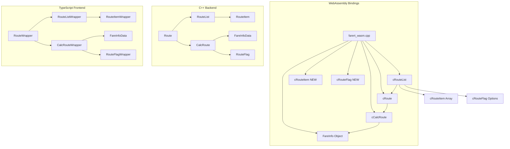
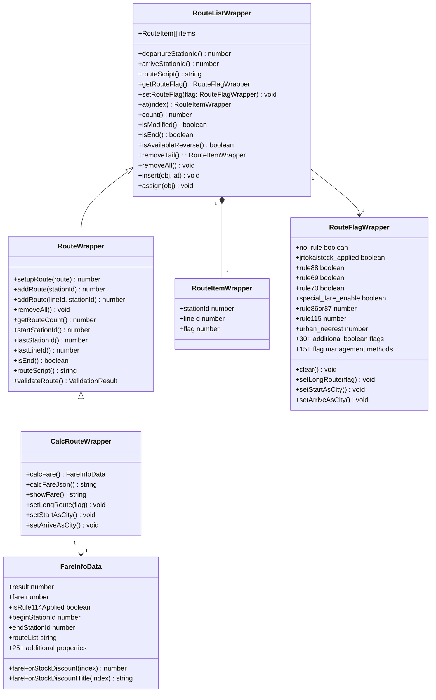

# Design Document - WASM Object Classes Enhancement

## Overview

The WASM Object Classes Enhancement project completes and improves the existing implementation of six core object classes that provide object-oriented access to the Japanese railway fare calculation system. These classes serve as the primary interface for modern JavaScript/TypeScript applications, providing a clean abstraction layer over the complex C++ railway calculation logic.

The project builds upon existing WebAssembly bindings (`cRoute`, `cRouteList`, `cCalcRoute`, `FareInfo`) and adds the missing `cRouteItem` class and new `cRouteFlag` class while enhancing type safety, error handling, and cross-platform compatibility with Android Kotlin implementations.

## Steering Document Alignment

### Technical Standards (CLAUDE.md)
The design follows the established WebAssembly architecture patterns:
- Maintains backward compatibility with all 39 existing procedural APIs
- Uses Emscripten class bindings for object-oriented JavaScript access
- Implements inheritance hierarchy: `cCalcRoute < cRoute < cRouteList`
- Follows Japanese station/line naming conventions and UTF-8 encoding
- Integrates with existing SQLite3 database via MEMFS

### Project Structure (structure.md)
Implementation aligns with established project organization:
- C++ wrapper classes in `src/include/route_interface.h` and `src/core/route_interface.cpp`
- WebAssembly bindings in `src/farert_wasm.cpp` (lines 540-611)
- TypeScript interfaces in `src/cli/types.ts`
- Test implementations in `src/cli/test_wasm_extended.ts`
- Database operations hidden at the wrapper class level

## Code Reuse Analysis

### Existing Components to Leverage

- **FareInfoData Structure (route_interface.h:13-152)**: Complete 25+ property structure with stock discount methods
- **RouteWrapper Class (route_interface.h:166-209)**: 15+ methods including setupRoute, addRoute, getRouteCount
- **CalcRouteWrapper Class (route_interface.h:227-261)**: Complete calcFare implementation and inheritance
- **RouteListWrapper Class (route_interface.h:212-224)**: Base container with basic functionality  
- **RouteUtility Class (route_interface.h:264-320)**: Station/line lookup and array operations
- **Existing WebAssembly Bindings (farert_wasm.cpp:540-611)**: Current object class implementations

### Integration Points

- **Procedural API Compatibility**: All existing procedural functions remain unchanged
- **Database Layer**: Existing SQLite3 integration via MEMFS continues to work transparently
- **CLI Test Suite**: Integration with `src/cli/test_exec.ts` and `test_wasm_extended.ts`
- **Android Kotlin**: Cross-platform compatibility with existing Android FareInfo.kt and RouteHelper.kt

## Architecture

The object class hierarchy provides a graduated interface from simple route containers to complete fare calculation objects:



### Class Relationship Design



## Components and Interfaces

### Component 1: cRouteItem Class (NEW IMPLEMENTATION)
- **Purpose:** Individual route element container with fare and distance information
- **Interfaces:** 
  - `stationId: number` - Station ID for this route point
  - `lineId: number` - Line ID for this route segment
  - `falg: number` - Specific flags
- **Dependencies:** RouteItem C++ class from alpdb.h
- **Reuses:** Existing RouteItem structure and RouteUtility helper methods

### Component 2: Enhanced cRouteList Array Operations
- **Purpose:** Container class with explicit array manipulation methods
- **Interfaces:**
  - `at(index: number): cRouteItem` - Get route item at index
  - `count(): number` - Get number of route items
  - `remove(index: number): cRouteItem` - Remove item at index
  - `removeAll(): void` - Clear all items
  - `insert(obj: cRouteList, at: number): void` - Insert route list at position
  - `assign(obj: cRouteList): void` - Replace contents with another route list
- **Dependencies:** RouteList C++ class, RouteItem access
- **Reuses:** Existing RouteListWrapper foundation and C++ RouteList operations

### Component 3: Enhanced Error Handling System
- **Purpose:** Comprehensive error validation with specific error codes and suggestions
- **Interfaces:**
  - Error codes ROUTE_ERR_001-099 for route construction failures
  - `ValidationResult` interface with error details and suggested corrections
  - Fuzzy matching for invalid station names with up to 3 suggestions
- **Dependencies:** Existing RouteUtility station lookup methods
- **Reuses:** Existing database query functions for station name validation

### Component 4: TypeScript Interface Completions
- **Purpose:** Complete type definitions with full IDE support and compile-time checking
- **Interfaces:** Enhanced interfaces for all object classes with complete method signatures
- **Dependencies:** Existing TypeScript interface foundation in types.ts
- **Reuses:** Current FareInfoData property definitions and method signatures

### Component 5: cRouteFlag Class (NEW IMPLEMENTATION)
- **Purpose:** Comprehensive route flag management for fare calculation rules and special cases
- **Interfaces:** 
  - 30+ Boolean properties for rule states (rule69, rule70, rule88, etc.)
  - 4 numeric properties (rule86or87, rule115, urban_neerest, osakaKanPass)
  - 15+ management methods (setLongRoute, setStartAsCity, isAvailable*, etc.)
- **Dependencies:** RouteFlag C++ class from alpdb.h with all public members
- **Reuses:** Complete C++ RouteFlag implementation with identical behavior

### Component 6: Android Kotlin Compatibility Layer
- **Purpose:** Ensure compatibility with existing Android Kotlin implementations
- **Interfaces:** TypeScript interfaces that match Kotlin data class structures
- **Dependencies:** Android FareInfo.kt and RouteHelper.kt structure requirements
- **Reuses:** Existing FareInfoData property mapping and method naming conventions

## Data Models

### Enhanced RouteItemWrapper
```typescript
interface RouteItemWrapper {
  // Core properties (from CLAUDE.md specification)
  fare: number;                    // Fare amount for this segment
  salesKm: number;                 // Sales distance in kilometers  
  indexOfAggregate: number;        // Index for aggregated calculations
  
  // Additional properties for complete route information
  stationId: number;               // Station ID at this route point
  lineId: number;                  // Line ID for this segment
  
  // Methods for route item operations
  isValid(): boolean;              // Check if route item is valid
  getDisplayName(): string;        // Get formatted display name
}
```

### Enhanced FareInfoData with Error Handling
```typescript
interface FareInfoData {
  // Result and error information
  result: number;                  // -2: empty route, -3: calc failure, ≥0: success
  errorCode?: string;              // Specific error code (ROUTE_ERR_XXX)
  errorMessage?: string;           // Human-readable error description
  suggestedStations?: string[];    // Up to 3 suggested station names for errors
  
  // Core fare information (25+ properties from route_interface.h)
  fare: number;
  isRule114Applied: boolean;
  availCountForFareOfStockDiscount: number;
  beginStationId: number;
  endStationId: number;
  isResultCompanyBeginEnd: boolean;
  isResultCompanyMultipassed: boolean;
  totalSalesKm: number;
  jrCalcKm: number;
  jrSalesKm: number;
  companySalesKm: number;
  fareForCompanyline: number;
  fareForIC: number;
  fareForBRT: number;
  childFare: number;
  academicFare: number;
  ticketAvailDays: number;
  isRoundtrip: boolean;
  isRoundtripDiscount: boolean;
  routeList: string;
  routeListForTOICA: string;
  
  // Stock discount methods
  fareForStockDiscount(index: number): number;
  fareForStockDiscountTitle(index: number): string;
  
  // Enhanced display methods
  getFormattedFare(): string;
  getFareBreakdown(): FareBreakdown;
  compare(other: FareInfoData): FareComparison;
}
```

### ValidationResult
```typescript
interface ValidationResult {
  isValid: boolean;
  errorCode?: string;              // ROUTE_ERR_001 through ROUTE_ERR_099
  errorMessage?: string;
  invalidStationName?: string;
  suggestedStations?: string[];    // Up to 3 fuzzy matched suggestions
  invalidLineConnection?: {
    fromStation: string;
    toStation: string;
    attemptedLine: string;
    validLines: string[];
  };
}
```

## Error Handling

### Error Scenarios

1. **Invalid Station Names in setupRoute()**
   - **Handling:** Throw RouteConstructionError with ROUTE_ERR_001-020 codes
   - **User Impact:** Specific error message with up to 3 fuzzy-matched station suggestions
   - **Implementation:** Use RouteUtility.keyMatchStations() for suggestion generation

2. **Route Calculation Failures in calcFare()**
   - **Handling:** Return FareInfo with result = -2 (empty) or -3 (calculation failure)
   - **User Impact:** Error details in FareInfo.errorMessage with specific failure reason
   - **Implementation:** Preserve existing C++ error codes while adding descriptive messages

3. **Invalid Line Connections**
   - **Handling:** Throw RouteConstructionError with ROUTE_ERR_021-050 codes
   - **User Impact:** Detailed message showing invalid connection and valid alternatives
   - **Implementation:** Use RouteUtility.getLineIdsFromStation() to suggest valid connections

4. **Memory Allocation Failures**
   - **Handling:** Throw WebAssemblyMemoryError with proper cleanup
   - **User Impact:** Recoverable error that allows application to continue
   - **Implementation:** Proper destructor calling and heap monitoring

5. **Array Index Out of Bounds**
   - **Handling:** Throw IndexError with ROUTE_ERR_051-070 codes
   - **User Impact:** Clear message indicating valid index ranges
   - **Implementation:** Bounds checking in all array access methods

### Error Code Classification
```typescript
enum RouteErrorCode {
  // Station-related errors (001-020)
  ROUTE_ERR_001 = "Station name not found",
  ROUTE_ERR_002 = "Ambiguous station name", 
  ROUTE_ERR_003 = "Empty station name",
  
  // Line connection errors (021-050)
  ROUTE_ERR_021 = "Invalid line connection",
  ROUTE_ERR_022 = "Line not serving station",
  ROUTE_ERR_023 = "Circular route detected",
  
  // Array operation errors (051-070)
  ROUTE_ERR_051 = "Index out of bounds",
  ROUTE_ERR_052 = "Empty route list",
  
  // Calculation errors (071-099)
  ROUTE_ERR_071 = "Fare calculation failed",
  ROUTE_ERR_072 = "Insufficient route data"
}
```

## Testing Strategy

### Unit Testing

**Approach:** Extend existing test suite in `src/cli/test_wasm_extended.ts`

**Key Components to Test:**

1. **cRouteItem Class**
   - Property access and validation
   - Integration with cRouteList array operations
   - Memory management and lifecycle

2. **Enhanced Array Operations**
   - `at()`, `count()`, `remove()`, `removeAll()`, `insert()`, `assign()` methods
   - Bounds checking and error handling
   - Performance with large route collections

3. **Error Handling System**
   - All error codes ROUTE_ERR_001-099
   - Fuzzy matching suggestions for invalid station names
   - Error recovery and object state consistency

4. **Cross-Platform Compatibility**
   - TypeScript interface compatibility with Android Kotlin structures
   - Method name consistency and parameter types
   - Data serialization compatibility

### Integration Testing

**Approach:** Create comprehensive test scenarios using real Japanese railway data

**Key Flows to Test:**

1. **Complex Route Construction**
   - Multi-company routes (JR East + JR Central + JR West)
   - Special fare rules (Rule 114, Rule 115)
   - Circular routes and detour handling

2. **Error Recovery Scenarios**
   - Invalid station names with correction suggestions
   - Failed route calculations with alternative suggestions
   - Memory pressure scenarios with proper cleanup

3. **Cross-Platform Data Exchange**
   - FareInfo object serialization to JSON and back
   - Route data compatibility between TypeScript and hypothetical Kotlin usage
   - Database query consistency across platforms

### End-to-End Testing

**Approach:** Real-world usage scenarios with complete application workflows

**User Scenarios to Test:**

1. **Frontend Integration Scenario**
   ```typescript
   // Test complete workflow from route input to fare display
   const route = new module.cRoute();
   route.setupRoute("東京 東海道線 横浜");
   const calcRoute = new module.cCalcRoute(route);
   const fareInfo = calcRoute.calcFare();
   expect(fareInfo.fare).toBeGreaterThan(0);
   expect(fareInfo.routeList).toContain("横浜");
   ```

2. **Error Handling and Recovery**
   ```typescript
   // Test error handling with invalid input
   const route = new module.cRoute();
   try {
     route.setupRoute("無効な駅名 存在しない路線 別の無効駅");
   } catch (error) {
     expect(error.code).toBe("ROUTE_ERR_001");
     expect(error.suggestions).toHaveLength(3);
   }
   ```

3. **Performance and Memory Management**
   ```typescript
   // Test memory management with repeated operations
   for (let i = 0; i < 1000; i++) {
     const route = new module.cRoute();
     route.setupRoute("新宿 中央東線 立川");
     const calcRoute = new module.cCalcRoute(route);
     const fareInfo = calcRoute.calcFare();
     // Objects should be properly cleaned up
   }
   // Verify WebAssembly heap hasn't grown significantly
   ```

4. **Android Compatibility Validation**
   ```typescript
   // Test TypeScript interface compatibility with Android Kotlin expectations
   const fareInfo = calcRoute.calcFare();
   
   // Properties that must match Android FareInfo.kt
   expect(typeof fareInfo.fare).toBe('number');
   expect(typeof fareInfo.isRule114Applied).toBe('boolean');
   expect(typeof fareInfo.routeList).toBe('string');
   
   // Methods that must match Android RouteHelper.kt
   expect(typeof fareInfo.fareForStockDiscount).toBe('function');
   expect(fareInfo.fareForStockDiscount(0)).toBeGreaterThanOrEqual(0);
   ```

### Performance Testing Requirements

- Object method calls SHALL have overhead < 5ms compared to procedural API calls
- FareInfo object creation SHALL complete within 100ms for 5-station routes
- Route validation SHALL complete within 200ms for routes up to 10 stations
- Memory usage per object instance SHALL not exceed 50KB including C++ data

### Test Data Strategy

**Real Japanese Railway Data:**
- Use existing `jrdbnewest.db` database for realistic testing
- Test with major station combinations: 東京-大阪, 新宿-品川, 上野-池袋
- Include edge cases: rural stations, discontinued lines, special fare zones

**Error Condition Testing:**
- Systematically test all error codes ROUTE_ERR_001-099
- Use intentionally invalid inputs to verify error handling robustness
- Test boundary conditions (empty routes, maximum route length, etc.)

**Cross-Platform Consistency:**
- Ensure identical results between object classes and procedural APIs
- Verify data structure compatibility with Android Kotlin implementations
- Test serialization/deserialization fidelity

This comprehensive testing strategy ensures the enhanced object classes meet all functional requirements while maintaining backward compatibility and providing a solid foundation for frontend application development.