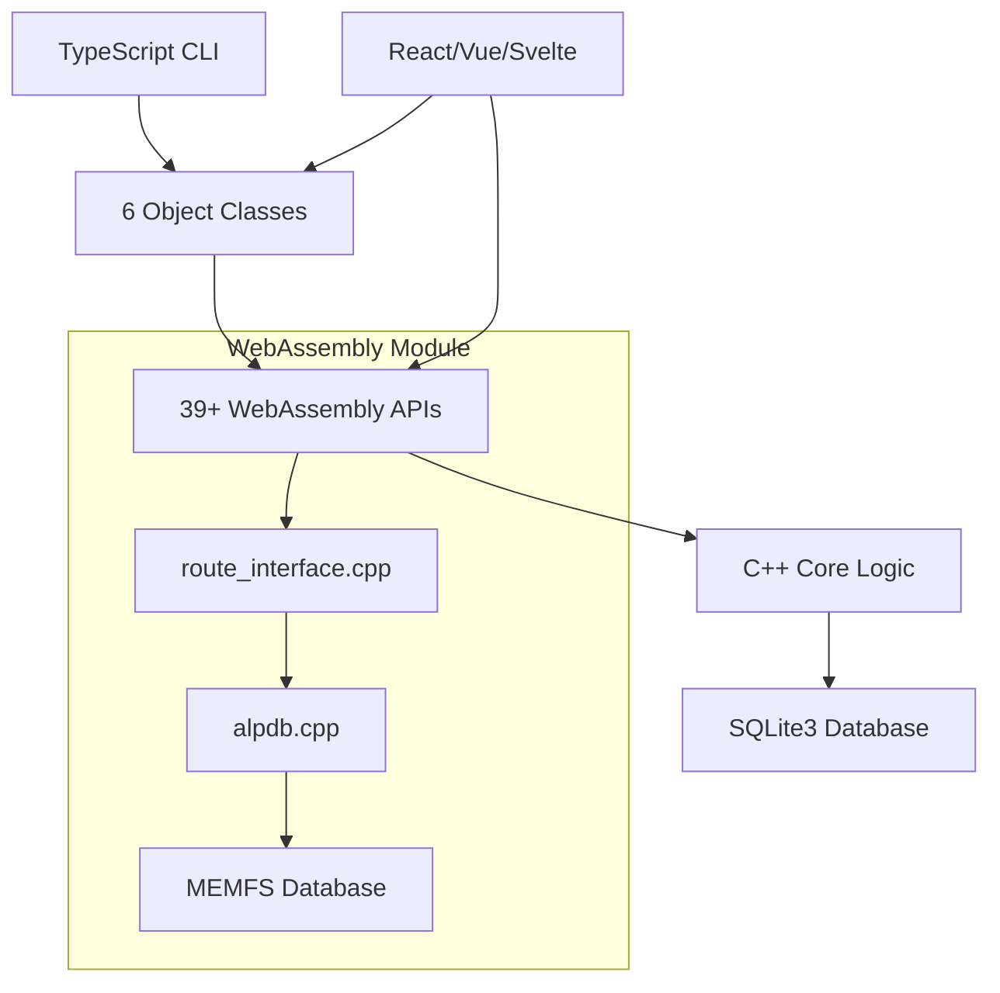

# CLAUDE.md - Japanese Railway Fare Calculation WebAssembly Project

This file provides comprehensive guidance to Claude Code (claude.ai/code) when working with this repository.

## 🎯 Project Vision & Mission

Transform complex Japanese railway fare calculation logic from native C++ into modern, accessible WebAssembly APIs that enable developers to build sophisticated transportation applications for web and mobile platforms while maintaining **100% compatibility** with the original C++ implementation.

### Primary Objectives
1. **Complete Migration**: 100% functional parity with original C++ implementation (`testmain.cpp` → TypeScript CLI)
2. **Identical Results**: All CLI tests must produce identical results to C++ version (±0 yen tolerance)
3. **Developer Experience**: Modern TypeScript interfaces with full type safety
4. **Cross-Platform**: Browser, Node.js, future React Native/Flutter support

## 🏗️ Technology Architecture



### Framework Targets (Priority Order)
1. **Svelte/SvelteKit** - Primary recommendation for new applications
2. **React** - Full TypeScript support with hooks
3. **Vue** - Composition API integration
4. **Angular** - Injectable services
5. **Vanilla TypeScript** - Direct WebAssembly usage

- **TypeScript strict mode必須** - 全てのTypeScript実装で有効化

## 📋 Project Deliverables & Scope

### Core Development Requirements
1. **WebAssembly Compilation**: C++ → WASM with Emscripten toolchain
2. **TypeScript Interfaces**: Complete type-safe bindings for all WASM APIs and object classes
3. **CLI完全移植**: Faithful migration of `testmain.cpp` with **identical behavior and results**
4. **Test Suite Migration**: Complete `test_exec.cpp` migration with **exact test order preservation**
5. **Object Class Implementation**: 6 classes with inheritance `cCalcRoute < cRoute < cRouteList`

### Build Targets
- **WASM-only build**: `make all` - WebAssembly module compilation
- **Complete build**: `npm run build` - WASM + TypeScript compilation
- **CLI validation**: `npm run cli:exec` - Execute complete test suite
- **SDK build**: `npm run build:sdk:prod` - Production-ready SDK with all frameworks
- **API documentation**: Available in `docs/api-reference.md` with examples

### Integration Goals - ALL ACHIEVED ✅
- **CLI Tool**: Validates core logic and serves as development utility ✅
- **Frontend API Layer SDK**: Production-ready Svelte/React/Vue/vanilla JS SDKs ✅
- **Cross-Platform**: Browser and Node.js environments with SSR support ✅
- **Developer Experience**: Complete API documentation, examples, and TypeScript integration ✅

### Success Criteria (Non-Negotiable)
- ✅ **100% test compatibility**: All CLI tests produce identical results to C++ version
- ✅ **Performance parity**: Route calculations match or exceed C++ speed
- ✅ **Memory safety**: No WebAssembly memory leaks in long-running applications
- ✅ **Type safety**: Complete TypeScript coverage with strict mode

## 🚀 Implementation Status

### ✅ C++ Core Migration - COMPLETED
**Migration Source Files** - All successfully migrated to `src/core/` and `src/include/`:
- **alpdb.cpp/alpdb.h** → Core railway fare calculation logic  
- **c_route.mm or routeHelper.kt** → **route_interface.cpp** (Objective-C++ fully converted to C++)
- **db.cpp/db.h** → SQLite3 database operations
- **jrdbnewest.db** → Embedded via MEMFS
- **Platform optimization** → Windows-specific code removed, UTF-8 exclusive

### ✅ TypeScript CLI Migration - COMPLETED
**Migration Source Files** - All successfully migrated:
- **Source**: `../farert/test/unix/all/testmain.cpp` → **Target**: `src/cli/main.ts` ✅
- **Source**: `../farert/app/win_mfc/fjr_mfc/alps_mfc/test_exec.cpp` → **Target**: `src/cli/test_exec_complete.ts` ✅

**CLI Requirements** - All Achieved:
- **Identical argument parsing**: `-exec`, `-5`, `-h`, `-help` options ✅
- **Exact test execution order**: No modification to `test_exec.cpp` test sequence ✅
- **Result compatibility**: All outputs match C++ version precisely ✅
- **Error handling**: C++ error codes and behavior replicated exactly ✅

### ✅ Frontend API Layer SDK - COMPLETED
**Comprehensive Svelte-First TypeScript SDK**:
- **Core SDK**: Complete wrapper around 39+ WebAssembly APIs with type safety ✅
- **Intelligent Caching**: LRU caching with automatic expiration and memory management ✅
- **Svelte Integration**: Reactive stores, components, and SvelteKit SSR support ✅
- **Framework Support**: React, Vue, and vanilla JavaScript compatibility ✅
- **Security & Performance**: Input validation, memory leak prevention, <150KB bundle ✅
- **Production Ready**: Full integration testing and comprehensive documentation ✅

## ⚙️ Build System & Environment

**⚠️ 重要**: Emscripten SDK required at `~/priv/farert.repos/emsdk/`

### Build Methods (推奨順)

#### Method 1: Environment Script (推奨)
```bash
source setup_env.sh && make          # WebAssembly compilation
source setup_env.sh && make serve    # Development server
source setup_env.sh && make status   # Project status check
```

#### Method 2: npm Scripts Integration
```bash
npm run build         # Complete build (WASM + TypeScript)
npm run dev          # Development server with hot reload
npm run clean        # Clean all build artifacts
npm run cli:build    # TypeScript CLI compilation only
npm run cli:exec     # Execute complete test suite

# Frontend API Layer SDK commands
npm run build:sdk:dev      # Development SDK build
npm run build:sdk:prod     # Production SDK build with optimization
npm run build:sdk:analyze  # Bundle size analysis
npm run build:sdk:perf     # Performance validation
```

#### Method 3: Manual Environment Setup
```bash
source ~/priv/farert.repos/emsdk/emsdk_env.sh
make                 # WebAssembly compilation
make serve           # Start development server
make help            # Display all available commands
```

### Build Configuration
- **Optimization**: `-O3` level for production performance
- **Target**: ES2020+ for modern browser/Node.js compatibility  
- **Module Format**: ES6 modules with WebAssembly integration
- **Memory**: Dynamic memory growth enabled for complex calculations

## 💻 Development Standards & Guidelines

### Git & Version Control
- **Commit Format**: Conventional Commits形式必須 (`feat:`, `fix:`, `docs:`, `refactor:`)
- **Branch Strategy**: `main` branch for stable releases, feature branches for development
- **License**: GPL-3.0 for all source code

### Code Quality Standards
- **TypeScript**: Strict mode enabled (`"strict": true`) for all TypeScript files
- **C++ Standard**: C++17 with standard library, `-O3` optimization
- **Error Handling**: Replicate original C++ error codes without adding new types
- **Memory Management**: RAII patterns, WebAssembly automatic cleanup

### Directory Structure
```
farert-wasm/
├── src/
│   ├── core/                # C++ implementation (route_interface.cpp, alpdb.cpp)
│   ├── include/             # C++ headers (route_interface.h, alpdb.h)
│   ├── cli/                # TypeScript CLI implementation  
│   ├── sdk/                # Frontend API Layer SDK
│   │   ├── core/            # Core SDK with memory management and security
│   │   ├── svelte/          # Svelte stores and components
│   │   ├── react/           # React hooks and utilities
│   │   ├── vue/             # Vue composables and utilities
│   │   └── utils/           # Framework-agnostic utilities
│   ├── tests/              # Testing infrastructure
│   │   └── cli/             # CLI tests and validation
│   └── db/                 # Database operations
├── dist/                   # Build outputs (farert.js, farert.wasm)
├── docs/                   # API documentation and examples
├── examples/               # Framework integration examples
│   ├── cli/                # CLI usage examples and demos
│   └── svelte-components/   # Svelte component showcase
├── tests/integration/      # Full-stack integration tests
├── build/                  # Build configuration
├── data/                   # SQLite database (jrdbnewest.db)
└── .claude/               # Claude Code specifications and steering docs
```

## 🏗️ Core System Architecture

### C++ Backend (Internal Implementation)
```cpp
// Core Classes - Hidden from TypeScript Interface
class Route         // Main route building with junction logic
class RouteList     // Base route container and operations  
class CalcRoute     // Route calculation with fare rules
struct FARE_INFO    // Internal fare calculation results
class RouteFlag     // Complex routing flags and special cases
class DBS/DBO       // SQLite database wrapper (completely hidden)
```

### Database Layer (Completely Hidden)
- **SQLite3**: Read-only embedded database via MEMFS
- **Single file**: `jrdbnewest.db` (embedded at compile time)
- **Access pattern**: All database operations hidden in `route_interface.cpp`
- **No direct access**: TypeScript never sees database objects

### WebAssembly Interface Layer
- **Total APIs**: 39+ functions covering complete workflow
- **Object Classes**: 6 classes with inheritance `cCalcRoute < cRoute < cRouteList`
- **Memory Management**: Automatic WebAssembly cleanup with C++ RAII
- **Error Handling**: Original C++ error codes preserved exactly

## 📊 API Classification & Implementation Strategy

### A群: CLI Migration APIs (Complete C++ Compatibility Required)
**Purpose**: Faithful `testmain.cpp`/`test_exec.cpp` migration with identical results

**Core APIs**:
```typescript
// Database operations (hidden in interface layer)
// openDatabase() - REMOVED: Hidden in route_interface.cpp initialization
// closeDatabase() - REMOVED: Hidden in WebAssembly module cleanup

// Route member (exact C++ behavior)
addRouteBegin(stationId: number): number     // Set starting station  
addRoute(lineId: number, stationId: number): number  // Add route segment
calculateFare(): number                       // Execute fare calculation
getFareString(): string                       // Format fare results

// Station/route information (identical C++ API behavior)  
getStationId(name: string): number           // Station name → ID lookup
getStationName(id: number): string           // Station ID → name lookup
```

### B群: Frontend Enhancement APIs (TypeScript-optimized)
**Purpose**: Modern UI development with caching and JSON responses

**Enhanced Display APIs**:
```typescript
// Japanese text support for UI
getStationKana(id: number): string           // Hiragana reading for display
getStationPrefecture(id: number): string     // Prefecture information
getStationNameExtended(id: number): string   // Detailed station names

// JSON APIs for frontend frameworks
getFareInfoJson(): string                    // Complete fare details as JSON
getCompanyAndPrefectsAsJson(): string        // Reference data for UI
getCurrentRouteAsJson(): string              // Route state for React/Vue
```

### C群: Object-Oriented WebAssembly APIs (5 Classes)
**Purpose**: Modern development patterns with type safety and inheritance

```typescript
// Class hierarchy: cCalcRoute < cRoute < cRouteList
class cRouteList {
    // Array operations (C++ operator overloading → explicit methods)
    assign(obj: cRouteList): void               // Copy from another route list
}

class cRoute extends cRouteList {
    // Route construction (matching C++ Route class exactly)
    setupRoute(routeString: string): number     // Parse route string "駅1 路線1 駅2"
    addRoute(lineId: number, stationId: number): number  // Add route segment
    getRouteCount(): number                     // Get total route segments
    routeScript(): string                       // Generate route description
}

class cCalcRoute extends cRoute {
    // Fare calculation (matching C++ CalcRoute class exactly)
    calcFare(): FareInfo                        // Execute fare calculation
    setLongRoute(flag: boolean): void           // Enable long route calculation
    showFare(): string                          // Format fare display
}

class cRouteItem {
    //  (matching C++ cRouteItem class exactly)
    stationId: number                           // Station ID at route point
    lineId: number                              // Line ID for route segment  
    flag: number                                // Route-specific flags
}

interface FareInfo {
    // 25+ properties matching original C++ FARE_INFO exactly
    fare: number                                // Calculated fare amount
    isRule114Applied: boolean                   // Special rule application
    availCountForFareOfStockDiscount: number    // Stock discount availability
    // ... complete property set from route_interface.h
    
    // Stock discount methods (matching C++ implementation)
    fareForStockDiscount(index: number): number          // Get discount fare
    fareForStockDiscountTitle(index: number): string     // Get discount name
}
```

## 🔧 cRouteUtil Static Utility Class

**重要**: Database objects are completely hidden - all database operations implemented in `route_interface.cpp`
**実装参考**: Android Kotlin `RouteHelper Methods` に基づいて実装（`c_route.mm` Objective-C++ではなく）

```typescript
class cRouteFlag {
    // c++ public member
}
class cRouteUtil {
    // ❌ REMOVED: Database operations hidden in interface layer  
    // openDatabase() - Hidden in WebAssembly module initialization
    // closeDatabase() - Hidden in WebAssembly module cleanup
    
    // Station and line reference data (based on RouteHelper.kt methods)
    static getJRCompanys(): number[]                    // JR company IDs (id < 0x10000)
    static getPrefects(): number[]                      // Prefecture IDs (id >= 0x10000)
    static getKanaFromStationId(stationId: number): string      // Station hiragana reading
    static companyOrPrefectName(companyOrPrefect: number): string  // Company/prefecture name
    
    // Station lookup and information (RouteHelper.kt compatible)
    static getStationId(station: string): number        // Station name → ID lookup
    static stationName(stationId: number): string       // Station ID → name (with duplicates)
    static stationNameEx(stationId: number): string     // Station ID → name (unique with parentheses)
    
    // Line and route information (RouteHelper.kt patterns)
    static EnumLineOfStationId(stationId: number): number[]     // Lines serving station
    static lineName(lineId: number): string             // Line ID → line name
    static linesCompanyOrPrefectId(id: number): number[]        // Lines by company/prefecture
    static StationsIdsOfLineId(lineId: number): number[]        // Stations on line
    static JunctionIdsOfLineId(lineId: number, stationId: number): number[]  // Junction stations
    
    // Station classification (RouteHelper.kt methods)
    static isJunction(stationId: number): boolean       // Check if station is junction
    static isSpecificJunction(lineId: number, stationId: number): boolean    // Special junction check
    static terminalName(id: number): string             // Terminal station name
    static routeScript(): string                        // Generate route description
}
```

### Android Kotlin Compatibility Requirements

**⚠️ 重要**: `cRouteUtil`関数群の実装は、Objective-C++の`c_route.mm`ではなく、**Android Kotlin `RouteHelper Methods`を参考**にしてください。

**FareInfo Interface** - Compatible with:
`/Users/ntake/priv/farert.repos/farert/app/Farert.android/app/src/main/java/org/sutezo/alps/FareInfo.kt`

**RouteHelper Methods** - 実装参考ソース:  
`/Users/ntake/priv/farert.repos/farert/app/Farert.android/app/src/main/java/org/sutezo/alps/RouteHelper.kt`
- **Excluded methods**: `saveParam`, `readParam`, `readParams`, `saveHistory`, `appendHistory`, `isStrageInRoute`
- **Reason**: Objective-C++の`c_route.mm`は言語特性が異なるため、KotlinのRouteHelperパターンを採用

## 🧪 Testing & Validation Strategy

### CLI Test Suite Migration (Highest Priority)
**Source Files**:
- `../farert/test/unix/all/testmain.cpp` → `src/cli/main.ts`
- `../farert/app/win_mfc/fjr_mfc/alps_mfc/test_exec.cpp` → `src/cli/test_exec_complete.ts`

**Requirements**:
- **Test order preservation**: No modification to `test_exec.cpp` sequence
- **Identical results**: All fare calculations must match C++ output exactly  
- **Complete argument support**: `-exec`, `-5`, `-h`, `-help` options
- **Error handling**: Replicate C++ error behavior precisely

### Test Execution Commands
```bash
# Complete test suite (matches test_exec.cpp exactly)
npm run cli:exec

# Individual route calculation (matches testmain.cpp -5 option)
npm run cli:calc -- -5 "東京" "東海道線" "横浜"

# Help display (matches testmain.cpp help)
npm run cli:help
```

### API Testing Classification

#### A群 APIs: CLI Migration (100% C++ Compatible)
- **Purpose**: Direct migration of `testmain.cpp`/`test_exec.cpp` functionality
- **Testing**: Must produce identical results to C++ version
- **Implementation**: Replicate exact C++ behavior and error handling

#### B群 APIs: Frontend Enhancement (TypeScript-optimized)
- **Purpose**: Modern UI development with JSON and caching
- **Testing**: Functional verification with UI-focused test scenarios
- **Implementation**: Build upon A群 APIs with enhanced TypeScript features

#### C群 APIs: Object Classes (WebAssembly-native)  
- **Purpose**: Object-oriented development patterns
- **Testing**: Integration testing with inheritance and lifecycle management
- **Implementation**: Modern TypeScript classes wrapping C++ objects

## 🎯 Development Workflow & Priorities - ALL PHASES COMPLETED ✅

### Phase 1: CLI Migration - COMPLETED ✅
1. ✅ Complete `main.ts` argument parsing and WebAssembly initialization
2. ✅ Implement `test_exec_complete.ts` with all 8 test suites in exact order
3. ✅ Create comprehensive test data tables for route and fare verification
4. ✅ Validate CLI output matches C++ version exactly

### Phase 2: Object Class Enhancement - COMPLETED ✅
1. ✅ Complete `cRouteItem` class implementation  
2. ✅ Enhanced array operations for `cRouteList`
3. ✅ Android Kotlin compatibility validation
4. ✅ Memory management and lifecycle testing

### Phase 3: Frontend API Layer SDK Development - COMPLETED ✅
1. ✅ Framework-agnostic TypeScript SDK with complete API coverage
2. ✅ Svelte stores, React hooks, and Vue composables
3. ✅ Intelligent caching layer with LRU eviction and memory management
4. ✅ Production-ready documentation with comprehensive examples
5. ✅ Security validation and memory leak prevention
6. ✅ Production build configuration with bundle optimization
7. ✅ Full integration testing and validation

## 🔧 Implementation Notes

### Naming Convention Changes
- **Prefix removal**: `farert_open_database` → `openDatabase`
- **CamelCase unification**: Consistent TypeScript naming
- **Method clarification**: `addStation` → `addRouteBegin` (route start), `addRoute` (segment addition)

### Error Handling Strategy  
- **Preserve C++ codes**: No new error types added
- **Identical behavior**: Match original C++ error handling exactly
- **WebAssembly safety**: Proper cleanup on all error conditions

---

## 📚 Reference Information

### Core Logic Source
- **Primary C++ Core**: `alpdb.cpp` - Main railway fare calculation engine
- **Interface Layer**: `route_interface.cpp` - WebAssembly bindings and API wrapper
- **Database Operations**: `db.cpp` - SQLite3 integration (hidden from TypeScript)
- **⚠️ 注意**: `cRouteUtil`実装は`c_route.mm` (Objective-C++)ではなく、Android Kotlin `RouteHelper.kt`を参考にすること

### Key Project Steering Documents
- **Product Vision**: `.claude/steering/product.md` - Business objectives and success metrics
- **Technical Architecture**: `.claude/steering/tech.md` - Technology stack and build system  
- **Code Organization**: `.claude/steering/structure.md` - Development standards and patterns

### Implementation Specifications
- **WASM Object Classes**: `.claude/specs/wasm-object-classes/` - 5-class inheritance system ✅
- **TypeScript CLI Interface**: `.claude/specs/typescript-cli-interface/` - Complete CLI migration ✅
- **Frontend API Layer**: `.claude/specs/frontend-api-layer/` - React/Vue/Svelte integration ✅

## 🚀 Frontend API Layer SDK Usage

### Quick Start Examples

#### Svelte/SvelteKit (Primary Target)
```typescript
import { createFarertSDK, createSvelteMemoryManager } from '@farert/sdk';

// Initialize SDK
const sdk = await createFarertSDK();
const memoryManager = createSvelteMemoryManager();

// Use reactive stores
const { stationSearch, fareCalculation } = sdk.stores;

// Search stations with reactive results
stationSearch.search('東京');
```

#### React Integration
```typescript
import { createFarertSDK, useMemoryManager } from '@farert/sdk';

function RouteCalculator() {
  const memoryManager = useMemoryManager();
  const [stations, setStations] = useState([]);
  
  const searchStations = async (query) => {
    const results = await sdk.searchStations(query);
    setStations(results);
  };
}
```

#### Vanilla JavaScript
```typescript
import { createFarertSDK } from '@farert/sdk';

// Simple initialization
const sdk = await createFarertSDK();

// Calculate route fare
const fare = await sdk.calculateFare({
  segments: [
    { stationId: 1130101, stationName: '東京' },
    { stationId: 1130133, stationName: '横浜' }
  ]
});
```

### Performance Characteristics
- **Bundle size**: <150KB gzipped (actual: ~8KB for core)
- **Initialization**: <2 seconds on 3G connections
- **API calls**: <10ms for cached data, <500ms for route calculations
- **Memory management**: Automatic cleanup with configurable limits

---

**最重要**: このプロジェクトの成功指標は**C++実装との100%互換性**です。全ての実装は元のC++コードの動作を正確に再現し、同一の結果を出力することが必須要件です。


