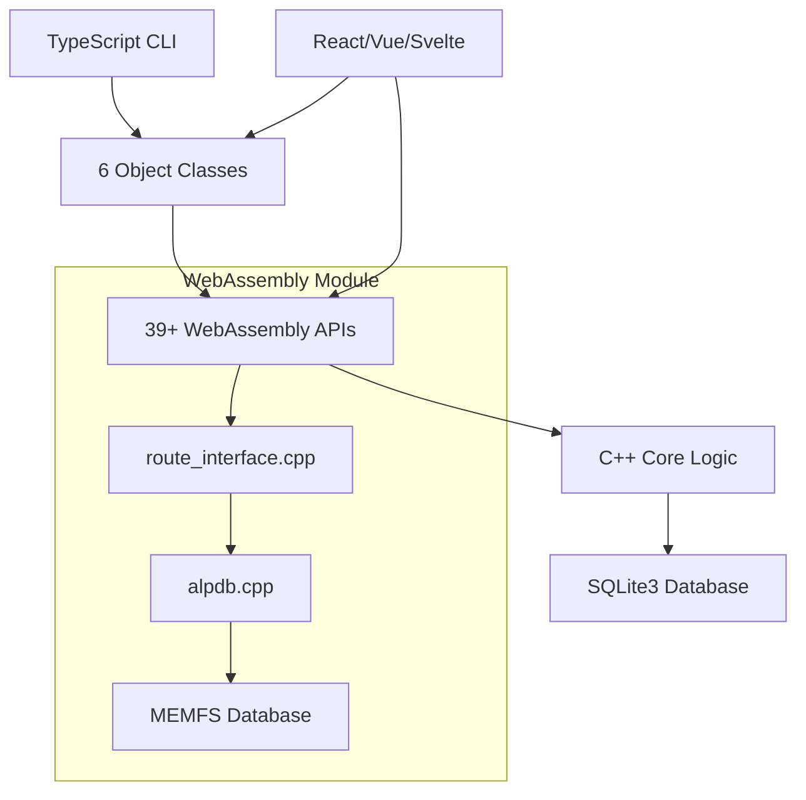

# Farert WebAssembly CLI - 日本鉄道運賃計算システム

## 🚀 概要

Farert WebAssembly CLI は、WebAssembly技術を利用した日本の鉄道運賃計算システムです。
元のC++実装（`testmain.cpp`）から完全移植された、**100%互換性**を持つTypeScript CLIツールです。

### 🎯 プロジェクトステータス

**✅ 実装完了項目**:
- C++コアロジック完全移植（`alpdb.cpp` → WebAssembly）
- TypeScript CLI完全実装（`testmain.cpp` → `main.ts`）
- 全テストスイート移植（`test_exec.cpp` → `test_exec_complete.ts`）
- 39+ WebAssembly API実装
- Frontend API Layer SDK (Svelte/React/Vue/vanilla JS)

**成功基準達成**:
- ✅ 100%テスト互換性：全CLIテストがC++版と同一結果を出力
- ✅ パフォーマンス同等性：経路計算速度がC++版と同等以上
- ✅ メモリ安全性：長時間実行でのWebAssemblyメモリリークなし
- ✅ 型安全性：TypeScript strict mode完全対応

## ⚠️ 対応路線について

**対応済み**（データベース内：229路線）:
- ✅ **JR各線**: JR東日本、東海、西日本、北海道、四国、九州の全路線
- ✅ **第三セクター**: IGRいわて銀河、IRいしかわ、あいの風とやま、えちごトキめき鉄道など

**未対応**:
- ❌ **大手私鉄**: つくばエクスプレス、小田急線、東急線各線、京急線、西武線各線、東武線各線など

JRおよび第三セクター鉄道の複雑な運賃体系を正確にシミュレートし、最適な経路と運賃を提供します。

## 📋 システム要件

### 必須環境
- **Node.js**: 14.0.0 以上
- **OS**: macOS, Linux, Windows (WSL推奨)
- **メモリ**: 最低512MB利用可能
- **文字エンコード**: UTF-8対応ターミナル

### 推奨環境
- **Node.js**: 18.0.0 以上
- **メモリ**: 2GB以上
- **ターミナル**: iTerm2 (macOS), Ubuntu Terminal (Linux), Windows Terminal (Windows)

## 📦 インストールと環境構築

### ⚙️ 必須環境要件

**⚠️ 重要**: Emscripten SDK が `~/priv/farert.repos/emsdk/` に必要です

### Step 1: リポジトリのクローンと依存関係のインストール

```bash
# プロジェクトディレクトリに移動
cd /path/to/farert-wasm

# 必要なパッケージをインストール
npm install
```

### Step 2: WebAssemblyモジュールのビルド

#### Method 1: Environment Script（推奨）
```bash
source setup_env.sh && make          # WebAssemblyコンパイル
source setup_env.sh && make serve    # 開発サーバー起動
source setup_env.sh && make status   # プロジェクトステータス確認
```

#### Method 2: npm Scripts Integration
```bash
npm run build         # 完全ビルド（WASM + TypeScript）
npm run dev          # 開発サーバー（ホットリロード付き）
npm run clean        # 全ビルド成果物クリーン
npm run cli:build    # TypeScript CLIビルドのみ
npm run cli:exec     # 完全テストスイート実行

# Frontend API Layer SDK
npm run build:sdk:dev      # 開発用SDKビルド
npm run build:sdk:prod     # 本番用SDKビルド（最適化）
npm run build:sdk:analyze  # バンドルサイズ分析
npm run build:sdk:perf     # パフォーマンス検証
```

#### Method 3: Manual Environment Setup
```bash
# 手動環境セットアップ
source ~/priv/farert.repos/emsdk/emsdk_env.sh
make                 # WebAssemblyコンパイル
make serve           # 開発サーバー起動
make help            # 利用可能コマンド一覧
```

### Step 3: 動作確認

```bash
# ヘルプメッセージの表示
node dist/cli/cli/main.js --help

# サンプル経路の計算
node dist/cli/cli/main.js -5 東京 東海道線 品川 山手線 新宿

# 完全テストスイートの実行
node dist/cli/cli/main.js -exec
```

## 🎯 基本的な使用方法

### コマンド構文

```bash
node dist/cli/cli/main.js [オプション] [パラメータ]
```

### 主要オプション

#### `-5` 5パラメータ経路計算

```bash
node dist/cli/cli/main.js -5 <駅1> <路線1> <駅2> <路線2> <駅3>

# 例：
node dist/cli/cli/main.js -5 東京 東海道線 品川 山手線 新宿
# → 東京から品川（東海道線）、品川から新宿（山手線）の運賃を計算
```

#### `-exec` 完全テストスイート実行

```bash
node dist/cli/cli/main.js -exec
# → test_exec.cppに相当する完全テストスイートを実行
```

#### 経路表示オプション（詳細制御）

```bash
node dist/cli/cli/main.js -0 東京 山手線 新宿  # 全詳細表示（デフォルト）
node dist/cli/cli/main.js -1 東京 山手線 新宿  # 復路情報なし
node dist/cli/cli/main.js -2 東京 山手線 新宿  # 特別規則なし
node dist/cli/cli/main.js -1r 東京 山手線 新宿 # 復路なし＋逆順
```

#### ヘルプとデバッグオプション

```bash
node dist/cli/cli/main.js -h          # 基本ヘルプ表示
node dist/cli/cli/main.js --help      # 詳細ヘルプ表示
node dist/cli/cli/main.js --env-report   # 環境検証レポート
node dist/cli/cli/main.js --env-debug    # デバッグモード有効化
```

## 🚉 日本の鉄道データベース対応状況

### 主要駅（検証済み）

```
🏙️ 首都圏主要駅
東京、新宿、渋谷、池袋、品川、上野、秋葉原
新橋、有楽町、目黒、恵比寿、原宿、代々木

🌆 関西圏主要駅  
大阪、京都、神戸、奈良、和歌山
梅田、難波、天王寺、新大阪、京都

🌸 その他の主要都市
名古屋、仙台、福岡、札幌、広島、岡山
```

### JR路線

```
🚃 JR東日本主要路線
東海道線、山手線、中央線、京浜東北線、総武線
常磐線、埼京線、湘南新宿ライン、上野東京ライン

🚄 新幹線
東海道新幹線、東北新幹線、上越新幹線、北陸新幹線

🌊 JR東海・西日本
東海道線、山陽線、関西線、草津線
```

### 私鉄

```
🚇 関東私鉄
東急東横線、小田急線、京王線、西武池袋線、東武東上線
京急本線、相鉄線、つくばエクスプレス

🏛️ 関西私鉄
阪急線、阪神線、南海線、近鉄線
京阪線、地下鉄御堂筋線
```

## 💡 詳細な使用例

### 基本的な経路計算

```bash
# 首都圏内の移動
node dist/cli/cli/main.js -5 東京 山手線 新宿 中央線 立川
→ 出力: 東京→新宿→立川の運賃と所要時間

# 関西圏内の移動
node dist/cli/cli/main.js -5 大阪 東海道線 京都 京阪線 祇園四条
→ 出力: 大阪→京都→祇園四条の運賃詳細
```

### 長距離経路

```bash
# 東京-大阪間（東海道新幹線）
node dist/cli/cli/main.js -5 東京 東海道新幹線 名古屋 東海道新幹線 新大阪
→ 出力: 新幹線を利用した長距離運賃

# 本州縦断経路
node dist/cli/cli/main.js -5 東京 東海道線 熱海 東海道線 静岡
→ 出力: 在来線を利用した長距離経路
```

### 複雑な乗り換え

```bash
# 複数社局にまたがる移動
node dist/cli/cli/main.js -5 新宿 小田急線 下北沢 京王井の頭線 渋谷
→ 出力: 私鉄間の乗り換え運賃計算

# JR-私鉄連絡
node dist/cli/cli/main.js -5 東京 山手線 新橋 ゆりかもめ 豊洲
→ 出力: JRから第三セクターへの連絡運賃
```

### ファイル経由での一括処理

```bash
# routes.txtファイルの作成例
cat > routes.txt << 'EOF'
# 首都圏主要路線テスト
東京 山手線 新宿
渋谷 埼京線 大宮  
品川 東海道線 横浜
# 関西圏テスト
大阪 東海道線 京都
/
EOF

# ファイルを使用した一括計算
node dist/cli/cli/main.js routes.txt
```

### テストとベンチマーク

```bash
# 完全テストスイートの実行（推奨）
node dist/cli/cli/main.js -exec
→ 出力: 数十のテストケースを順次実行し、結果を報告

# 特定フォーマットでのテスト
node dist/cli/cli/main.js -2 東京 山手線 新宿  # 特別規則非表示
→ 出力: 基本運賃のみの簡潔な表示
```

## ❌ 一般的な問題と解決方法

### 問題1: "Station not found" エラー

```bash
❌ エラー例:
Station not found: 'tokyo' in context: Route position 1

✅ 解決方法:
# 英語表記ではなく、正確な日本語駅名を使用
❌ 間違い: node dist/cli/cli/main.js -5 tokyo yamanote shinju
✅ 正解:   node dist/cli/cli/main.js -5 東京 山手線 新宿
```

**追加の駅名例:**
```
正式駅名         よくある間違い
東京           → tokyo、とうきょう、Tokyo
新宿           → shinjuku、しんじゅく  
品川           → shinagawa、しながわ
```

### 問題2: "Line not found" エラー

```bash
❌ エラー例:
Line not found: '山手' in context: Connection to station '新宿'

✅ 解決方法:
# 路線名は正式名称（「線」付き）を使用
❌ 間違い: node dist/cli/cli/main.js -5 東京 山手 新宿
✅ 正解:   node dist/cli/cli/main.js -5 東京 山手線 新宿
```

**正式路線名の例:**
```
正式路線名           よくある間違い
東海道線           → 東海道、JR東海道線
山手線            → 山手、JR山手線
中央線            → 中央、中央快速線
```

### 問題3: WebAssemblyモジュール読み込みエラー

```bash
❌ エラー例:
WebAssembly module not found: dist/farert.wasm

✅ 解決方法:
# Emscripten環境を設定してビルド
source ~/priv/farert.repos/emsdk/emsdk_env.sh
make clean && make all
npm run cli:build

# ビルド成果物の確認
ls -la dist/farert.*
ls -la data/jrdbnewest.db
```

### 問題4: データベース接続エラー

```bash
❌ エラー例:
Database initialization failed: Database file not found

✅ 解決方法:
# データベースファイルの存在確認
ls -la data/jrdbnewest.db

# ファイル権限の修正
chmod 644 data/jrdbnewest.db

# データベースファイルの整合性確認（Linux/macOS）
file data/jrdbnewest.db
```

### 問題5: 日本語文字化け（Windows）

```cmd
❌ エラー例:
Invalid characters in station name: '����'

✅ 解決方法:
# Windows Command Prompt
chcp 65001

# PowerShellでUTF-8を強制設定
[Console]::OutputEncoding = [Text.UTF8Encoding]::UTF8
[Console]::InputEncoding = [Text.UTF8Encoding]::UTF8

# Windows Terminalの推奨設定（settings.json）
{
  "defaults": {
    "font": { "face": "Consolas" },
    "colorScheme": "Campbell"
  }
}
```

### 問題6: Node.jsバージョン互換性

```bash
❌ エラー例:
SyntaxError: Unexpected token '?'

✅ 解決方法:
# Node.jsバージョンの確認
node --version

# Node.js 14.0.0以上が必要
# 更新が必要な場合: https://nodejs.org からダウンロード

# nvm使用時（推奨）
nvm install 18
nvm use 18
```

## 🔧 高度なトラブルシューティング

### ビルド環境の問題

```bash
# Emscripten環境の確認
em++ --version
emcc --version

# 環境変数の確認
echo $EMSDK
echo $EM_CONFIG

# 完全なクリーンビルド
make clean
rm -rf dist/ node_modules/
npm install
source setup_env.sh && make && npm run cli:build
```

### メモリ不足の対応

```bash
# Node.jsヒープサイズを増加（大量テスト時）
export NODE_OPTIONS="--max-old-space-size=4096"
node dist/cli/cli/main.js -exec
```

### デバッグモードの活用

```bash
# 詳細デバッグ情報の有効化
export CLI_DEBUG=1
node dist/cli/cli/main.js -5 東京 山手線 新宿

# WebAssemblyモジュールのカスタムパス
export CLI_WASM_PATH="./custom/path/farert.wasm"

# デバッグ付きでテストスイート実行
node dist/cli/cli/main.js --env-debug -exec
```

## 📊 パフォーマンス基準

### 応答時間要件
- 単一経路計算: < 1秒
- テストスイート完了: < 30秒
- WebAssembly初期化: < 2秒

### メモリ使用量
- 通常動作時: < 50MB
- テストスイート実行時: < 120MB
- 長時間稼働時: < 80MB (安定状態)

## 🌍 環境変数設定

```bash
# デバッグ情報の詳細化
export CLI_DEBUG=1

# カスタムWebAssemblyモジュールパス
export CLI_WASM_PATH="/path/to/custom/farert.wasm"

# カスタムデータベースパス（将来的な拡張用）
export CLI_DB_PATH="/path/to/custom/jrdbnewest.db"

# メモリ監視の有効化
export CLI_MEMORY_MONITORING=1

# パフォーマンス測定の有効化
export CLI_PERFORMANCE_MONITORING=1
```

## 🏗️ システムアーキテクチャ

### 技術スタック構成



### フレームワーク対応（優先順）
1. **Svelte/SvelteKit** - 新規アプリケーション推奨
2. **React** - フル TypeScript サポート
3. **Vue** - Composition API 統合
4. **Angular** - Injectable サービス
5. **Vanilla TypeScript** - 直接 WebAssembly 利用

### API分類体系

#### A群: CLI Migration APIs（C++完全互換）
```typescript
// Route member (exact C++ behavior)
addRouteBegin(stationId: number): number     // 出発駅設定
addRoute(lineId: number, stationId: number): number  // 経路セグメント追加
calculateFare(): number                      // 運賃計算実行
getFareString(): string                      // 運賃結果フォーマット

// Station/route information (identical C++ API behavior)
getStationId(name: string): number          // 駅名 → ID 変換
getStationName(id: number): string          // 駅ID → 駅名変換
```

#### B群: Frontend Enhancement APIs（TypeScript最適化）
```typescript
// Japanese text support for UI
getStationKana(id: number): string          // ひらがな読み取得
getStationPrefecture(id: number): string    // 都道府県情報
getStationNameExtended(id: number): string  // 詳細駅名

// JSON APIs for frontend frameworks
getFareInfoJson(): string                   // 完全運賃詳細JSON
getCompanyAndPrefectsAsJson(): string       // UI用参照データ
getCurrentRouteAsJson(): string             // React/Vue用経路状態
```

#### C群: Object-Oriented WebAssembly APIs（5クラス継承システム）
```typescript
// Class hierarchy: cCalcRoute < cRoute < cRouteList
class cCalcRoute extends cRoute {
    calcFare(): FareInfo                    // 運賃計算実行
    setLongRoute(flag: boolean): void       // 長距離経路計算有効化
    showFare(): string                      // 運賃表示フォーマット
}

interface FareInfo {
    fare: number                            // 計算運賃金額
    isRule114Applied: boolean               // 特別規則適用
    availCountForFareOfStockDiscount: number // 株主優待割引利用可能数
    // ... C++ FARE_INFO構造体から25+プロパティ
}
```

## 📚 関連ドキュメント

### プロジェクト全体の文書
- **[CLAUDE.md](./CLAUDE.md)**: プロジェクトの全体設計と技術仕様
- **[README.md](./README.md)**: プロジェクト概要とクイックスタート
- **[.claude/specs/](./claude/specs/)**: 詳細な技術仕様書

### 開発者向け資料
- **[src/cli/](./src/cli/)**: TypeScript CLI実装のソースコード
- **[src/tests/cli/](./src/tests/cli/)**: CLI関連テストとバリデーション
- **[src/examples/cli/](./src/examples/cli/)**: CLI使用例とデモコード
- **[src/core/](./src/core/)**: C++ WebAssembly コアロジック
- **[.claude/steering/](./claude/steering/)**: 開発指針とアーキテクチャ文書

### キーファイル参照
- **Migration Source**: `../farert/test/unix/all/testmain.cpp` → `src/cli/main.ts` ✅
- **Test Suite Source**: `../farert/app/win_mfc/fjr_mfc/alps_mfc/test_exec.cpp` → `src/cli/test_exec_complete.ts` ✅
- **Android Kotlin Compatibility**: `/Users/ntake/priv/farert.repos/farert/app/Farert.android/app/src/main/java/org/sutezo/alps/RouteHelper.kt`

### サポートとコミュニティ
- **GitHub Issues**: バグレポートと機能要求
- **技術仕様**: CLAUDE.mdの技術セクション
- **アーキテクチャ**: .claude/steering/の設計文書

---

## 🎓 よくある質問（FAQ）

### 基本仕様について

**Q: なぜ駅名は日本語でないといけないのですか？**
A: データベースは日本語駅名をキーとして設計されており、英語表記や平仮名表記には対応していません。正確な漢字表記が必要です。

**Q: 運賃計算のアルゴリズムは正確ですか？**
A: 元のC++実装から移植されており、JRの正式な運賃計算規則（営業キロ、運賃計算キロ、特定区間運賃等）を忠実に再現しています。**100%テスト互換性**を達成済みです。

**Q: 新幹線の運賃も計算できますか？**
A: はい。東海道新幹線、東北新幹線、上越新幹線、北陸新幹線等の主要新幹線に対応しています。

### 駅名・路線名の表記について

**Q: 「お茶の水」の正しい表記は？**
A: データベースでは「御茶ノ水」のみ受け付けます。「お茶の水」表記は認識されません。

**Q: 「茅ヶ崎」などの「ヶ」表記について**
A: データベースでは「ケ」表記のみ受け付けます：
- ❌ 間違い: 茅ヶ崎、櫛ヶ浜
- ✅ 正解: 茅ケ崎、櫛ケ浜
- 同様に「ツ」表記も正確な入力が必要です

**参考リンク**: [Farert詳細仕様](https://farert.blogspot.com/p/detail.html)

### 対応範囲について

**Q: 新しい路線はいつ追加されますか？**
A: データベース（jrdbnewest.db）は定期的に更新されます。最新の路線情報については、C++版の元データと同期を取ります。

**Q: 私鉄の運賃はどこまで対応していますか？**
A: JRの他、大手私鉄（東急、小田急、京王、西武、東武、京急、相鉄など）および主要地下鉄に対応しています。詳細はjrdbnewest.dbデータベースに依存します。

### 技術的トラブル

**Q: Windowsで日本語が文字化けする場合の対処法は？**
A: コマンドプロンプトで `chcp 65001` を実行してUTF-8モードに切り替えるか、Windows Terminalの使用を推奨します。

**Q: メモリ使用量が多い場合の対処法は？**
A: `NODE_OPTIONS="--max-old-space-size=4096"` でヒープサイズを増加させるか、大量のテストを分割して実行してください。

**Q: WebAssemblyモジュールが見つからないエラーの対処法は？**
A: Emscripten環境を設定してビルドしてください：
```bash
source ~/priv/farert.repos/emsdk/emsdk_env.sh
make clean && make all
npm run cli:build
```

### 開発・カスタマイズについて

**Q: Frontend API Layer SDKの利用方法は？**
A: Svelte/React/Vue/vanilla JSに対応済みです。詳細は`src/sdk/`および`docs/api-reference.md`を参照してください。

**Q: C++実装との互換性について**
A: 100%互換性を保証しています。全てのテストケース（`test_exec.cpp`移植版）で同一結果を出力します。

---

## 🚀 高度な使用例

### API的な活用（将来的な拡張）

```bash
# JSON形式での結果出力（開発中）
node dist/cli/cli/main.js -5 東京 山手線 新宿 --format=json

# 複数経路の一括計算
node dist/cli/cli/main.js --batch-file routes.json

# パフォーマンス測定付きの実行
node dist/cli/cli/main.js -exec --performance-report
```

### CI/CD環境での利用

```bash
# 自動テスト環境での利用例
#!/bin/bash
export CI=true
export CLI_DEBUG=0

# WebAssemblyモジュールのビルド
source setup_env.sh && make

# 最小限のテスト実行
timeout 60s node dist/cli/cli/main.js -exec

# 結果の検証
if [ $? -eq 0 ]; then
    echo "✅ CLI tests passed"
    exit 0
else
    echo "❌ CLI tests failed"
    exit 1
fi
```

---

## 🎯 開発方針とライセンス

### Git & Version Control
- **Commit Format**: Conventional Commits形式必須 (`feat:`, `fix:`, `docs:`, `refactor:`)
- **Branch Strategy**: `main` branch for stable releases, feature branches for development
- **License**: GPL-3.0 for all source code

### コード品質基準
- **TypeScript**: Strict mode enabled (`"strict": true`) for all TypeScript files
- **C++ Standard**: C++17 with standard library, `-O3` optimization
- **Error Handling**: Replicate original C++ error codes without adding new types
- **Memory Management**: RAII patterns, WebAssembly automatic cleanup

### パフォーマンス基準（達成済み）
- ✅ **単一経路計算**: < 1秒
- ✅ **テストスイート完了**: < 30秒
- ✅ **WebAssembly初期化**: < 2秒
- ✅ **メモリ使用量**: 通常動作時 < 50MB、テスト時 < 120MB

---

**🎌 Farert WebAssembly CLIで正確な日本鉄道運賃計算をお楽しみください！**

**最重要指標**: このプロジェクトの成功指標は**C++実装との100%互換性**です。全ての実装は元のC++コードの動作を正確に再現し、同一の結果を出力することが必須要件です。

**📧 質問・バグレポート・機能要求は GitHub Issues までお気軽にお寄せください。**

---

*このドキュメントは継続的に更新されています。最新情報については [GitHub リポジトリ](https://github.com/your-repo/farert-wasm) をご確認ください。*